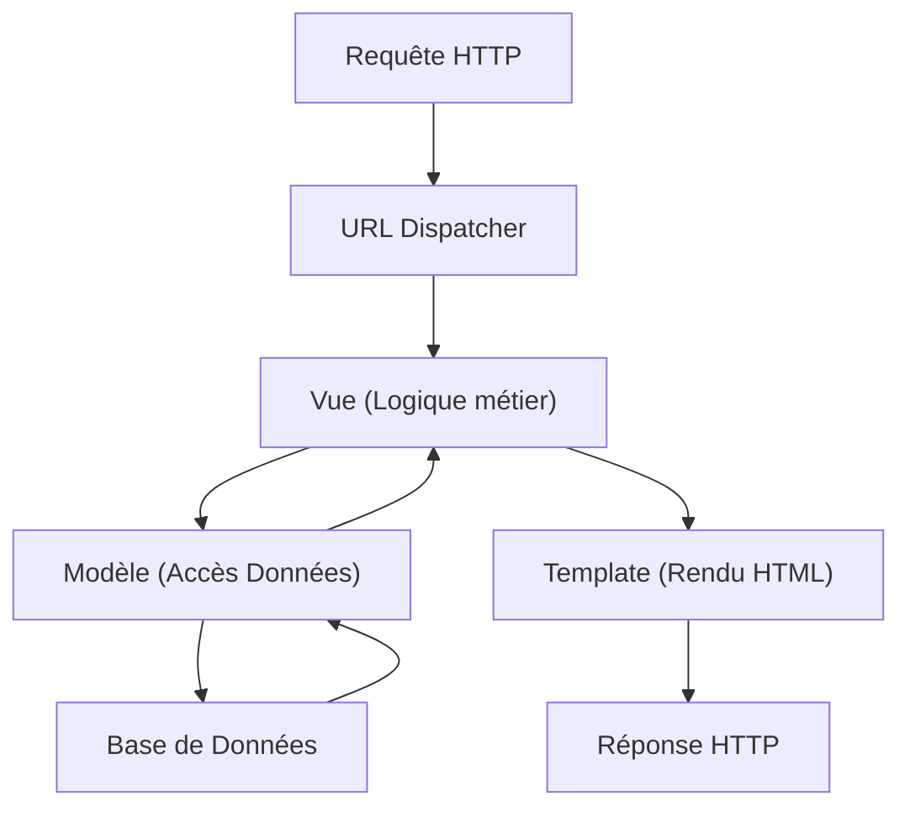

# Avant-propos : Maîtriser Django {#avant-propos-maîtriser-django-0}

Bienvenue dans ce parcours dédié à **Django**, le framework web "pour les perfectionnistes avec des délais". Ce chapitre pose les bases de notre approche pédagogique et définit les objectifs que nous atteindrons ensemble.

## Prérequis {#prérequis-0}

Pour aborder cette formation sereinement, vous devez disposer des bases suivantes :

- **Python** : Une maîtrise confortable de la syntaxe, des structures de données (listes, dictionnaires), des fonctions et de la programmation orientée objet (classes, héritage).
- **Web** : Une compréhension du protocole HTTP (méthodes GET/POST, codes de statut) et des bases du HTML/CSS.
- **Environnement** : Savoir utiliser un terminal (ligne de commande) et gérer des environnements virtuels Python (`venv`).

## Objectifs pédagogiques {#objectifs-pédagogiques-0}

À l'issue de cette formation, vous serez capable de :

1. **Architecturer** des applications web robustes et sécurisées en respectant le pattern MVT (Model-View-Template).
2. **Modéliser** des bases de données complexes via l'ORM Django.
3. **Sécuriser** vos applications contre les vulnérabilités courantes (CSRF, XSS, SQL Injection).
4. **Déployer** une application Django en environnement de production.

## La philosophie Django {#la-philosophie-django-0}

Django a été conçu pour automatiser les tâches répétitives du développement web tout en restant extrêmement flexible.

Le framework repose sur le principe du **"Batteries Included"** : tout ce dont vous avez besoin pour construire un site web moderne (authentification, administration, ORM, sécurité) est inclus nativement.

## Aller plus loin : Le projet final {#aller-plus-loin-le-projet-final-0}

Pour valider vos acquis, nous construirons tout au long de ce parcours une plateforme de gestion de contenu (type CMS) complète. 

Ce projet intégrera :
- Un système d'authentification utilisateur personnalisé.
- Une interface d'administration sur-mesure.
- Une API REST exposant les données de votre application.
- Des tests unitaires et d'intégration pour garantir la stabilité de votre code.

Préparez votre environnement de développement, nous commençons dès le prochain chapitre par l'installation et la découverte de l'écosystème Django.