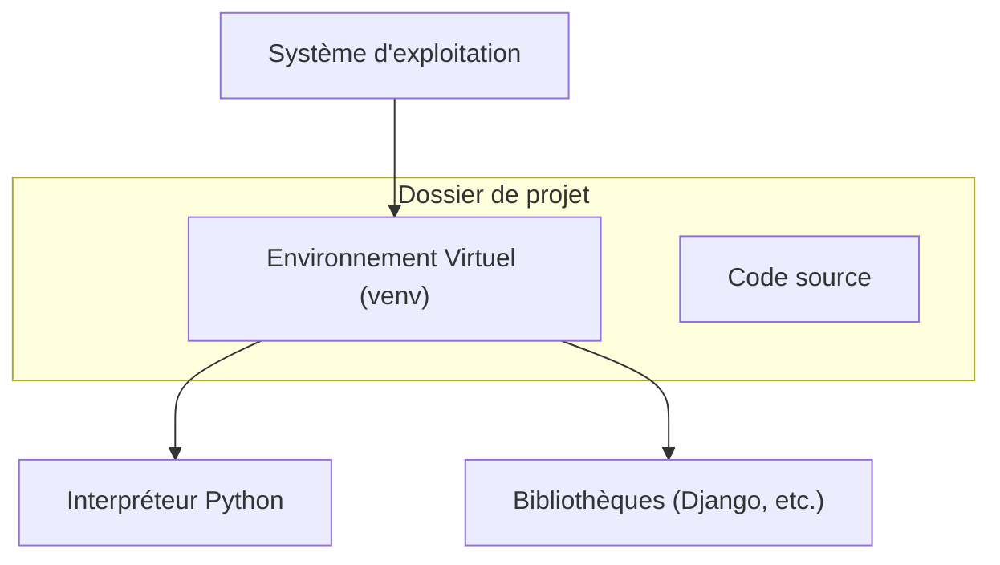

# Chapitre 1 : Installation et environnement de développement {#chapitre-1-installation-et-environnement-de-développement-1}

Python, Environnement virtuel, Pip, Django, Gestion des dépendances

## Architecture de l'environnement {#architecture-de-l-environnement-1}



## Python et Environnement Virtuel {#python-et-environnement-virtuel-1}

### 1. Quoi
Un **environnement virtuel** est un répertoire isolé qui contient une installation spécifique de Python et un ensemble de bibliothèques indépendantes du système global.

### 2. Pourquoi
Il permet d'éviter les conflits de versions entre différents projets. Si le Projet A nécessite Django 4.2 et le Projet B Django 5.0, les environnements virtuels permettent de faire cohabiter ces versions sans risque.

### 3. Comment
A. **Création de l'environnement** :
```bash
# Créer le dossier de l'environnement virtuel nommé 'venv'
python -m venv venv
```

B. **Activation** :
- Sur Windows : `venv\Scripts\activate`
- Sur macOS/Linux : `source venv/bin/activate`

C. **Vérification** :
Une fois activé, votre terminal affichera `(venv)` au début de la ligne. Vous pouvez vérifier la version de Python avec `python --version`.

### 4. Zone de Danger
❌ **À ne pas faire** : Installer des bibliothèques avec `pip` sans avoir activé l'environnement virtuel (cela pollue l'installation globale de Python).
✅ **Bonne Pratique** : Toujours vérifier la présence du préfixe `(venv)` dans votre terminal avant d'exécuter une commande `pip`.

> 📸 **CAPTURE D'ÉCRAN REQUISE**
> **Sujet** : Terminal affichant l'activation réussie de l'environnement virtuel avec le préfixe (venv).
> **Alt Text** : Terminal montrant la commande d'activation et le prompt modifié.

## Installation de Django {#installation-de-django-1}

### 1. Quoi
**Django** est un framework web Python de haut niveau. L'installation se fait via `pip`, le gestionnaire de paquets officiel de Python.

### 2. Pourquoi
Installer Django dans l'environnement virtuel garantit que votre projet possède toutes les dépendances nécessaires pour fonctionner de manière autonome.

### 3. Comment
A. **Installation** :
```bash
# Installation de la dernière version stable
pip install django
```

B. **Configuration et vérification** :
```bash
# Vérifier que Django est bien installé
python -m django --version
```

### 4. Zone de Danger
❌ **À ne pas faire** : Installer Django avec `sudo pip install django` sur Linux/macOS.
✅ **Bonne Pratique** : Utiliser un fichier `requirements.txt` pour lister vos dépendances (`pip freeze > requirements.txt`) afin de faciliter le déploiement.

## Questions clés (validation des acquis du chapitre) {#questions-clés-(validation-des-acquis-du-chapitre)-1}

1. **Pourquoi est-il crucial d'utiliser un environnement virtuel pour chaque projet Django ?**
   *Réponse : Pour isoler les dépendances et éviter les conflits de versions entre différents projets sur la même machine.*

2. **Quelle commande permet de créer un environnement virtuel ?**
   *Réponse : `python -m venv <nom_du_dossier>`.*

3. **Comment vérifier que Django est correctement installé dans votre environnement ?**
   *Réponse : En exécutant `python -m django --version` dans un terminal où l'environnement est activé.*