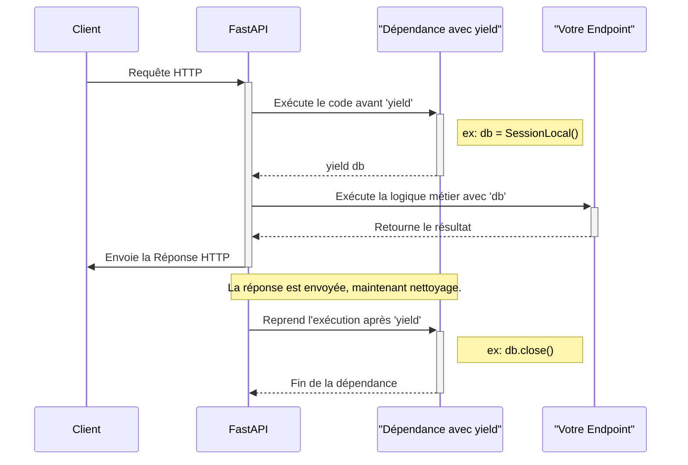

# Dépendances avec 'yield' pour la Gestion de Ressources {#dependances-avec-yield-pour-la-gestion-de-ressources-18}

Les dépendances classiques sont parfaites pour fournir une valeur à un endpoint. Mais que se passe-t-il si vous avez besoin d'exécuter une action de "nettoyage" *après* que la réponse a été envoyée ? Le cas le plus courant est la gestion des connexions à une base de données : il faut ouvrir une session au début de la requête et la fermer à la fin, quoi qu'il arrive.

FastAPI offre une solution élégante et puissante pour ce scénario en permettant aux dépendances d'utiliser le mot-clé `yield`. Une telle dépendance devient un générateur qui peut non seulement fournir une ressource, mais aussi reprendre son exécution pour la nettoyer proprement.



## Concept 1 : Le Modèle "Setup and Teardown" avec `yield` {#concept-1-le-modele-setup-and-teardown-avec-yield-18}

### Quoi ? {#quoi-18}
Une dépendance peut être une fonction "générateur" contenant une seule instruction `yield`.
-   Le code **avant `yield`** est exécuté avant que la requête ne soit traitée par votre endpoint. C'est la phase de "setup".
-   La valeur fournie par `yield` est injectée dans votre endpoint.
-   Le code **après `yield`** est exécuté *après* que la réponse a été générée et envoyée. C'est la phase de "teardown" ou nettoyage.

Pour garantir que le nettoyage a toujours lieu, même si une erreur se produit dans l'endpoint, ce code est généralement placé dans un bloc `finally`.

### Pourquoi ? {#pourquoi-18}
-   **Gestion Robuste des Ressources :** C'est la méthode recommandée pour gérer des ressources comme les connexions de base de données, les transactions, ou les verrous (locks). Elle garantit que les ressources sont libérées correctement, prévenant les fuites.
-   **Encapsulation de la Logique :** La logique d'ouverture et de fermeture d'une ressource est centralisée dans la dépendance, rendant les endpoints plus propres et focalisés sur leur mission.
-   **Contexte de la Requête :** Cela imite le comportement d'un "gestionnaire de contexte" (`with` statement) mais à l'échelle d'une requête HTTP.

### Comment (Syntaxe + Cas Réel) ? {#comment-syntaxe--cas-reel-18}
On définit une fonction avec `yield` et on l'utilise avec `Depends` comme n'importe quelle autre dépendance.

**Cas Réel : Gérer une session de base de données (simulation)**

```python
from fastapi import FastAPI, Depends

app = FastAPI()

# Simulation d'une session de base de données
class DBSession:
    def __init__(self):
        print("--- Connexion à la base de données ouverte ---")
        self.closed = False
    
    def close(self):
        print("--- Connexion à la base de données fermée ---")
        self.closed = True

# Notre dépendance avec yield
def get_db():
    db = DBSession()
    try:
        yield db  # Ici, la valeur 'db' est fournie à l'endpoint
    finally:
        # Ce code s'exécute après que la réponse est envoyée
        db.close()

@app.get("/items/{item_id}")
async def read_item(item_id: int, db: DBSession = Depends(get_db)):
    # L'objet 'db' que nous recevons ici est l'instance créée dans get_db
    if db.closed:
        # Ceci ne devrait jamais arriver
        return {"item_id": item_id, "status": "Erreur: la DB est fermée !"}
        
    print(f"Logique métier pour l'item {item_id}...")
    return {"item_id": item_id, "status": "Item récupéré avec succès"}
```
Lorsque vous appelez cet endpoint, la console de votre serveur affichera :
1.  `--- Connexion à la base de données ouverte ---`
2.  `Logique métier pour l'item 123...`
3.  `--- Connexion à la base de données fermée ---`

L'ordre prouve que le nettoyage se produit bien après l'exécution de la logique métier.

### Zone de Danger {#zone-de-danger-18}
Le code après `yield` est exécuté **après** l'envoi de la réponse. Par conséquent, si vous levez une `HTTPException` dans le bloc `finally`, elle ne sera pas envoyée au client. Ce code doit être réservé exclusivement au nettoyage et à la journalisation interne, et non à la communication avec le client.

---

## Concept 2 : Dépendances Asynchrones avec `yield` {#concept-2-dependances-asynchrones-avec-yield-18}

### Quoi ? {#quoi-19}
Ce puissant modèle fonctionne également de manière transparente avec les dépendances asynchrones. Vous pouvez définir votre dépendance avec `async def` et utiliser `await` pour les opérations de setup et de teardown non-bloquantes.

### Pourquoi ? {#pourquoi-19}
C'est essentiel lorsque vous travaillez avec des bibliothèques de bases de données modernes et asynchrones (comme `asyncpg` pour PostgreSQL, `motor` pour MongoDB, ou `SQLAlchemy` en mode asynchrone). Cela vous permet de gérer les connexions sans jamais bloquer la boucle d'événements (event loop) de votre application, maintenant ainsi des performances élevées.

### Comment (Syntaxe + Cas Réel) ? {#comment-syntaxe--cas-reel-19}
La syntaxe est une combinaison naturelle de `async/await` et du `yield` que nous venons de voir.

**Cas Réel : Gérer un client de DB asynchrone (simulation)**

```python
import asyncio
from fastapi import FastAPI, Depends

app = FastAPI()

# Simulation d'un client de DB asynchrone
class AsyncDBClient:
    async def connect(self):
        print("--- [Async] Connexion au client DB...")
        await asyncio.sleep(0.1) # Simule une opération réseau
        print("--- [Async] Client connecté ---")

    async def close(self):
        print("--- [Async] Fermeture du client DB...")
        await asyncio.sleep(0.1) # Simule une opération réseau
        print("--- [Async] Client fermé ---")

# Dépendance asynchrone avec yield
async def get_async_db():
    client = AsyncDBClient()
    try:
        await client.connect()
        yield client
    finally:
        await client.close()

@app.get("/data")
async def get_data(db: AsyncDBClient = Depends(get_async_db)):
    print("Logique métier asynchrone utilisant le client DB...")
    await asyncio.sleep(0.5)
    return {"data": "some async data"}
```
L'exécution de cet endpoint montrera que les étapes `connect` et `close` sont bien attendues (`await`) et s'exécutent au bon moment, sans bloquer le serveur.

### Zone de Danger {#zone-de-danger-20}
Assurez-vous d'utiliser `await` pour toutes les opérations asynchrones, y compris dans le bloc `finally`. Oublier un `await` (par exemple, appeler `client.close()` au lieu de `await client.close()`) est une erreur courante qui empêchera le nettoyage de s'exécuter correctement et provoquera un avertissement (`RuntimeWarning: coroutine ... was never awaited`).

---

### 3 Questions Clés {#3-questions-cles-18}
1.  Quel est l'objectif principal de l'utilisation de `yield` dans une dépendance FastAPI ?
2.  Dans une dépendance avec `yield`, à quel moment précis le code situé *après* l'instruction `yield` est-il exécuté ?
3.  Pourquoi est-il crucial d'utiliser un bloc `try...finally` dans une dépendance avec `yield` qui gère une ressource externe ?

### 3 Exercices Progressifs {#3-exercices-progressifs-18}

**Exercice 1 : Chronométrer une Requête**
Créez une dépendance `request_timer` qui utilise `yield`.
-   Avant le `yield`, elle doit enregistrer l'heure de début (`time.monotonic()`).
-   Après le `yield`, elle doit enregistrer l'heure de fin, calculer la durée, et afficher un message comme `"Durée de la requête: 0.512s"`.
-   Appliquez cette dépendance à un endpoint qui simule un travail en attendant 0.5 seconde (`asyncio.sleep(0.5)`).

<details>
<summary>Découvrir la solution commentée</summary>

```python
import time
import asyncio
from fastapi import FastAPI, Depends

app = FastAPI()

async def request_timer():
    start_time = time.monotonic()
    try:
        yield
    finally:
        duration = time.monotonic() - start_time
        print(f"Durée de la requête: {duration:.3f}s")

@app.get("/slow-operation", dependencies=[Depends(request_timer)])
async def slow_operation():
    await asyncio.sleep(0.5)
    return {"status": "complete"}
```
*Note : Pour les dépendances qui n'ont pas besoin de retourner une valeur, on peut les appliquer au niveau de l'opération de chemin avec `dependencies=[...]`. Le `yield` simple (sans valeur) est tout à fait valide.*
</details>

**Exercice 2 : Gestion de Fichier Temporaire**
Créez une dépendance `temp_file_manager`.
-   Avant le `yield`, elle doit créer un fichier temporaire (ex: `temp_log.txt`) et l'ouvrir en mode écriture.
-   Elle doit `yield` le handle du fichier.
-   Après le `yield`, elle doit fermer le fichier et le supprimer.
-   Créez un endpoint `/log` qui utilise cette dépendance pour écrire un message dans le fichier.

<details>
<summary>Découvrir la solution commentée</summary>

```python
import os
from fastapi import FastAPI, Depends
from typing import TextIO

app = FastAPI()

TEMP_FILENAME = "temp_log.txt"

def temp_file_manager() -> TextIO:
    # Setup: ouvrir le fichier
    file_handle = open(TEMP_FILENAME, "w")
    try:
        # Fournir le handle au endpoint
        yield file_handle
    finally:
        # Teardown: fermer et supprimer le fichier
        print(f"Fermeture et suppression du fichier '{TEMP_FILENAME}'")
        file_handle.close()
        os.remove(TEMP_FILENAME)

@app.post("/log")
async def log_message(message: str, log_file: TextIO = Depends(temp_file_manager)):
    log_file.write(f"LOG: {message}\n")
    return {"message": "Message logged"}
```
*Cet exercice montre la gestion d'une ressource non-réseau. Après la requête, le fichier `temp_log.txt` aura bien été supprimé du disque.*
</details>

**Exercice 3 : Simulation de Transaction DB avec Rollback**
Créez une dépendance `db_transaction` qui simule une transaction de base de données.
-   Elle doit `yield` un objet "session" factice (un simple dictionnaire).
-   Utilisez un bloc `try...except...finally`.
-   Dans le `try`, faites le `yield`.
-   Dans le `except`, imprimez `"--- TRANSACTION ROLLED BACK ---"`.
-   Si aucune exception n'est levée, imprimez `"--- TRANSACTION COMMITTED ---"` juste avant le `finally`.
-   Dans le `finally`, imprimez `"--- SESSION CLOSED ---"`.
-   Créez deux endpoints : `/success` qui réussit, et `/fail` qui lève une `HTTPException`. Observez la sortie de la console pour chacun.

<details>
<summary>Découvrir la solution commentée</summary>

```python
from fastapi import FastAPI, Depends, HTTPException

app = FastAPI()

async def db_transaction():
    session = {}
    print("--- SESSION OPENED, TRANSACTION BEGUN ---")
    try:
        yield session
    except Exception:
        print("--- TRANSACTION ROLLED BACK ---")
        # On relève l'exception pour que FastAPI puisse la gérer normalement
        raise
    else:
        # Ce bloc 'else' s'exécute uniquement si aucune exception n'a été levée
        print("--- TRANSACTION COMMITTED ---")
    finally:
        print("--- SESSION CLOSED ---")

@app.get("/success")
async def transaction_success(session: dict = Depends(db_transaction)):
    session["data"] = "some important data"
    return {"status": "Success"}

@app.get("/fail")
async def transaction_fail(session: dict = Depends(db_transaction)):
    session["data"] = "some partial data"
    raise HTTPException(status_code=500, detail="Something went wrong")

```
*Cet exercice illustre le modèle le plus complet et robuste. Pour `/success`, vous verrez COMMIT puis CLOSE. Pour `/fail`, vous verrez ROLLBACK puis CLOSE, démontrant que le nettoyage est toujours assuré et que la logique de transaction est correcte.*
</details>