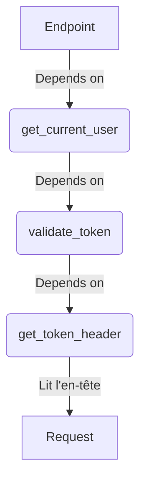

# Injection de Dépendances (Dependency Injection) : Fondamentaux {#injection-de-dependances-dependency-injection--fondamentaux-17}

L'injection de dépendances (DI) est l'une des fonctionnalités les plus puissantes et les plus innovantes de FastAPI. C'est un concept d'ingénierie logicielle qui peut sembler intimidant, mais que FastAPI rend incroyablement simple et intuitif.

Le principe de base est de découpler votre code. Au lieu que votre fonction d'endpoint crée elle-même tout ce dont elle a besoin (une connexion à la base de données, l'utilisateur authentifié, des paramètres de pagination...), elle déclare simplement ses "dépendances". Le framework se charge alors de "fournir" ou "injecter" ces dépendances avant même que le code de votre endpoint ne s'exécute.

```mermaid
graph TD
    subgraph FastAPI
        D[Depends(get_db_session)]
        E[Depends(get_current_user)]
    end

    subgraph "Votre Code"
        F[Fonction d'endpoint]
    end

    A[Requête entrante] --> D
    A --> E
    
    D -- "Instance de DB" --> F
    E -- "Objet User" --> F
    
    F -- "Logique métier..." --> G[Réponse HTTP]
```

## Concept 1 : `Depends`, la Fonction Magique {#concept-1-depends-la-fonction-magique-17}

### Quoi ? {#quoi-17}
`Depends` est un "marqueur" que vous placez dans les paramètres de votre fonction d'opération de chemin. Il prend en argument une autre fonction, appelée "dépendance" ou "fournisseur". FastAPI exécutera cette fonction de dépendance, prendra la valeur qu'elle retourne, et la passera en argument à votre fonction d'endpoint.

### Pourquoi ? {#pourquoi-17}
-   **Réutilisation du Code :** La logique partagée (comme la gestion des paramètres de pagination, la vérification d'une clé API) peut être extraite dans une seule fonction et réutilisée dans des dizaines d'endpoints.
-   **Séparation des Préoccupations :** Votre logique d'endpoint se concentre sur le métier, tandis que les dépendances gèrent les aspects transverses comme l'authentification, la connexion à la base de données, etc.
-   **Testabilité Améliorée :** Il devient très facile de remplacer une dépendance par une version "mock" (factice) lors des tests. Par exemple, vous pouvez remplacer `get_current_user` par une fonction qui retourne un utilisateur de test, sans avoir à simuler un processus de connexion complet.
-   **Intégration avec l'OpenAPI :** Les paramètres des fonctions de dépendance (comme les paramètres de requête ou les en-têtes) sont automatiquement ajoutés à la documentation de votre API.

### Comment (Syntaxe + Cas Réel) ? {#comment-syntaxe--cas-reel-17}
On utilise `Depends` comme valeur par défaut d'un paramètre de fonction. FastAPI sait qu'il ne s'agit pas d'une valeur normale, mais d'une instruction pour exécuter la fonction fournie.

**Cas Réel : Centraliser la gestion de la pagination**
Beaucoup d'endpoints qui retournent des listes ont besoin de paramètres `skip` et `limit`. Au lieu de les répéter partout, créons une dépendance.

```python
from fastapi import FastAPI, Depends
from typing import Optional

app = FastAPI()

# La fonction de dépendance. Elle peut prendre ses propres paramètres.
def pagination_params(skip: int = 0, limit: int = 100):
    return {"skip": skip, "limit": limit}

@app.get("/items/")
# On déclare que notre endpoint dépend de 'pagination_params'.
# 'pagination' sera le dictionnaire retourné par la dépendance.
async def read_items(pagination: dict = Depends(pagination_params)):
    # ... logique pour récupérer les items en utilisant pagination["skip"] et pagination["limit"]
    return {"message": f"Fetching items from {pagination['skip']} to {pagination['skip'] + pagination['limit']}"}

@app.get("/users/")
# On réutilise la même dépendance ici !
async def read_users(pagination: dict = Depends(pagination_params)):
    return {"message": f"Fetching users with limit {pagination['limit']}"}
```
Dans la documentation Swagger, les paramètres `skip` et `limit` apparaîtront pour les deux endpoints, même s'ils ne sont pas déclarés directement dans leurs signatures.

> 📸 **CAPTURE D'ÉCRAN REQUISE**
> **Sujet** : Documentation Swagger UI de l'endpoint `/items/`.
> **Alt Text** : Interface Swagger montrant les paramètres de requête "skip" (avec 0 par défaut) et "limit" (avec 100 par défaut) pour l'endpoint `/items/`, prouvant que les paramètres de la dépendance ont été intégrés.

### Zone de Danger {#zone-de-danger-17}
Une erreur fréquente est d'appeler la fonction à l'intérieur de `Depends`.
-   **MAUVAIS :** `pagination: dict = Depends(pagination_params())`
-   **BON :** `pagination: dict = Depends(pagination_params)`

Vous devez passer la fonction elle-même, pas le résultat de son appel. FastAPI se charge de l'appeler.

---

## Concept 2 : Hiérarchie des Dépendances {#concept-2-hierarchie-des-dependances-17}

### Quoi ? {#quoi-18}
Une dépendance peut elle-même dépendre d'autres dépendances. FastAPI est capable de comprendre cet arbre de dépendances et de résoudre chaque maillon dans le bon ordre.

### Pourquoi ? {#pourquoi-18}
Cela permet de construire des logiques complexes et modulaires. Un cas d'usage classique est la sécurité :
1.  Un endpoint a besoin de l'utilisateur courant (`get_current_user`).
2.  Pour obtenir l'utilisateur, il faut valider son token (`validate_token`).
3.  Pour valider le token, il faut d'abord l'extraire de l'en-tête `Authorization` (`get_token_header`).

Cette chaîne de responsabilités est parfaitement modélisée par une hiérarchie de dépendances.



### Comment (Syntaxe + Cas Réel) ? {#comment-syntaxe--cas-reel-18}
La syntaxe est la même. Vous utilisez simplement `Depends` dans la signature d'une autre fonction de dépendance.

**Cas Réel : Vérifier un token et un statut d'administrateur**

```python
from fastapi import FastAPI, Depends, Header, HTTPException, status

app = FastAPI()

# 1. Dépendance de plus bas niveau : extraire le token
async def get_token_header(x_token: str = Header(...)):
    if x_token != "fake-super-secret-token":
        raise HTTPException(status_code=400, detail="X-Token header invalid")
    return x_token

# 2. Dépendance intermédiaire : valider le statut admin (qui dépend du token)
async def is_admin_user(token: str = Depends(get_token_header)):
    if token != "fake-super-secret-token": # Logique de validation plus complexe ici
        raise HTTPException(status_code=403, detail="Not an admin user")
    # Pourrait retourner un objet User, ici on ne retourne rien (juste valide)
    return True 

@app.post("/admin/items")
# 3. L'endpoint dépend de la validation admin
async def create_admin_item(is_admin: bool = Depends(is_admin_user)):
    return {"message": "Admin item created successfully!"}
```
FastAPI va d'abord appeler `get_token_header`. Si elle réussit, il passe son résultat (`token`) à `is_admin_user`. Si celle-ci réussit, il appelle enfin `create_admin_item`. Si une dépendance échoue (lève une `HTTPException`), la chaîne est rompue et la réponse d'erreur est immédiatement envoyée.

### Zone de Danger {#zone-de-danger-19}
**Dépendances circulaires :** Si la dépendance A dépend de B, et que B dépend de A, FastAPI le détectera au démarrage et lèvera une erreur. Assurez-vous que votre graphe de dépendances est bien un graphe orienté acyclique (DAG).

---

## Concept 3 : Partager des Instances avec `use_cache` {#concept-3-partager-des-instances-avec-use_cache-17}

### Quoi ? {#quoi-20}
Par défaut, si plusieurs dépendances dans la même chaîne dépendent de la même fonction, FastAPI appellera cette fonction plusieurs fois. En passant `use_cache=True` à `Depends`, vous demandez à FastAPI d'exécuter la dépendance une seule fois par requête et de mettre en cache son résultat. Les appels suivants à `Depends` pour cette même dépendance dans la même requête réutiliseront la valeur en cache.

### Pourquoi ? {#pourquoi-20}
-   **Performance :** Évite d'exécuter plusieurs fois une opération coûteuse (comme un appel réseau ou un calcul complexe) au sein d'une seule et même requête.
-   **Consistance :** Garantit que différentes parties de votre logique travaillent avec la même instance d'un objet (par exemple, un objet de configuration ou un utilisateur récupéré de la base de données).

### Comment (Syntaxe + Cas Réel) ? {#comment-syntaxe--cas-reel-20}
Il suffit d'ajouter `use_cache=True` dans la fonction `Depends`.

**Cas Réel : Éviter un calcul redondant**
Imaginons un calcul coûteux dont deux parties différentes d'un rapport ont besoin.

```python
from fastapi import FastAPI, Depends

app = FastAPI()

# Dépendance coûteuse
async def expensive_computation():
    print("--- Running expensive computation... ---")
    return {"result": 42}

# Dépendance qui a besoin du calcul
async def get_report_summary(data: dict = Depends(expensive_computation)):
    return {"summary": f"The result is {data['result']}"}

# Autre dépendance qui a aussi besoin du calcul
async def get_report_details(data: dict = Depends(expensive_computation)):
    return {"details": f"Based on the result {data['result']}, we can conclude..."}

# Sans use_cache (comportement par défaut)
@app.get("/report-slow")
async def get_slow_report(
    summary: dict = Depends(get_report_summary), 
    details: dict = Depends(get_report_details)
):
    # La console affichera "--- Running expensive computation... ---" DEUX FOIS
    return {**summary, **details}

# Pour optimiser, les sous-dépendances doivent utiliser le cache
async def get_report_summary_cached(data: dict = Depends(expensive_computation, use_cache=True)):
    return {"summary": f"The result is {data['result']}"}

async def get_report_details_cached(data: dict = Depends(expensive_computation, use_cache=True)):
    return {"details": f"Based on the result {data['result']}, we can conclude..."}

@app.get("/report-fast")
async def get_fast_report(
    summary: dict = Depends(get_report_summary_cached),
    details: dict = Depends(get_report_details_cached)
):
    # La console affichera "--- Running expensive computation... ---" UNE SEULE FOIS
    return {**summary, **details}
```

### Zone de Danger {#zone-de-danger-21}
Le cache de `use_cache` est strictement **limité à la durée de vie d'une seule requête**. Ce n'est pas un cache global pour l'application (comme Redis ou Memcached). Chaque nouvelle requête réexécutera la dépendance.

---

### 3 Questions Clés {#3-questions-cles-17}
1.  Quel est l'avantage principal de l'injection de dépendances pour la testabilité du code ?
2.  Décrivez un scénario où une hiérarchie de dépendances est utile.
3.  Quelle est la portée (scope) du cache activé par `use_cache=True` dans `Depends` ?

### 3 Exercices Progressifs {#3-exercices-progressifs-17}

**Exercice 1 : Filtres de Recherche Communs**
Créez une dépendance `filtering_params` qui accepte deux paramètres de requête optionnels : `status: Optional[str]` et `priority: Optional[int]`. La dépendance doit retourner un dictionnaire contenant uniquement les paramètres qui ont été fournis. Créez deux endpoints, `/tickets` et `/tasks`, qui utilisent cette dépendance pour afficher les filtres reçus.

<details>
<summary>Découvrir la solution commentée</summary>

```python
from fastapi import FastAPI, Depends
from typing import Optional

app = FastAPI()

def filtering_params(status: Optional[str] = None, priority: Optional[int] = None):
    filters = {}
    if status:
        filters["status"] = status
    if priority is not None: # Vérifier 'is not None' car 0 est une priorité valide
        filters["priority"] = priority
    return filters

@app.get("/tickets")
async def get_tickets(filters: dict = Depends(filtering_params)):
    return {"retrieving": "tickets", "filters": filters}

@app.get("/tasks")
async def get_tasks(filters: dict = Depends(filtering_params)):
    return {"retrieving": "tasks", "filters": filters}
```
</details>

**Exercice 2 : Vérification de Clé API**
Construisez une hiérarchie de dépendances pour la sécurité :
1.  Une dépendance `get_api_key` qui extrait une clé de l'en-tête `X-API-Key`. Si l'en-tête est manquant, elle lève une `HTTPException` 403.
2.  Une dépendance `is_api_key_valid` qui *dépend de `get_api_key`*. Elle vérifie si la clé reçue est égale à "my-secret-api-key". Si non, elle lève une `HTTPException` 403.
3.  Un endpoint `/secure-data` qui dépend de `is_api_key_valid` pour se protéger.

<details>
<summary>Découvrir la solution commentée</summary>

```python
from fastapi import FastAPI, Depends, Header, HTTPException, status

app = FastAPI()

# Dépendance de niveau 1
async def get_api_key(x_api_key: str = Header(...)):
    if not x_api_key:
        raise HTTPException(
            status_code=status.HTTP_403_FORBIDDEN, detail="X-API-Key header is required"
        )
    return x_api_key

# Dépendance de niveau 2, qui dépend de la première
async def is_api_key_valid(api_key: str = Depends(get_api_key)):
    if api_key != "my-secret-api-key":
        raise HTTPException(
            status_code=status.HTTP_403_FORBIDDEN, detail="Invalid API Key"
        )
    return True

@app.get("/secure-data")
async def get_secure_data(is_valid: bool = Depends(is_api_key_valid)):
    return {"data": "You are accessing secure data."}
```
</details>

**Exercice 3 : Optimiser la Récupération de Données**
Simulez la récupération d'un objet "projet" depuis une base de données, une opération que vous voulez effectuer une seule fois par requête.
-   Créez une dépendance `get_project(project_id: str)` qui imprime "Fetching project {project_id} from DB..." et retourne un dictionnaire `{"id": project_id, "name": "My Project"}`.
-   Créez deux autres dépendances : `get_project_name(project: dict = Depends(get_project))` et `get_project_id(project: dict = Depends(get_project))`.
-   Créez un endpoint `/projects/{project_id}/info` qui dépend de `get_project_name` et `get_project_id`.
-   Modifiez les dépendances pour que le message "Fetching project..." ne s'affiche qu'une seule fois lorsque vous appelez l'endpoint.

<details>
<summary>Découvrir la solution commentée</summary>

```python
from fastapi import FastAPI, Depends

app = FastAPI()

# La dépendance "coûteuse"
async def get_project(project_id: str):
    print(f"--- Fetching project {project_id} from DB... ---")
    return {"id": project_id, "name": "My Project"}

# Les dépendances intermédiaires doivent utiliser le cache pour la dépendance commune
async def get_project_name(project: dict = Depends(get_project, use_cache=True)):
    return {"project_name": project["name"]}

async def get_project_id(project: dict = Depends(get_project, use_cache=True)):
    return {"project_id": project["id"]}

@app.get("/projects/{project_id}/info")
async def get_project_info(
    name_info: dict = Depends(get_project_name),
    id_info: dict = Depends(get_project_id)
):
    # Grâce à use_cache=True dans les dépendances intermédiaires, get_project
    # ne sera appelée qu'une seule fois.
    return {**name_info, **id_info}
```
</details>