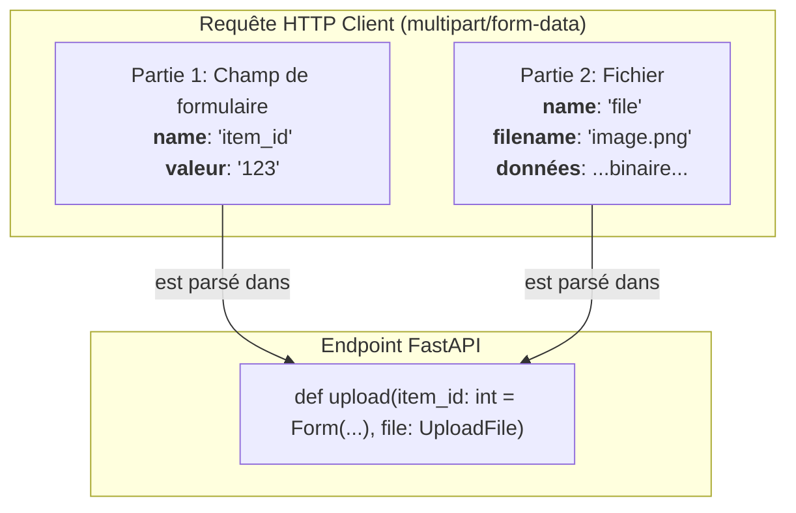

# Téléchargement de Fichiers (File Uploads) {#telechargement-de-fichiers-file-uploads-23}

Le téléchargement de fichiers est une fonctionnalité fondamentale pour de nombreuses applications web, qu'il s'agisse d'avatars d'utilisateurs, de documents ou de tout autre type de média. FastAPI gère le téléversement de fichiers en utilisant le même mécanisme que les données de formulaire, car les fichiers sont envoyés via le type de contenu `multipart/form-data`.

Il offre des outils puissants et efficaces pour recevoir des fichiers, accéder à leurs métadonnées et les traiter, tout en étant attentif à la performance et à l'utilisation de la mémoire.

## Prérequis : Installation {#prerequis--installation-23}

Comme pour les données de formulaire, vous devez d'abord installer la bibliothèque `python-multipart` :

```bash
pip install python-multipart
```

FastAPI utilise cette bibliothèque en coulisses pour parser les données `multipart`.

## Concept 1 : `UploadFile` pour des Téléchargements Robustes {#concept-1-uploadfile-pour-des-telechargements-robustes-23}

### Quoi ? {#quoi-23}
Plutôt que de charger le contenu entier d'un fichier en mémoire sous forme de `bytes`, FastAPI propose un type plus avancé : `UploadFile`. C'est l'approche recommandée.

Un objet `UploadFile` n'est pas le fichier lui-même, mais une interface (un "spooled file") qui possède plusieurs avantages et attributs utiles :
-   `filename`: Le nom du fichier original envoyé par le client (ex: `"mon_avatar.jpg"`).
-   `content_type`: Le type MIME du fichier (ex: `"image/jpeg"`).
-   `file`: Un objet fichier asynchrone. Vous pouvez utiliser `.read()`, `.write()`, `.seek()`.
-   **Gestion de la mémoire :** Pour les petits fichiers, il garde le contenu en mémoire. Pour les fichiers plus volumineux, il le stocke temporairement sur le disque, protégeant ainsi votre serveur de la saturation de la mémoire.

### Pourquoi ? {#pourquoi-23}
Utiliser `UploadFile` est crucial pour la stabilité et la performance de votre application. Si vous utilisiez `bytes = File(...)`, un utilisateur téléversant un fichier de 2 Go consommerait 2 Go de la RAM de votre serveur, pouvant entraîner un crash. `UploadFile` évite ce problème en gérant intelligemment le stockage des données.

### Comment (Syntaxe + Cas Réel) ? {#comment-syntaxe--cas-reel-23}
On déclare le paramètre de la fonction avec le type `UploadFile`, et FastAPI s'occupe du reste.

**Cas Réel : Téléverser et sauvegarder l'avatar d'un utilisateur**

```python
import shutil
from fastapi import FastAPI, UploadFile, File

app = FastAPI()

@app.post("/upload/avatar/")
async def upload_avatar(file: UploadFile = File(...)):
    # Le chemin où sauvegarder le fichier.
    # Dans une vraie app, ce chemin serait plus robuste (ex: /var/data/uploads).
    file_location = f"uploads/{file.filename}"
    
    # On ouvre un fichier en écriture binaire (wb) et on y copie le contenu du fichier uploadé.
    with open(file_location, "wb") as buffer:
        shutil.copyfileobj(file.file, buffer)
        
    return {
        "filename": file.filename,
        "content_type": file.content_type,
        "saved_path": file_location
    }
```
Dans la documentation Swagger UI, cet endpoint affichera un bouton "Choose File" permettant de sélectionner un fichier depuis votre ordinateur.

> 📸 **CAPTURE D'ÉCRAN REQUISE**
> **Sujet** : Documentation Swagger UI de l'endpoint `/upload/avatar/`.
> **Alt Text** : Interface Swagger montrant l'endpoint POST /upload/avatar/ avec un corps de requête de type "multipart/form-data" et un champ permettant de sélectionner un fichier.

### Zone de Danger {#zone-de-danger-23}
**Ne jamais faire confiance au `filename` ou au `content_type` !** Un attaquant peut manipuler ces valeurs. Il peut nommer un fichier `../../etc/passwd` (tentative de Path Traversal) ou donner un `content_type` de `image/jpeg` à un fichier exécutable malveillant. Validez et nettoyez toujours le nom du fichier et vérifiez le type de fichier réel côté serveur si la sécurité est une préoccupation.

---

## Concept 2 : Télécharger Plusieurs Fichiers {#concept-2-telecharger-plusieurs-fichiers-23}

### Quoi ? {#quoi-24}
Pour accepter plusieurs fichiers envoyés sous le même nom de champ, vous pouvez utiliser le type `List[UploadFile]`. Le client peut alors sélectionner plusieurs fichiers dans le champ de téléversement, ou envoyer plusieurs parties `multipart` avec le même `name`.

### Pourquoi ? {#pourquoi-24}
C'est un cas d'usage très fréquent pour les galeries d'images, le traitement de documents en lot, ou toute fonctionnalité où un utilisateur doit fournir plusieurs fichiers en une seule action.

### Comment (Syntaxe + Cas Réel) ? {#comment-syntaxe--cas-reel-24}
Il suffit d'utiliser le type `List` du module `typing`.

**Cas Réel : Téléverser les photos d'une galerie**

```python
from typing import List
from fastapi import FastAPI, UploadFile, File

app = FastAPI()

@app.post("/upload/gallery/")
async def upload_gallery(files: List[UploadFile] = File(...)):
    uploaded_filenames = []
    for file in files:
        # Ici, vous traiteriez chaque fichier (sauvegarde, redimensionnement, etc.)
        print(f"Processing {file.filename}...")
        uploaded_filenames.append(file.filename)
        
    return {
        "message": f"Successfully uploaded {len(files)} files.",
        "filenames": uploaded_filenames
    }
```

### Zone de Danger {#zone-de-danger-25}
Soyez conscient du potentiel d'abus. Un utilisateur pourrait tenter de téléverser des milliers de fichiers en une seule requête, ou des fichiers très volumineux, ce qui pourrait épuiser les ressources de votre serveur (CPU, disque, bande passante). Il est sage de mettre en place des limites, soit au niveau de votre serveur web (ex: `client_max_body_size` dans Nginx) soit avec une logique applicative qui vérifie le nombre de fichiers ou leur taille totale.

---

## Concept 3 : Fichiers avec des Métadonnées (`Form`) {#concept-3-fichiers-avec-des-metadonnees-form-23}

### Quoi ? {#quoi-26}
Vous pouvez combiner le téléversement de fichiers avec d'autres champs de formulaire classiques. FastAPI détecte automatiquement que la requête est de type `multipart/form-data` et parse à la fois les fichiers et les champs de formulaire.



### Pourquoi ? {#pourquoi-26}
Il est rare qu'un fichier soit téléversé sans contexte. On a souvent besoin d'associer des métadonnées : l'ID de l'utilisateur qui téléverse, une description pour l'image, une catégorie pour le document, etc. Cette méthode permet de tout envoyer en une seule requête atomique.

### Comment (Syntaxe + Cas Réel) ? {#comment-syntaxe--cas-reel-26}
On déclare simplement des paramètres `UploadFile` à côté de paramètres utilisant `Form`.

**Cas Réel : Téléverser un document avec sa description**

```python
from fastapi import FastAPI, UploadFile, File, Form

app = FastAPI()

@app.post("/documents/")
async def upload_document(
    file: UploadFile = File(...),
    description: str = Form(...)
):
    # Logique pour sauvegarder le fichier
    file_location = f"uploads/{file.filename}"
    with open(file_location, "wb") as buffer:
        buffer.write(await file.read())

    # Logique pour sauvegarder la description en base de données avec le chemin du fichier
    print(f"Saving metadata: {description}")
    
    return {
        "filename": file.filename,
        "description": description,
        "saved_path": file_location
    }
```

### Zone de Danger {#zone-de-danger-27}
Rappel : dès que vous utilisez `File` ou `Form`, vous ne pouvez plus déclarer de corps de requête JSON avec un modèle Pydantic (`Body`). Le corps de la requête est soit `application/json`, soit `multipart/form-data`, mais pas les deux. Si vous avez besoin d'envoyer une structure JSON complexe avec un fichier, la technique standard est de l'envoyer comme une chaîne de caractères dans un champ de formulaire, puis de la parser manuellement côté serveur avec `json.loads()`.

---

### 3 Questions Clés {#3-questions-cles-23}
1.  Pourquoi est-il généralement préférable d'utiliser `UploadFile` plutôt que `bytes = File(...)` pour gérer les téléversements de fichiers ?
2.  Quelle signature de fonction utiliseriez-vous pour un endpoint qui doit accepter jusqu'à 5 images pour une galerie de produits ?
3.  Comment pouvez-vous recevoir l'ID d'un utilisateur et son fichier d'avatar dans la même requête HTTP ?

### 3 Exercices Progressifs {#3-exercices-progressifs-23}

**Exercice 1 : Simple Analyseur de Fichier**
Créez un endpoint `POST /files/analyze` qui accepte un seul fichier. L'endpoint ne doit pas sauvegarder le fichier, mais plutôt lire son contenu et retourner un JSON contenant son nom (`filename`), son type de contenu (`content_type`), et sa taille en octets.

<details>
<summary>Découvrir la solution commentée</summary>

```python
from fastapi import FastAPI, UploadFile, File

app = FastAPI()

@app.post("/files/analyze")
async def analyze_file(file: UploadFile = File(...)):
    # Lit le contenu entier du fichier en mémoire pour en obtenir la taille.
    # C'est acceptable ici car on ne le stocke pas.
    contents = await file.read()
    size = len(contents)
    
    return {
        "filename": file.filename,
        "content_type": file.content_type,
        "size_bytes": size
    }
```
</details>

**Exercice 2 : Traitement d'un Lot de Fichiers CSV**
Créez un endpoint `POST /csv/process-batch` qui accepte plusieurs fichiers CSV. Pour chaque fichier, l'endpoint doit vérifier si son `content_type` est bien `text/csv`. Il doit retourner une liste des noms de fichiers valides (ceux qui sont des CSV) et une liste des noms de fichiers invalides.

<details>
<summary>Découvrir la solution commentée</summary>

```python
from typing import List
from fastapi import FastAPI, UploadFile, File

app = FastAPI()

@app.post("/csv/process-batch")
async def process_csv_batch(files: List[UploadFile] = File(...)):
    valid_files = []
    invalid_files = []

    for file in files:
        if file.content_type == "text/csv":
            valid_files.append(file.filename)
        else:
            invalid_files.append(file.filename)
            
    return {
        "processed_files": len(files),
        "valid_csv_files": valid_files,
        "invalid_files": invalid_files
    }
```
</details>

**Exercice 3 : Téléversement de Facture avec Métadonnées**
Créez un endpoint `POST /invoices/` pour téléverser des factures au format PDF.
-   Il doit accepter un fichier, et vous devez vérifier que son `content_type` est `application/pdf`. Si ce n'est pas le cas, levez une `HTTPException` 400.
-   Il doit également accepter un `invoice_id` (chaîne de caractères) et un `client_name` (chaîne de caractères) via des champs de formulaire.
-   L'endpoint doit retourner un message de succès confirmant la réception de la facture pour le client spécifié.

<details>
<summary>Découvrir la solution commentée</summary>

```python
from fastapi import FastAPI, UploadFile, File, Form, HTTPException, status

app = FastAPI()

@app.post("/invoices/")
async def upload_invoice(
    invoice_id: str = Form(...),
    client_name: str = Form(...),
    file: UploadFile = File(...)
):
    if file.content_type != "application/pdf":
        raise HTTPException(
            status_code=status.HTTP_400_BAD_REQUEST,
            detail="Invalid file type. Only PDF files are accepted."
        )
    
    # Ici, vous sauvegarderiez le fichier et associeriez les métadonnées
    # dans votre base de données.
    print(f"Received invoice {invoice_id} for client {client_name}. File: {file.filename}")
    
    return {
        "message": f"Invoice '{invoice_id}' for '{client_name}' uploaded successfully.",
        "filename": file.filename
    }
```
</details>