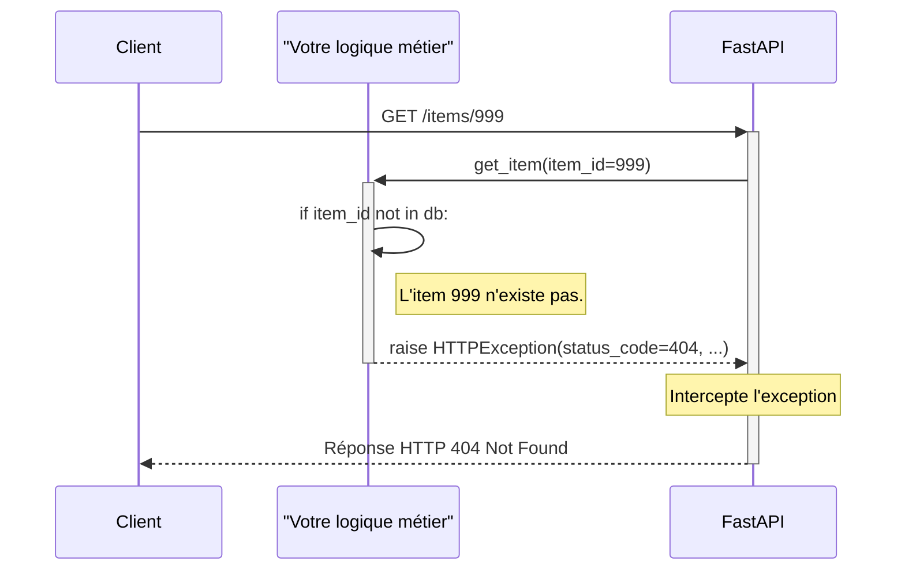

# Gestion des Erreurs : Lever des HTTPException {#gestion-des-erreurs-lever-des-http-exception-14}

Une API robuste ne se contente pas de gérer les cas de succès ; elle doit aussi répondre de manière prévisible et claire lorsque les choses tournent mal. Un client peut demander une ressource qui n'existe pas, essayer d'effectuer une action non autorisée, ou envoyer des données invalides.

Pour toutes ces erreurs dites "logiques" ou "métier", FastAPI nous fournit un outil puissant et élégant : l'exception `HTTPException`. En la "levant" (`raise`), vous court-circuitez le déroulement normal de votre fonction pour renvoyer immédiatement une réponse HTTP d'erreur parfaitement formatée.



## Concept 1 : Lever une `HTTPException` de base {#concept-1-lever-une-http-exception-de-base-14}

### Quoi ? {#quoi-14}
`HTTPException` est une classe d'exception Python spéciale fournie par FastAPI. Elle prend au minimum deux arguments :
1.  `status_code`: Le code de statut HTTP de l'erreur (ex: 404, 403, 400).
2.  `detail`: Un message clair et lisible expliquant l'erreur au client.

Lorsque vous utilisez `raise HTTPException(...)`, FastAPI arrête l'exécution de votre code et envoie une réponse JSON au client contenant ces informations.

### Pourquoi ? {#pourquoi-14}
-   **Simplicité :** C'est une seule ligne de code pour gérer une condition d'erreur complète.
-   **Clarté :** Votre code est plus lisible, séparant clairement la logique de succès des chemins d'erreur.
-   **Standardisation :** Toutes vos erreurs métier peuvent être gérées de la même manière, ce qui rend votre API cohérente.
-   **Auto-documentation :** Votre documentation OpenAPI (Swagger UI) listera automatiquement les erreurs HTTP possibles pour chaque endpoint où vous levez une `HTTPException`.

### Comment (Syntaxe + Cas Réel) ? {#comment-syntaxe--cas-reel-14}
Il suffit d'importer `HTTPException` de `fastapi` et de l'utiliser avec le mot-clé `raise`.

**Cas Réel : Vérifier si un utilisateur a le droit de modifier une ressource**
Imaginons un endpoint où seul l'utilisateur "admin" peut modifier un item.

```python
from fastapi import FastAPI, HTTPException, Header, status
from typing import Optional

app = FastAPI()

@app.put("/items/{item_id}")
async def update_item(item_id: int, x_user: Optional[str] = Header(None)):
    # Simulation: Vérifier si l'utilisateur est un admin
    if x_user != "admin":
        # Si non, on lève une exception 403 Forbidden
        raise HTTPException(
            status_code=status.HTTP_403_FORBIDDEN,
            detail="You do not have permission to update this item."
        )
    
    # Si on arrive ici, l'utilisateur est bien "admin"
    return {"message": f"Item {item_id} updated by {x_user}"}
```
Si vous testez cet endpoint sans l'en-tête `x-user` ou avec une valeur différente de "admin", vous recevrez une réponse 403.

> 📸 **CAPTURE D'ÉCRAN REQUISE**
> **Sujet** : Documentation Swagger UI montrant le endpoint `PUT /items/{item_id}` et sa réponse d'erreur "403 Forbidden".
> **Alt Text** : Section "Responses" de Swagger UI pour l'opération PUT, affichant la réponse de succès 200 et la réponse d'erreur 403 avec un exemple de corps de réponse.

### Zone de Danger {#zone-de-danger-14}
N'utilisez pas `HTTPException` pour les erreurs inattendues de votre serveur (bugs, pannes de base de données, etc.). C'est réservé aux erreurs "attendues", celles qui résultent d'une mauvaise requête du client ou d'une violation de vos règles métier. Une erreur inattendue devrait provoquer une erreur 500, que FastAPI gère par défaut.

---

## Concept 2 : Ajouter des En-têtes (Headers) Personnalisés à vos Erreurs {#concept-2-ajouter-des-en-tetes-headers-personnalises-a-vos-erreurs-14}

### Quoi ? {#quoi-15}
`HTTPException` accepte un troisième argument optionnel, `headers`, qui doit être un dictionnaire. Ce dictionnaire vous permet d'ajouter des en-têtes HTTP personnalisés à la réponse d'erreur.

### Pourquoi ? {#pourquoi-15}
C'est utile pour des scénarios plus avancés. Le cas d'usage le plus courant est pour les erreurs `401 Unauthorized`. La norme HTTP veut qu'une réponse 401 soit accompagnée d'un en-tête `WWW-Authenticate` qui indique au client comment il doit s'authentifier (par exemple, avec un "Bearer Token").

### Comment (Syntaxe + Cas Réel) ? {#comment-syntaxe--cas-reel-15}
Passez simplement un dictionnaire à l'argument `headers`.

**Cas Réel : Protéger un endpoint et guider le client pour l'authentification**

```python
from fastapi import FastAPI, HTTPException, Header, status
from typing import Optional

app = FastAPI()

@app.get("/secure-data")
async def get_secure_data(token: Optional[str] = Header(None)):
    if token != "super-secret-token":
        raise HTTPException(
            status_code=status.HTTP_401_UNAUTHORIZED,
            detail="Invalid or missing token",
            headers={"WWW-Authenticate": "Bearer"}, # Indique la méthode d'auth
        )
    
    return {"secret_data": "The secret code is 1234."}
```
Un client qui reçoit cette réponse 401 saura, grâce à l'en-tête `WWW-Authenticate`, qu'il doit probablement fournir un "Bearer Token" dans ses futures requêtes.

### Zone de Danger {#zone-de-danger-16}
Soyez prudent avec les informations que vous mettez dans les en-têtes. Ils sont visibles par n'importe qui interceptant la requête. N'y placez jamais de données sensibles. Respectez également les noms d'en-têtes HTTP standards lorsque c'est possible.

---

### 3 Questions Clés {#3-questions-cles-14}
1.  Quels sont les deux arguments principaux et obligatoires de `HTTPException` ?
2.  Dans quel scénario est-il particulièrement utile d'ajouter un en-tête `WWW-Authenticate` à une `HTTPException` ?
3.  Pourquoi ne devriez-vous pas utiliser `HTTPException` pour signaler une panne de connexion à votre base de données ? Quel type d'erreur serait plus approprié ?

### 3 Exercices Progressifs {#3-exercices-progressifs-14}

**Exercice 1 : Valider un paramètre de requête**
Créez un endpoint `GET /search`. Il accepte un paramètre de requête `q` (une chaîne de recherche).
-   Si le paramètre `q` n'est pas fourni, levez une `HTTPException` avec un code `400 Bad Request` et le détail `"Search query parameter 'q' is required."`.
-   Si `q` est fourni, retournez `{"searching_for": q}`.

<details>
<summary>Découvrir la solution commentée</summary>

```python
from fastapi import FastAPI, HTTPException, status
from typing import Optional

app = FastAPI()

@app.get("/search")
async def search_items(q: Optional[str] = None):
    if not q:
        raise HTTPException(
            status_code=status.HTTP_400_BAD_REQUEST,
            detail="Search query parameter 'q' is required."
        )
    return {"searching_for": q}
```
*Ici, `Optional[str] = None` permet à FastAPI d'accepter l'absence du paramètre. C'est ensuite à notre logique de vérifier si `q` est `None` et de lever l'erreur si c'est le cas.*
</details>

**Exercice 2 : Gérer un Stock Limité**
Simulez une boutique en ligne. Vous avez une base de données d'items avec un stock.
-   Créez un endpoint `POST /order/{item_id}`.
-   L'endpoint ne prend pas de corps de requête pour simplifier.
-   Si l'`item_id` n'existe pas, levez une erreur 404.
-   Si l'item existe mais que son stock (`stock`) est à 0, levez une `HTTPException` avec un code `400 Bad Request` et le détail `"Item is out of stock."`.
-   Si le stock est > 0, décrémentez-le et retournez un message de succès.

<details>
<summary>Découvrir la solution commentée</summary>

```python
from fastapi import FastAPI, HTTPException, status

app = FastAPI()

fake_items_db = {
    "item1": {"name": "Laptop", "stock": 5},
    "item2": {"name": "Mouse", "stock": 0},
}

@app.post("/order/{item_id}")
async def place_order(item_id: str):
    if item_id not in fake_items_db:
        raise HTTPException(
            status_code=status.HTTP_404_NOT_FOUND,
            detail=f"Item '{item_id}' not found."
        )
    
    item = fake_items_db[item_id]
    if item["stock"] <= 0:
        raise HTTPException(
            status_code=status.HTTP_400_BAD_REQUEST,
            detail=f"Item '{item['name']}' is out of stock."
        )
    
    # Décrémenter le stock
    item["stock"] -= 1
    
    return {"message": f"Order for '{item['name']}' placed successfully.", "stock_left": item["stock"]}
```
</details>

**Exercice 3 : API à Usage Limité**
Créez un endpoint `GET /premium-content`. Simulez une clé API qui ne peut être utilisée qu'un certain nombre de fois.
-   La clé API est passée via un en-tête `X-API-Key`.
-   Si l'en-tête `X-API-Key` est manquant ou ne correspond pas à une clé valide (ex: "my-secret-key"), levez une erreur `401 Unauthorized`.
-   Si la clé est valide mais que son compteur d'utilisation est à zéro, levez une `HTTPException` avec un code `429 Too Many Requests` (trop de requêtes). Ajoutez un en-tête personnalisé `X-RateLimit-Reset` indiquant dans combien de secondes la limite sera réinitialisée (ex: `60`).

<details>
<summary>Découvrir la solution commentée</summary>

```python
from fastapi import FastAPI, HTTPException, Header, status
from typing import Optional

app = FastAPI()

# Simule notre base de données de clés API
api_keys_db = {
    "my-secret-key": {"usage_left": 3}
}

@app.get("/premium-content")
async def get_premium_content(x_api_key: Optional[str] = Header(None)):
    if x_api_key not in api_keys_db:
        raise HTTPException(
            status_code=status.HTTP_401_UNAUTHORIZED,
            detail="Invalid or missing API Key"
        )
        
    key_data = api_keys_db[x_api_key]
    
    if key_data["usage_left"] <= 0:
        raise HTTPException(
            status_code=status.HTTP_429_TOO_MANY_REQUESTS,
            detail="API key usage limit exceeded.",
            headers={"X-RateLimit-Reset": "60"}, # L'en-tête personnalisé
        )
        
    key_data["usage_left"] -= 1
    
    return {"content": "This is premium content!", "usage_left": key_data["usage_left"]}
```
*Cet exercice montre un cas d'utilisation avancé et réaliste pour les en-têtes personnalisés dans les réponses d'erreur.*
</details>