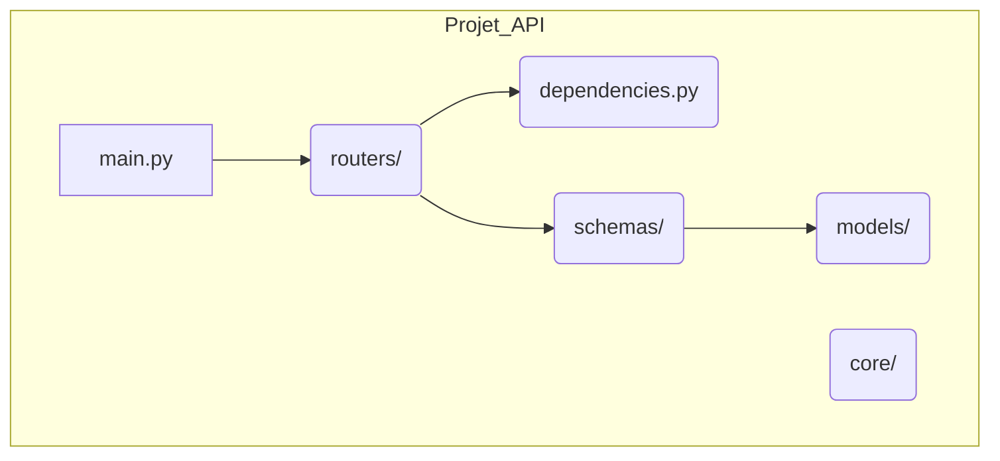

# Inclure des APIRouters : Structure d'Application {#inclure-des-apirouters--structure-dapplication-27}

Savoir créer un `APIRouter` est la première étape. L'étape suivante, cruciale pour les applications de production, est de savoir comment les organiser dans une structure de projet propre, évolutive et maintenable. Une bonne structure prévient les problèmes courants comme les dépendances circulaires et facilite la navigation dans le code.

Ce chapitre se concentre sur les patrons de conception ("patterns") pour structurer votre application FastAPI en utilisant des `APIRouter` de manière efficace.

## Concept 1 : La Structure de Projet Recommandée {#concept-1-la-structure-de-projet-recommandee-27}

### Quoi ? {#quoi-27}
La structure la plus courante et la plus efficace consiste à séparer votre logique en modules et paquets distincts. Le point d'entrée (`main.py`) reste minimal et son rôle principal est d'assembler les différentes parties de l'application.

Une structure typique ressemble à ceci :



-   `main.py`: Contient l'instance `FastAPI` et inclut les routeurs.
-   `routers/`: Un paquet Python (`__init__.py`) contenant les modules de routeurs (ex: `users.py`, `items.py`).
-   `models/`: Contient les modèles de votre ORM (ex: SQLAlchemy).
-   `schemas/`: Contient vos modèles Pydantic (schémas de données).
-   `dependencies.py` ou `core/`: Contient la logique partagée comme les dépendances d'authentification ou les connexions à la base de données.

### Pourquoi ? {#pourquoi-27}
-   **Séparation des préoccupations (Separation of Concerns) :** Chaque fichier/dossier a une responsabilité unique. Les routeurs gèrent les requêtes HTTP, les schémas définissent la forme des données, et les modèles représentent la structure de la base de données.
-   **Prévention des importations circulaires :** C'est le problème le plus critique que cette structure résout. Par exemple, `routers/users.py` peut importer une dépendance de `dependencies.py`, mais `dependencies.py` n'importera jamais rien de `routers/users.py`. Ce flux de dépendances unidirectionnel est la clé de la stabilité.
-   **Scalabilité :** Ajouter une nouvelle fonctionnalité (ex: "factures") se résume à créer un nouveau fichier `routers/invoices.py` et à l'inclure dans `main.py`, sans perturber le code existant.

### Comment (Syntaxe + Cas Réel) ? {#comment-syntaxe--cas-reel-27}
Voici à quoi ressemble le `main.py` dans cette structure :

```python
# main.py
from fastapi import FastAPI
from routers import users, items

app = FastAPI(title="Mon API Scalable")

# Point d'entrée pour la santé de l'API
@app.get("/")
def health_check():
    return {"status": "ok"}

# Assemblage des routeurs
app.include_router(users.router, prefix="/users", tags=["Users"])
app.include_router(items.router, prefix="/items", tags=["Items"])

# Vous pouvez également inclure ici des middlewares, des gestionnaires d'événements, etc.
```

### Zone de Danger {#zone-de-danger-27}
**L'importation circulaire fatale.** Le piège le plus courant pour les débutants est de tenter d'importer l'objet `app` de `main.py` à l'intérieur d'un module de routeur (par exemple, pour utiliser un décorateur comme `@app.exception_handler`). **Ne faites jamais cela.** Si `main.py` importe `routers.users` et que `routers.users` importe `main`, Python lèvera une `ImportError`. Toute logique partagée doit être extraite dans un module séparé (comme `dependencies.py` ou `core/config.py`).

---

## Concept 2 : Imbriquer des APIRouters pour le Versioning {#concept-2-imbriquer-des-apirouters-pour-le-versioning-27}

### Quoi ? {#quoi-28}
Un `APIRouter` peut non seulement être inclus dans une application `FastAPI`, mais il peut aussi inclure d'autres `APIRouter`. Cette capacité permet de créer des hiérarchies de routeurs, ce qui est extrêmement puissant pour organiser des API complexes, notamment pour le versioning.

### Pourquoi ? {#pourquoi-28}
-   **Versioning d'API :** La raison la plus courante. Vous pouvez regrouper tous les endpoints de la v1 de votre API sous un routeur principal avec le préfixe `/api/v1`. Lorsque vous développerez la v2, vous créerez un autre routeur principal pour `/api/v2`, permettant aux deux versions de coexister.
-   **Regroupement logique :** Vous pouvez avoir une section `/admin` qui contient ses propres sous-sections pour les utilisateurs et les produits, gérées par des routeurs imbriqués.

### Comment (Syntaxe + Cas Réel) ? {#comment-syntaxe--cas-reel-28}
Créons un routeur principal pour la V1 de notre API.

**1. Créez un routeur principal (`routers/api_v1.py`)**

```python
# routers/api_v1.py
from fastapi import APIRouter
from . import users, items # Importe les autres routeurs du même paquet

# Routeur principal pour la v1
router = APIRouter()

# Inclut les routeurs spécifiques dans le routeur principal
router.include_router(users.router, prefix="/users", tags=["Users V1"])
router.include_router(items.router, prefix="/items", tags=["Items V1"])
```

**2. Modifiez `main.py` pour n'inclure que le routeur principal**

```python
# main.py
from fastapi import FastAPI
from routers import api_v1

app = FastAPI(title="Mon API Versionnée")

# N'inclut plus que le routeur de la v1
app.include_router(api_v1.router, prefix="/api/v1")
```
Maintenant, tous les chemins sont préfixés par `/api/v1`. Par exemple, l'endpoint pour obtenir tous les utilisateurs est maintenant accessible à l'URL `/api/v1/users/`.

> 📸 **CAPTURE D'ÉCRAN REQUISE**
> **Sujet** : Documentation Swagger UI montrant les tags "Users V1" et "Items V1" avec les chemins complets comme `/api/v1/users/`.
> **Alt Text** : Interface Swagger avec des sections pour "Users V1" et "Items V1", illustrant la structure versionnée de l'API.

### Zone de Danger {#zone-de-danger-29}
Les préfixes sont cumulatifs. Si le routeur principal a `prefix="/api/v1"` et qu'il inclut un sous-routeur avec `prefix="/users"`, le chemin final sera `/api/v1/users`. Soyez attentif à la concaténation des préfixes pour ne pas créer des URLs inattendues. Une sur-imbrication de routeurs peut également rendre la structure difficile à suivre. Une ou deux couches d'imbrication sont généralement suffisantes.

---

### 3 Questions Clés {#3-questions-cles-27}
1.  Quel est le principal danger d'importer l'objet `app` de `main.py` dans un module de routeur comme `routers/users.py` ?
2.  Décrivez une structure de fichiers qui permettrait de gérer une API avec deux versions (`v1` et `v2`) coexistant et partageant une logique de base de données commune.
3.  Si un `APIRouter` principal avec `prefix="/admin"` inclut un autre `APIRouter` avec `prefix="/reports"`, quel sera le préfixe final pour les opérations de ce dernier ?

### 3 Exercices Progressifs {#3-exercices-progressifs-27}

**Exercice 1 : Structurer une Application Simple**
Créez une structure de projet pour une API de blog.
-   Un fichier `main.py`.
-   Un répertoire `routers/` contenant `posts.py` et `comments.py`.
-   Le routeur `posts` doit gérer les chemins `/posts` et `/posts/{post_id}`.
-   Le routeur `comments` doit gérer `/comments` et `/comments/{comment_id}`.
-   `main.py` doit inclure ces deux routeurs avec leurs préfixes respectifs et des tags.

<details>
<summary>Découvrir la solution commentée</summary>

**Structure de fichiers :**
```
.
├── main.py
└── routers
    ├── __init__.py
    ├── comments.py
    └── posts.py
```

**`routers/posts.py`**
```python
from fastapi import APIRouter
router = APIRouter()
@router.get("/")
def get_posts(): return {"message": "List of posts"}
@router.get("/{post_id}")
def get_post(post_id: int): return {"message": f"Details of post {post_id}"}
```

**`routers/comments.py`**
```python
from fastapi import APIRouter
router = APIRouter()
@router.get("/")
def get_comments(): return {"message": "List of comments"}
@router.get("/{comment_id}")
def get_comment(comment_id: int): return {"message": f"Details of comment {comment_id}"}
```

**`main.py`**
```python
from fastapi import FastAPI
from routers import posts, comments

app = FastAPI()
app.include_router(posts.router, prefix="/posts", tags=["Posts"])
app.include_router(comments.router, prefix="/comments", tags=["Comments"])
```
</details>

**Exercice 2 : Créer un Préfixe d'API Global**
En partant de l'exercice 1, modifiez la structure pour que tous les endpoints soient sous un préfixe global `/api`. Vous devrez créer un routeur principal qui inclut les routeurs `posts` et `comments`.

<details>
<summary>Découvrir la solution commentée</summary>

**Nouveau fichier `routers/api_router.py`**
```python
from fastapi import APIRouter
from . import posts, comments

router = APIRouter()
router.include_router(posts.router, prefix="/posts", tags=["Posts"])
router.include_router(comments.router, prefix="/comments", tags=["Comments"])
```

**`main.py` (modifié)**
```python
from fastapi import FastAPI
from routers import api_router # On importe le nouveau routeur principal

app = FastAPI()
app.include_router(api_router.router, prefix="/api")
```
*Désormais, les chemins finaux sont `/api/posts/` et `/api/comments/`.*
</details>

**Exercice 3 : Projet Multi-Domaines avec Dépendance Partagée**
Structurez une application pour un site e-commerce avec des sections "public" et "admin".
1.  Créez un routeur "public" (`public_router.py`) qui inclut les routeurs pour les produits (`products.py`) et les commandes (`orders.py`).
2.  Créez un routeur "admin" (`admin_router.py`) qui gère les utilisateurs (`users.py`) et les rapports (`reports.py`).
3.  Le routeur "admin" doit être protégé par une dépendance partagée `verify_admin` (définie dans `dependencies.py`).
4.  `main.py` doit inclure `public_router` avec le préfixe `/` et `admin_router` avec le préfixe `/admin`.

<details>
<summary>Découvrir la solution commentée</summary>

**Structure de fichiers :**
```
.
├── main.py
├── dependencies.py
└── routers
    ├── __init__.py
    ├── admin_router.py
    ├── orders.py
    ├── products.py
    ├── public_router.py
    ├── reports.py
    └── users.py
```

**`dependencies.py`**
```python
from fastapi import Header, HTTPException, status
async def verify_admin(x_token: str = Header(...)):
    if x_token != "admin-secret": raise HTTPException(status_code=status.HTTP_403_FORBIDDEN)
```

**`routers/users.py` (exemple de sous-routeur admin)**
```python
from fastapi import APIRouter
router = APIRouter()
@router.get("/")
def get_users(): return {"message": "Admin: list of users"}
```
*(les autres sous-routeurs `products`, `orders`, `reports` seraient similaires)*

**`routers/public_router.py`**
```python
from fastapi import APIRouter
from . import products, orders
router = APIRouter()
router.include_router(products.router, prefix="/products", tags=["Public Products"])
router.include_router(orders.router, prefix="/orders", tags=["Public Orders"])
```

**`routers/admin_router.py`**
```python
from fastapi import APIRouter, Depends
from . import users, reports
from dependencies import verify_admin
router = APIRouter(dependencies=[Depends(verify_admin)])
router.include_router(users.router, prefix="/users", tags=["Admin Users"])
router.include_router(reports.router, prefix="/reports", tags=["Admin Reports"])
```

**`main.py`**
```python
from fastapi import FastAPI
from routers import public_router, admin_router

app = FastAPI()
app.include_router(public_router.router)
app.include_router(admin_router.router, prefix="/admin")
```
*Cette structure est très robuste et démontre une excellente organisation pour une application complexe.*
</details>