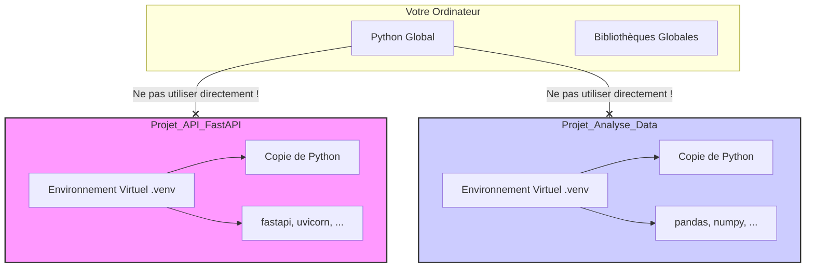

# Installation et Configuration de l'Environnement Virtuel {#installation-et-configuration-de-lenvironnement-virtuel-2}

Maintenant que nous avons une bonne compréhension théorique de FastAPI, il est temps de préparer notre machine pour le développement. Ce chapitre est crucial : un environnement de travail propre et bien configuré est la première étape vers un projet réussi.

Nous allons suivre une approche professionnelle en utilisant un **environnement virtuel** pour isoler les dépendances de notre projet.

## Pourquoi Utiliser un Environnement Virtuel ? {#pourquoi-utiliser-un-environnement-virtuel-2}

Imaginez que vous travaillez sur deux projets différents :
*   **Projet A** (une vieille application) nécessite une ancienne version de la bibliothèque `requests` (version 2.20.0).
*   **Projet B** (notre nouvelle API FastAPI) nécessite la dernière version de `requests` (version 2.28.0).

Si vous installez ces bibliothèques globalement sur votre système, vous ne pouvez en avoir qu'une seule version. Le Projet A ou le Projet B ne fonctionnera pas correctement.

Un environnement virtuel est un répertoire isolé qui contient une installation spécifique de Python et des bibliothèques nécessaires à un seul projet. C'est comme avoir une boîte à outils dédiée pour chaque projet, sans que les outils ne se mélangent.



## Étape 1 : Vérifier votre version de Python {#etape-1-verifier-votre-version-de-python-2}

FastAPI nécessite **Python 3.7+**. Ouvrez votre terminal (ou PowerShell sur Windows) et tapez la commande suivante :

```bash
python --version
# Ou si vous avez plusieurs versions
python3 --version
```

Vous devriez voir une sortie comme `Python 3.10.6` ou supérieure. Si ce n'est pas le cas, veuillez installer une version récente de Python depuis le [site officiel](https://www.python.org/).

> 📸 **CAPTURE D'ÉCRAN REQUISE**
> **Sujet** : Résultat de la commande `python --version` dans un terminal.
> **Alt Text** : Ligne de commande affichant "Python 3.11.2".

## Étape 2 : Créer et Activer l'Environnement Virtuel {#etape-2-creer-et-activer-lenvironnement-virtuel-2}

1.  **Créez un dossier pour votre projet** et naviguez à l'intérieur :
    ```bash
    mkdir formation-fastapi
    cd formation-fastapi
    ```

2.  **Créez l'environnement virtuel**. Nous utiliserons le module `venv` inclus avec Python. Nous appellerons notre environnement `venv` (un nom standard).
    ```bash
    python -m venv venv
    ```
    Cette commande crée un dossier `venv` dans votre projet. Il contient une copie de l'interpréteur Python et de ses outils.

3.  **Activez l'environnement**. Cette étape est différente selon votre système d'exploitation :

    *   **Sur macOS / Linux (bash/zsh) :**
        ```bash
        source venv/bin/activate
        ```

    *   **Sur Windows (PowerShell) :**
        ```powershell
        .\venv\Scripts\Activate.ps1
        ```
        (Il se peut que vous deviez d'abord autoriser l'exécution de scripts avec `Set-ExecutionPolicy -ExecutionPolicy RemoteSigned -Scope Process`)

    *   **Sur Windows (CMD) :**
        ```cmd
        .\venv\Scripts\activate.bat
        ```

Une fois l'environnement activé, vous devriez voir son nom (`venv`) apparaître au début de votre invite de commande.

> 📸 **CAPTURE D'ÉCRAN REQUISE**
> **Sujet** : Invite de commande avant et après l'activation de l'environnement virtuel.
> **Alt Text** : Terminal montrant que le prompt change pour inclure "(venv)" au début de la ligne.

## Étape 3 : Installer FastAPI et Uvicorn {#etape-3-installer-fastapi-et-uvicorn-2}

Maintenant que notre environnement est activé, toutes les bibliothèques que nous installerons seront confinées à ce projet.

Nous avons besoin de deux paquets principaux :
1.  `fastapi` : Le framework lui-même.
2.  `uvicorn` : Le serveur ASGI qui exécutera notre application.

Vous pouvez les installer avec `pip` :

```bash
pip install "fastapi[all]"
```

**Pourquoi `[all]` ?**
Cette syntaxe installe FastAPI ainsi que toutes ses dépendances optionnelles, ce qui inclut `uvicorn` pour le serveur, `python-multipart` pour la gestion des formulaires, `jinja2` pour les templates, et d'autres outils utiles. C'est le moyen le plus simple de démarrer.

## Étape 4 : Validation de l'Installation {#etape-4-validation-de-linstallation-2}

Vérifions que tout fonctionne en créant notre toute première application FastAPI.

1.  Créez un fichier nommé `main.py` à la racine de votre dossier `formation-fastapi`.

2.  Ajoutez le code suivant dans `main.py` :
    ```python
    from fastapi import FastAPI

    # Création d'une instance de l'application FastAPI
    app = FastAPI()

    # Définition d'un "endpoint" ou "route"
    @app.get("/")
    def read_root():
        return {"Hello": "World"}
    ```

3.  Dans votre terminal (avec l'environnement virtuel toujours activé), lancez le serveur Uvicorn :
    ```bash
    uvicorn main:app --reload
    ```
    *   `main`: le fichier `main.py` (le ".py" est implicite).
    *   `app`: l'objet `FastAPI` que nous avons créé dans `main.py`.
    *   `--reload`: une option très pratique qui redémarre le serveur automatiquement à chaque modification du code.

    Vous devriez voir une sortie indiquant que le serveur est en cours d'exécution.

    > 📸 **CAPTURE D'ÉCRAN REQUISE**
    > **Sujet** : Sortie du terminal après avoir lancé la commande `uvicorn`.
    > **Alt Text** : Terminal affichant des logs Uvicorn, incluant "Uvicorn running on http://127.0.0.1:8000 (Press CTRL+C to quit)".

4.  Ouvrez votre navigateur web et allez à l'adresse [http://127.0.0.1:8000](http://127.0.0.1:8000). Vous devriez voir la réponse JSON :
    `{"Hello":"World"}`

    > 📸 **CAPTURE D'ÉCRAN REQUISE**
    > **Sujet** : Navigateur affichant la réponse JSON de l'API.
    > **Alt Text** : Fenêtre de navigateur avec le JSON {"Hello":"World"} affiché.

5.  Maintenant, visitez [http://127.0.0.1:8000/docs](http://127.0.0.1:8000/docs). Vous découvrirez la documentation interactive (Swagger UI) générée automatiquement.

    > 📸 **CAPTURE D'ÉCRAN REQUISE**
    > **Sujet** : Page de documentation Swagger UI générée automatiquement.
    > **Alt Text** : Interface de Swagger UI montrant un endpoint GET "/" pour la racine de l'API.

Félicitations ! Votre environnement de développement FastAPI est maintenant installé, configuré et validé. Vous êtes prêt à construire des API incroyables.