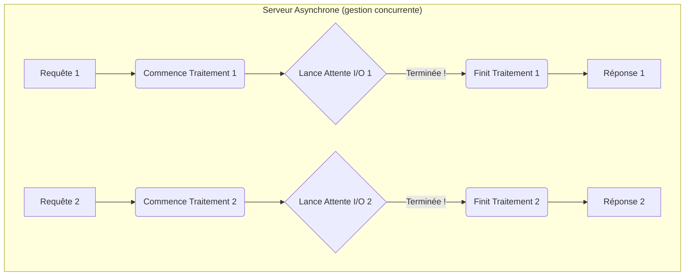

# Introduction à l'Asynchrone avec 'async' et 'await' {#introduction-a-lasynchrone-avec-async-et-await-16}

Vous avez remarqué que depuis le début, nous utilisons `async def` pour définir nos opérations de chemin. FastAPI est construit sur un socle asynchrone, ce qui lui permet d'être extrêmement performant. Mais que signifient réellement `async` et `await` ?

Ce chapitre démystifie ces concepts. Comprendre l'asynchrone est la clé pour exploiter la pleine puissance de FastAPI, surtout lorsque votre application doit communiquer avec d'autres services, des bases de données ou des fichiers.

## Concept 1 : Le "Pourquoi" de l'Asynchrone (Synchrone vs. Asynchrone) {#concept-1-le-pourquoi-de-lasynchrone-synchrone-vs-asynchrone-16}

### Quoi ? {#quoi-16}

Imaginez un serveur de café avec un seul barista (le serveur).

**Approche Synchrone (bloquante) :**
Le barista prend la commande du client A, prépare son café, lui donne, et encaisse. Pendant tout ce temps, les clients B et C attendent en ligne sans que rien ne se passe pour eux. Le barista est "bloqué" par la tâche en cours.

```mermaid
graph TD
    subgraph "Serveur Synchrone (1 tâche à la fois)"
        A[Requête 1] --> B(Traite la requête 1...)
        B --> C{Attente I/O<br/>(ex: base de données)}
        C --> D(Finit la requête 1)
        D --> E[Réponse 1]
        E --> F[Requête 2]
        F --> G(Traite la requête 2...)
    end
```

**Approche Asynchrone (non-bloquante) :**
Le barista prend la commande du client A et lance la machine à expresso (une opération lente). Au lieu d'attendre que le café coule, il se tourne immédiatement vers le client B, prend sa commande et lance sa boisson. Puis il fait de même pour le client C. Quand le café du client A est prêt, la machine l'avertit, il le récupère et le sert. Il gère plusieurs commandes en parallèle en profitant des temps d'attente.



### Pourquoi ? {#pourquoi-16}
Dans le monde des serveurs web, les "temps d'attente" sont les opérations d'Entrée/Sortie (I/O) :
-   Requêtes à une base de données.
-   Appels à une autre API.
-   Lecture ou écriture d'un fichier sur le disque.

Ces opérations sont très lentes comparées à la vitesse du processeur. Un serveur synchrone passe le plus clair de son temps à attendre. Un serveur asynchrone utilise ces temps d'attente pour commencer à traiter d'autres requêtes, augmentant massivement sa capacité à servir de nombreux utilisateurs simultanément (sa **concurrence**).

### Comment (Syntaxe + Cas Réel) ? {#comment-syntaxe--cas-reel-16}
En Python, la différence se voit dans la déclaration de la fonction.

**Fonction Synchrone (bloquante) :**
Utilise `time.sleep()`, qui bloque tout le programme.
```python
import time

def wait_sync():
    print("Début attente synchrone...")
    time.sleep(2) # Bloque tout pendant 2 secondes
    print("Fin attente synchrone.")
```

**Fonction Asynchrone (non-bloquante) :**
Utilise `asyncio.sleep()`, qui "rend la main" pour que d'autres tâches puissent s'exécuter.
```python
import asyncio

async def wait_async():
    print("Début attente asynchrone...")
    await asyncio.sleep(2) # Ne bloque pas, permet à d'autres tâches de tourner
    print("Fin attente asynchrone.")
```

### Zone de Danger {#zone-de-danger-16}
**Le pire des deux mondes :** Appeler une fonction bloquante (comme `time.sleep()` ou une requête avec la bibliothèque `requests`) à l'intérieur d'une fonction `async def`. Cela bloque tout le serveur asynchrone et annule tous ses bénéfices. Il faut toujours utiliser des bibliothèques compatibles avec `asyncio` (comme `httpx` pour les requêtes HTTP) dans du code asynchrone.

---

## Concept 2 : Les Mots-clés `async def` et `await` {#concept-2-les-mots-cles-async-def-et-await-16}

### Quoi ? {#quoi-17}
-   `async def` : Ce mot-clé déclare une fonction comme étant une **coroutine**. Une coroutine est une fonction spéciale qui peut être mise en pause et reprise.
-   `await` : Ce mot-clé ne peut être utilisé qu'à l'intérieur d'une fonction `async def`. Il dit à Python : "La tâche qui suit (`await ma_coroutine()`) va prendre du temps. Mets ma fonction actuelle en pause ici, et va faire autre chose en attendant. Quand la tâche sera terminée, reviens ici et continue mon exécution."

### Pourquoi ? {#pourquoi-17}
Ces deux mots-clés sont le cœur de la syntaxe asynchrone en Python. Ils permettent d'écrire du code concurrent qui reste très lisible et ressemble à du code synchrone séquentiel, évitant le "callback hell" (l'enfer des fonctions de rappel) présent dans d'autres langages.

### Comment (Syntaxe + Cas Réel) ? {#comment-syntaxe--cas-reel-17}
FastAPI gère la complexité pour vous. Il vous suffit de déclarer vos opérations de chemin avec `async def` et d'utiliser `await` lorsque vous appelez une autre fonction asynchrone.

**Cas Réel : Simuler un appel à une base de données**
Imaginons une fonction qui récupère des données d'une base de données (une opération lente).

```python
import asyncio
from fastapi import FastAPI

app = FastAPI()

# Une coroutine qui simule un appel DB lent
async def fetch_data_from_db(item_id: int):
    print(f"Début de la récupération des données pour l'item {item_id}...")
    await asyncio.sleep(1) # Simule une requête réseau vers la DB
    print(f"Données récupérées pour l'item {item_id}.")
    return {"id": item_id, "data": "Some valuable data"}

# Notre endpoint est une coroutine
@app.get("/items/{item_id}")
async def read_item(item_id: int):
    print("Le endpoint a reçu la requête.")
    # On met en pause l'exécution du endpoint pour attendre le résultat de la DB
    item_data = await fetch_data_from_db(item_id)
    print("Le endpoint reprend après l'attente.")
    return item_data
```
Pendant que `read_item` est en pause sur la ligne `await`, FastAPI peut utiliser ce temps pour gérer d'autres requêtes entrantes.

### Zone de Danger {#zone-de-danger-18}
**Oublier `await` :** C'est une erreur très courante.
```python
# MAUVAIS
async def my_endpoint():
    # On appelle la fonction mais on n'attend pas le résultat
    result_coroutine = fetch_data_from_db(1) 
    # Cela ne retourne pas les données, mais un objet coroutine !
    return {"data": result_coroutine} # Votre API retourne un objet Python au lieu des données
```
Si vous appelez une coroutine, vous devez presque toujours utiliser `await` pour l'exécuter et obtenir son résultat.

---

### 3 Questions Clés {#3-questions-cles-16}
1.  Quel est le principal type d'opérations qui bénéficie de l'asynchrone dans une application web ?
2.  Que déclare le mot-clé `async def` en Python ?
3.  Que se passe-t-il si vous appelez une fonction de coroutine dans une fonction `async def` mais que vous oubliez d'utiliser le mot-clé `await` devant ?

### 3 Exercices Progressifs {#3-exercices-progressifs-16}

**Exercice 1 : Convertir un Endpoint Synchrone**
Prenez le code synchrone ci-dessous et convertissez-le en un endpoint asynchrone performant. Remplacez l'opération bloquante par son équivalent non-bloquant.

*Code de départ :*
```python
import time
from fastapi import FastAPI
app = FastAPI()

@app.get("/slow-sync")
def slow_sync_endpoint():
    time.sleep(3) # Opération bloquante
    return {"status": "done"}
```

<details>
<summary>Découvrir la solution commentée</summary>

```python
import asyncio
from fastapi import FastAPI
app = FastAPI()

@app.get("/fast-async")
async def fast_async_endpoint():
    # On passe la fonction en 'async def'.
    # On utilise asyncio.sleep() qui est non-bloquant.
    # On attend le résultat avec 'await'.
    await asyncio.sleep(3) 
    return {"status": "done"}
```
</details>

**Exercice 2 : Appeler une Coroutine d'Aide**
Créez un endpoint `GET /profile/{user_id}`.
-   Le endpoint doit être asynchrone (`async def`).
-   Il doit appeler une autre coroutine d'aide nommée `get_user_info(user_id: int)`.
-   La fonction `get_user_info` simulera un appel réseau de 2 secondes avec `asyncio.sleep(2)` et retournera un dictionnaire avec les informations de l'utilisateur.
-   L'endpoint doit `await` le résultat de `get_user_info` et le retourner au client.

<details>
<summary>Découvrir la solution commentée</summary>

```python
import asyncio
from fastapi import FastAPI

app = FastAPI()

# Coroutine d'aide qui simule un appel à un service ou une DB
async def get_user_info(user_id: int):
    await asyncio.sleep(2)
    return {"user_id": user_id, "name": "John Doe", "email": "john.doe@example.com"}

@app.get("/profile/{user_id}")
async def get_profile(user_id: int):
    # On attend le résultat de la coroutine d'aide
    user_data = await get_user_info(user_id)
    return user_data
```
</details>

**Exercice 3 : Concurrence de Tâches Simultanées**
Créez un endpoint `GET /report`.
-   Ce endpoint a besoin de deux informations pour construire son rapport : les ventes (`get_sales_data`) et les utilisateurs (`get_users_data`).
-   Chacune de ces deux fonctions d'aide sera une coroutine simulant un appel de 3 secondes (`asyncio.sleep(3)`).
-   Appelez ces deux fonctions de manière séquentielle en utilisant `await`. Quel est le temps de réponse total de l'endpoint ?
-   *(Bonus)* : Utilisez `asyncio.gather` pour lancer les deux tâches en parallèle et réduire le temps de réponse.

<details>
<summary>Découvrir la solution commentée</summary>

```python
import asyncio
import time
from fastapi import FastAPI

app = FastAPI()

async def get_sales_data():
    await asyncio.sleep(3)
    return {"sales": 1000}

async def get_users_data():
    await asyncio.sleep(3)
    return {"users_count": 50}

# Version séquentielle
@app.get("/report/sequential")
async def get_report_sequential():
    start_time = time.time()
    
    sales = await get_sales_data() # Attend 3 secondes
    users = await get_users_data() # Attend 3 secondes de plus
    
    end_time = time.time()
    duration = end_time - start_time
    
    # Temps de réponse total : ~6 secondes
    return {"sales": sales, "users": users, "duration": duration}

# Version parallèle (Bonus)
@app.get("/report/parallel")
async def get_report_parallel():
    start_time = time.time()

    # Lance les deux tâches en même temps
    sales_task = asyncio.create_task(get_sales_data())
    users_task = asyncio.create_task(get_users_data())

    # Attend que les deux tâches soient terminées
    sales, users = await asyncio.gather(sales_task, users_task)

    end_time = time.time()
    duration = end_time - start_time

    # Temps de réponse total : ~3 secondes
    return {"sales": sales, "users": users, "duration": duration}
```
*Cet exercice illustre parfaitement la puissance de l'asynchrone : en exécutant les tâches I/O indépendantes en parallèle, on peut réduire drastiquement le temps de réponse.*
</details>