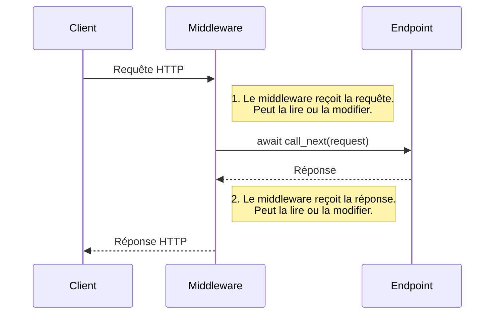

# Introduction aux Middlewares {#introduction-aux-middlewares-28}

Un middleware est une fonction qui se situe "au milieu" du traitement d'une requête et d'une réponse. Il peut intercepter chaque requête qui arrive à votre application, effectuer une action, puis passer la requête à l'opération de chemin correspondante. Une fois que l'opération de chemin a généré une réponse, le middleware peut également intercepter cette réponse et la modifier avant de la renvoyer au client.

C'est un mécanisme extrêmement puissant pour gérer des préoccupations transversales ("cross-cutting concerns") comme la journalisation (logging), la gestion des erreurs, la compression, ou encore l'authentification.

## Concept 1 : Le Patron de Conception du Middleware {#concept-1-le-patron-de-conception-du-middleware-28}

### Quoi ? {#quoi-28}
Dans FastAPI (et Starlette, sur lequel il est basé), un middleware est une fonction `async` qui reçoit deux arguments : `request` et `call_next`.
-   `request`: L'objet `Request` entrant, contenant toutes les informations sur la requête du client.
-   `call_next`: Une fonction que vous devez appeler (`await call_next(request)`) pour passer la requête à l'étape suivante du traitement (soit un autre middleware, soit l'opération de chemin elle-même). La valeur de retour de cet appel sera l'objet `Response`.

Le flux de traitement peut être visualisé comme un oignon, où la requête traverse les couches jusqu'au centre (l'endpoint), et la réponse repart en traversant les mêmes couches en sens inverse.



### Pourquoi ? {#pourquoi-28}
Les middlewares permettent d'appliquer une logique à **toutes** les requêtes de votre application sans avoir à la répéter dans chaque opération de chemin. C'est le principe DRY (Don't Repeat Yourself) appliqué à l'échelle de l'application.

Cas d'usage typiques :
-   Mesurer le temps de traitement de chaque requête.
-   Ajouter des en-têtes de sécurité (comme CORS) à chaque réponse.
-   Journaliser chaque requête et sa réponse.
-   Gérer les exceptions de manière globale.
-   Compresser les réponses (Gzip).

### Comment (Syntaxe + Cas Réel) ? {#comment-syntaxe--cas-reel-28}
La façon la plus simple de créer un middleware personnalisé est d'utiliser le décorateur `@app.middleware("http")`.

**Cas Réel : Mesurer le temps de traitement d'une requête**

```python
import time
from fastapi import FastAPI, Request

app = FastAPI()

@app.middleware("http")
async def add_process_time_header(request: Request, call_next):
    start_time = time.time()
    
    # Passe la requête à l'endpoint
    response = await call_next(request)
    
    # Calcule le temps écoulé
    process_time = time.time() - start_time
    
    # Ajoute un en-tête personnalisé à la réponse
    response.headers["X-Process-Time"] = str(process_time)
    
    return response

@app.get("/")
async def main():
    return {"message": "Hello World"}
```
Si vous appelez cet endpoint et inspectez la réponse, vous verrez un en-tête `X-Process-Time` avec une valeur comme `0.000123...`.

### Zone de Danger {#zone-de-danger-28}
**Ne pas appeler `await call_next(request)` !** Si vous oubliez cette ligne, la requête ne sera jamais traitée par vos opérations de chemin, et votre client attendra indéfiniment (ou jusqu'à un timeout). Le seul cas où vous ne l'appelez pas est si vous voulez intentionnellement court-circuiter la requête (par exemple, pour un blocage d'IP).

---

## Concept 2 : Utiliser les Middlewares Intégrés de Starlette {#concept-2-utiliser-les-middlewares-integres-de-starlette-28}

### Quoi ? {#quoi-29}
FastAPI est construit sur le framework ASGI Starlette, qui fournit plusieurs middlewares très utiles et prêts à l'emploi. Plutôt que de les réinventer, vous pouvez les ajouter directement à votre application FastAPI via la méthode `app.add_middleware()`.

Quelques middlewares courants :
-   `CORSMiddleware`: Gère les en-têtes CORS pour autoriser les requêtes cross-origine.
-   `GZipMiddleware`: Compresse les réponses pour réduire la taille des transferts.
-   `HTTPSRedirectMiddleware`: Redirige tout le trafic HTTP vers HTTPS.
-   `TrustedHostMiddleware`: Protège contre les attaques d'en-tête "Host".

### Pourquoi ? {#pourquoi-29}
Utiliser ces middlewares est la méthode standard pour implémenter des fonctionnalités web communes. Ils sont robustes, testés et optimisés. Le `CORSMiddleware` est quasi indispensable pour toute API destinée à être consommée par une application frontend (React, Vue, Angular) hébergée sur un autre domaine.

### Comment (Syntaxe + Cas Réel) ? {#comment-syntaxe--cas-reel-29}
On importe la classe du middleware et on l'ajoute à l'application avec ses options de configuration.

**Cas Réel : Configurer CORS pour une application frontend**

```python
from fastapi import FastAPI
from fastapi.middleware.cors import CORSMiddleware

app = FastAPI()

# Liste des origines autorisées à faire des requêtes
origins = [
    "http://localhost:3000", # L'adresse de votre app React/Vue
    "https://mon-app.com",
]

app.add_middleware(
    CORSMiddleware,
    allow_origins=origins,       # Autorise des origines spécifiques
    allow_credentials=True,      # Autorise les cookies
    allow_methods=["*"],         # Autorise toutes les méthodes (GET, POST, etc.)
    allow_headers=["*"],         # Autorise tous les en-têtes
)

@app.get("/api/data")
async def get_data():
    return {"data": "Ceci est une donnée privée"}
```
Avec cette configuration, une requête provenant de `http://localhost:3000` sera acceptée, mais une requête d'une origine non listée sera bloquée par le navigateur.

### Zone de Danger {#zone-de-danger-30}
**L'ordre des middlewares est crucial.** Les middlewares sont traités dans l'ordre où ils sont ajoutés. Le premier middleware ajouté sera le plus "externe" (le premier à traiter la requête et le dernier à traiter la réponse). Si vous avez un middleware de gestion d'erreurs, il doit généralement être ajouté en premier pour pouvoir intercepter les erreurs de tous les autres middlewares et de l'application elle-même.

---

## Concept 3 : Gestion Globale des Erreurs avec un Middleware {#concept-3-gestion-globale-des-erreurs-avec-un-middleware-28}

### Quoi ? {#quoi-30}
Un cas d'usage avancé et extrêmement puissant des middlewares est de créer un gestionnaire d'exceptions global. En enrobant l'appel `await call_next(request)` dans un bloc `try...except`, vous pouvez intercepter n'importe quelle exception non gérée qui se produit plus bas dans la chaîne d'appel (dans d'autres middlewares ou dans vos endpoints).

### Pourquoi ? {#pourquoi-30}
Cela garantit que votre API ne plantera jamais avec une erreur 500 et une réponse HTML par défaut. Vous pouvez plutôt intercepter l'erreur, la journaliser, et retourner une réponse JSON propre et standardisée, ce qui est essentiel pour une expérience client professionnelle. Cela centralise la logique de gestion des erreurs en un seul endroit.

### Comment (Syntaxe + Cas Réel) ? {#comment-syntaxe--cas-reel-30}
On utilise un bloc `try...except Exception` autour de `call_next`.

**Cas Réel : Middleware de gestion d'erreurs 500**

```python
from fastapi import FastAPI, Request
from fastapi.responses import JSONResponse

app = FastAPI()

@app.middleware("http")
async def exception_handler_middleware(request: Request, call_next):
    try:
        # Tente de traiter la requête normalement
        return await call_next(request)
    except Exception as e:
        # Si une exception non gérée se produit, on l'intercepte
        # Dans une vraie application, vous journaliseriez l'erreur ici
        print(f"Une erreur inattendue est survenue: {e}")
        return JSONResponse(
            status_code=500,
            content={"message": "Erreur interne du serveur."},
        )

@app.get("/divide/{num1}/{num2}")
async def divide_numbers(num1: int, num2: int):
    # Cette opération lèvera une ZeroDivisionError si num2 est 0
    result = num1 / num2
    return {"result": result}
```
Si vous appelez `/divide/10/0`, au lieu de voir une trace d'erreur brute, vous recevrez une belle réponse JSON `{"message": "Erreur interne du serveur."}` avec un statut 500.

### Zone de Danger {#zone-de-danger-31}
Attention à ne pas intercepter les `HTTPException` de FastAPI dans ce middleware global. Les `HTTPException` sont des exceptions contrôlées que vous levez intentionnellement pour retourner des erreurs spécifiques (400, 404, etc.). Si votre middleware les intercepte et renvoie une réponse 500, vous perdez toute la granularité de vos erreurs HTTP. Il est souvent préférable de faire `except Exception as e:` et d'ajouter une condition pour relever les `HTTPException` si elles sont interceptées.

---

### 3 Questions Clés {#3-questions-cles-28}
1.  Quels sont les deux arguments principaux qu'une fonction de middleware HTTP doit accepter ? Quel est le rôle de chacun ?
2.  Pourquoi l'ordre dans lequel vous ajoutez les middlewares à votre application est-il important ? Donnez un exemple.
3.  Comment pouvez-vous utiliser un middleware pour vous assurer que votre API retourne toujours une réponse JSON formatée, même en cas d'erreur inattendue (comme une `ValueError` ou une `KeyError`) ?

### 3 Exercices Progressifs {#3-exercices-progressifs-28}

**Exercice 1 : Journalisation Simple des Requêtes**
Créez un middleware qui imprime sur la console la méthode HTTP et le chemin de chaque requête entrante. Par exemple, pour une requête `GET /items/1`, il devrait afficher : `INFO:     Request: GET /items/1`.

<details>
<summary>Découvrir la solution commentée</summary>

```python
from fastapi import FastAPI, Request

app = FastAPI()

@app.middleware("http")
async def log_requests(request: Request, call_next):
    print(f"INFO:     Request: {request.method} {request.url.path}")
    response = await call_next(request)
    return response

@app.get("/items/{item_id}")
async def read_item(item_id: int):
    return {"item_id": item_id}
```
</details>

**Exercice 2 : Middleware de Vérification de Clé d'API**
Créez un middleware qui protège l'ensemble de l'API. Il doit vérifier la présence d'un en-tête `X-API-Key`.
-   Si l'en-tête est présent et que sa valeur est `my-secret-api-key`, la requête doit passer.
-   Sinon, le middleware doit retourner immédiatement une `JSONResponse` avec un statut 401 et un message d'erreur, sans appeler `call_next`.
-   **Bonus :** Faites en sorte que ce middleware ne s'applique pas aux chemins de la documentation (`/docs`, `/redoc`, `/openapi.json`).

<details>
<summary>Découvrir la solution commentée</summary>

```python
from fastapi import FastAPI, Request
from fastapi.responses import JSONResponse

app = FastAPI()

@app.middleware("http")
async def verify_api_key(request: Request, call_next):
    # Liste des chemins à exclure de la vérification
    excluded_paths = ["/docs", "/redoc", "/openapi.json"]
    
    if request.url.path in excluded_paths:
        return await call_next(request)

    api_key = request.headers.get("X-API-Key")
    
    if api_key == "my-secret-api-key":
        response = await call_next(request)
        return response
    else:
        return JSONResponse(
            status_code=401,
            content={"detail": "Clé d'API manquante ou invalide"}
        )

@app.get("/secure-data")
async def get_secure_data():
    return {"data": "Informations très secrètes"}
```
</details>

**Exercice 3 : Middleware de Maintenance**
Créez un middleware qui peut mettre l'API en "mode maintenance".
-   Le middleware doit lire une variable globale ou une configuration (par exemple, `MAINTENANCE_MODE = True`).
-   Si le mode maintenance est activé, toutes les requêtes (sauf peut-être une page de statut spécifique) doivent recevoir une `JSONResponse` avec un statut 503 "Service Unavailable" et un message approprié.
-   Si le mode est désactivé, l'API doit fonctionner normalement.

<details>
<summary>Découvrir la solution commentée</summary>

```python
from fastapi import FastAPI, Request
from fastapi.responses import JSONResponse

# Dans une vraie application, cette valeur viendrait d'un fichier de config ou d'une variable d'environnement
MAINTENANCE_MODE = True

app = FastAPI()

@app.middleware("http")
async def maintenance_mode_middleware(request: Request, call_next):
    # On permet d'accéder à un endpoint de statut même en mode maintenance
    if request.url.path == "/status":
        return await call_next(request)

    if MAINTENANCE_MODE:
        return JSONResponse(
            status_code=503,
            content={"message": "Service temporairement indisponible pour maintenance."},
            headers={"Retry-After": "3600"} # Indique au client de réessayer dans 1 heure
        )
    
    response = await call_next(request)
    return response

@app.get("/status")
async def get_status():
    return {"maintenance_mode": MAINTENANCE_MODE}

@app.get("/")
async def get_root():
    return {"message": "API opérationnelle"}
```
</details>