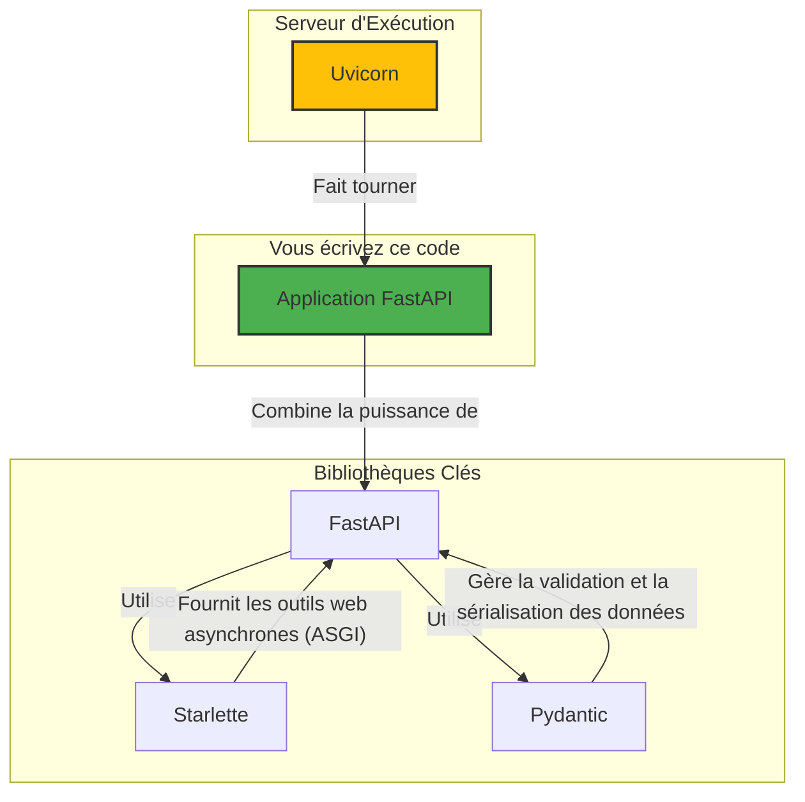

# Introduction à FastAPI et son Écosystème {#introduction-a-fastapi-et-son-ecosysteme-1}

Bienvenue dans le premier chapitre technique de notre formation ! Avant de plonger dans le code, il est essentiel de comprendre ce qu'est FastAPI, pourquoi il est devenu si populaire et comment il s'intègre dans l'écosystème Python moderne.

FastAPI est un framework web Python moderne et ultra-performant, conçu spécifiquement pour la création d'API. Il a été créé par Sebastián Ramírez et a rapidement gagné en popularité grâce à sa simplicité, sa rapidité d'exécution et son expérience de développement exceptionnelle.

## Pourquoi Choisir FastAPI ? {#pourquoi-choisir-fastapi-1}

FastAPI n'est pas juste un autre framework web. Il a été conçu en s'appuyant sur les épaules de géants et en tirant parti des fonctionnalités les plus récentes de Python pour résoudre des problèmes courants dans le développement d'API.

Voici ses principaux atouts :

1.  **Hautes Performances** : FastAPI est l'un des frameworks Python les plus rapides disponibles. Ses performances sont comparables à celles de serveurs écrits en **Go** ou **Node.js**. Cette rapidité est due à son architecture basée sur **Starlette** (pour la partie web) et **Pydantic** (pour la validation des données), deux bibliothèques asynchrones de haute volée.

2.  **Rapidité de Développement** : Grâce à l'utilisation intensive des `type hints` (annotations de type) de Python, vous écrivez un code plus propre, plus explicite, et bénéficiez d'une auto-complétion de premier ordre dans votre éditeur de code. Le résultat ? Vous développez de nouvelles fonctionnalités jusqu'à **200% à 300% plus vite**.

3.  **Moins de Bugs** : La déclaration des types n'est pas juste là pour faire joli. FastAPI s'en sert pour valider automatiquement les données des requêtes entrantes. Si un client envoie des données incorrectes (par exemple, un texte au lieu d'un nombre), FastAPI renvoie une erreur JSON claire et précise, automatiquement. Cela réduit considérablement les erreurs humaines.

4.  **Documentation Automatique et Interactive** : C'est l'une des fonctionnalités les plus appréciées. FastAPI génère automatiquement une documentation interactive pour votre API en se basant sur les standards **OpenAPI** (anciennement Swagger) et **JSON Schema**. Vous pouvez visualiser et même tester vos endpoints directement depuis votre navigateur.

    > 📸 **CAPTURE D'ÉCRAN REQUISE**
    > **Sujet** : Interface de Swagger UI générée automatiquement par FastAPI.
    > **Alt Text** : Documentation interactive Swagger UI montrant une liste d'endpoints API avec des boutons pour les tester.

5.  **Basé sur les Standards** : FastAPI est entièrement basé sur des standards ouverts :
    *   **OpenAPI** pour la définition des API.
    *   **JSON Schema** pour la validation des données.
    *   **OAuth2** et **JWT** pour la sécurité.

## L'Écosystème de FastAPI {#lecosysteme-de-fastapi-1}

FastAPI n'est pas un bloc monolithique. Il est le résultat d'une composition intelligente de plusieurs bibliothèques spécialisées. Comprendre cette architecture est la clé pour maîtriser le framework.

Décortiquons ce diagramme :

-   **Pydantic** : C'est la bibliothèque qui gère toute la magie de la validation des données. Vous définissez la "forme" de vos données avec des classes Python et des `type hints`, et Pydantic s'occupe de valider, sérialiser et désérialiser les données JSON. C'est le cœur de la robustesse de FastAPI.
-   **Starlette** : C'est une boîte à outils **ASGI** (Asynchronous Server Gateway Interface) légère et performante. Starlette fournit toutes les fondations web : routage, middlewares, gestion des requêtes/réponses, WebSockets, etc. FastAPI ajoute une surcouche par-dessus Starlette pour la validation, l'injection de dépendances et la documentation.
-   **Uvicorn** : C'est le serveur qui exécute votre application. Tout comme vous avez besoin d'un serveur comme Gunicorn pour une application WSGI (Flask, Django), vous avez besoin d'un serveur ASGI comme Uvicorn pour une application ASGI (FastAPI, Starlette). Uvicorn est extrêmement rapide et est le serveur recommandé pour le développement et la production.

En résumé, lorsque vous créez une application avec FastAPI, vous bénéficiez de la puissance combinée de ces trois outils, orchestrée de manière cohérente et simple.

## FastAPI face à Flask et Django {#fastapi-face-a-flask-et-django-1}

Si vous venez de l'écosystème Python, vous connaissez probablement Flask ou Django. Comment FastAPI se positionne-t-il ?

-   **vs. Flask** : Flask est un micro-framework, tout comme FastAPI. Cependant, Flask ne propose pas nativement la validation de données ni la documentation automatique. Pour obtenir des fonctionnalités similaires, il faut ajouter de nombreuses extensions, ce qui peut complexifier le projet. FastAPI offre tout cela dès le départ, avec des performances bien supérieures grâce à l'asynchrone.

-   **vs. Django** : Django est un framework "batteries incluses" beaucoup plus lourd. Il est excellent pour les applications web traditionnelles (rendu de templates HTML, admin, ORM intégré). Django REST Framework (DRF) est la solution pour créer des API avec Django, mais elle est souvent considérée comme plus verbeuse et moins performante que FastAPI. FastAPI est "API-first", conçu dès le départ pour ce cas d'usage spécifique.

Le choix dépend du projet, mais pour des API modernes, performantes et bien documentées, FastAPI est aujourd'hui souvent le meilleur choix en Python.

Nous avons maintenant une vision claire de ce qu'est FastAPI et de sa place dans l'écosystème. Dans le prochain chapitre, nous allons mettre les mains dans le cambouis en installant tout le nécessaire pour commencer à coder.