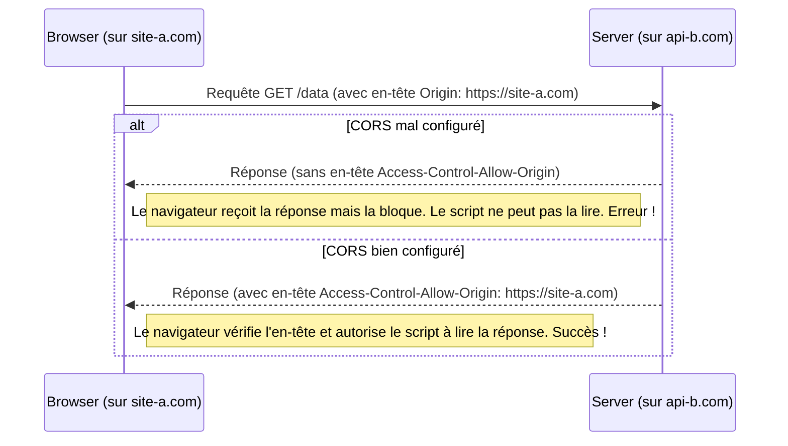
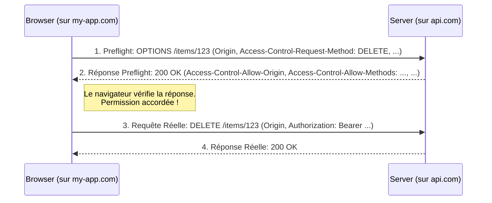

# Middleware CORS (Cross-Origin Resource Sharing) {#middleware-cors-cross-origin-resource-sharing-29}

Si vous avez déjà développé une application frontend (comme React, Vue, ou Angular) qui communique avec une API FastAPI hébergée sur un autre domaine, vous avez presque certainement rencontré une erreur CORS. C'est l'un des problèmes les plus courants et les plus frustrants pour les développeurs web.

Heureusement, FastAPI fournit une solution simple et élégante : le `CORSMiddleware`. Ce chapitre explique ce qu'est CORS, pourquoi c'est nécessaire, et comment le configurer correctement dans votre application.

## Concept 1 : La Politique de Même Origine (Same-Origin Policy) {#concept-1-la-politique-de-meme-origine-same-origin-policy-29}

### Quoi ? {#quoi-29}
La "Same-Origin Policy" (SOP) est une politique de sécurité fondamentale implémentée par les navigateurs web. Elle stipule qu'un script chargé depuis une "origine" A ne peut faire de requêtes HTTP vers une "origine" B que si l'origine B l'autorise explicitement.

Une **origine** est définie par la combinaison de trois éléments : **protocole** (http, https), **hôte** (domaine), et **port**. Si l'un de ces trois éléments diffère, les origines sont considérées comme différentes.

| URL                                  | Origine de `http://api.example.com:8000` | Même Origine ? |
| ------------------------------------ | --------------------------------------- | :------------: |
| `http://api.example.com:8000/users`  | `http://api.example.com:8000`           |       ✅        |
| `https://api.example.com:8000`       | `https://api.example.com:8000`          |       ❌ (protocole)       |
| `http://www.example.com:8000`        | `http://www.example.com:8000`           |       ❌ (hôte)       |
| `http://api.example.com:3000`        | `http://api.example.com:3000`           |       ❌ (port)        |

### Pourquoi ? {#pourquoi-29}
La SOP est une mesure de sécurité cruciale. Imaginez que vous êtes connecté à votre banque en ligne sur `banque.com`. Vous ouvrez un autre onglet et naviguez sur `site-malveillant.com`. Sans la SOP, un script sur `site-malveillant.com` pourrait faire une requête `GET` à `banque.com/api/solde`. Comme vous êtes déjà authentifié, le navigateur enverrait vos cookies de session avec la requête, et le script malveillant pourrait lire le solde de votre compte.

CORS (Cross-Origin Resource Sharing) est le mécanisme qui permet à un serveur de **relaxer** cette politique de manière contrôlée, en indiquant au navigateur quelles origines externes sont autorisées à lire ses réponses.



### Zone de Danger {#zone-de-danger-29}
CORS est une politique **appliquée par le navigateur**. Des outils comme `curl`, Postman, ou des requêtes de serveur à serveur ignorent complètement la politique de même origine et les en-têtes CORS. Si votre API fonctionne avec `curl` mais pas depuis votre application web, le problème est presque certainement lié à CORS.

---

## Concept 2 : Mettre en place `CORSMiddleware` {#concept-2-mettre-en-place-corsmiddleware-29}

### Quoi ? {#quoi-30}
FastAPI inclut un middleware de Starlette, `CORSMiddleware`, qui gère automatiquement l'ajout des en-têtes CORS appropriés à vos réponses. Il vous suffit de l'ajouter à votre application et de le configurer avec les origines, méthodes et en-têtes que vous souhaitez autoriser.

### Pourquoi ? {#pourquoi-30}
Plutôt que de gérer manuellement les en-têtes `Access-Control-Allow-Origin`, `Access-Control-Allow-Methods`, etc., sur chaque endpoint, le middleware centralise cette logique. Il gère également les requêtes "preflight" (voir concept 3) de manière transparente, ce qui simplifie considérablement le développement.

### Comment (Syntaxe + Cas Réel) ? {#comment-syntaxe--cas-reel-30}
On importe `CORSMiddleware` et on l'ajoute à l'application `FastAPI` à l'aide de `app.add_middleware()`.

**Cas Réel : Configuration pour un environnement de développement et de production**

```python
from fastapi import FastAPI
from fastapi.middleware.cors import CORSMiddleware

app = FastAPI()

# Liste des origines autorisées (clients)
origins = [
    "http://localhost:3000",      # Frontend React en développement
    "http://localhost:8080",      # Frontend Vue en développement
    "https://my-production-app.com", # Frontend en production
]

app.add_middleware(
    CORSMiddleware,
    allow_origins=origins,
    allow_credentials=True, # Autorise les cookies et les en-têtes d'authentification
    allow_methods=["GET", "POST", "PUT", "DELETE"], # Méthodes HTTP autorisées
    allow_headers=["Authorization", "Content-Type"], # En-têtes HTTP autorisés
)

@app.get("/api/v1/users/me")
def read_current_user():
    return {"username": "fakecurrentuser"}
```

### Zone de Danger {#zone-de-danger-31}
Configurer `allow_origins=["*"]` est tentant mais dangereux. Cela signifie que **n'importe quel site web sur Internet** peut faire des requêtes à votre API depuis le navigateur d'un utilisateur. C'est acceptable pour des API publiques qui ne gèrent pas de données sensibles et ne nécessitent pas d'authentification. Cependant, si votre API gère des données utilisateur ou des actions privées, vous **ne devez jamais** utiliser `allow_origins=["*"]` en conjonction avec `allow_credentials=True`. C'est une faille de sécurité majeure.

---

## Concept 3 : Les Requêtes "Preflight" (`OPTIONS`) {#concept-3-les-requetes-preflight-options-29}

### Quoi ? {#quoi-31}
Pour certaines requêtes considérées comme "complexes" (par exemple, une requête `DELETE` ou une requête `POST` avec un en-tête `Content-Type: application/json` ou un en-tête personnalisé comme `Authorization`), le navigateur ne lance pas immédiatement la requête. Il envoie d'abord une requête "preflight" (de pré-vérification) en utilisant la méthode HTTP `OPTIONS`.

### Pourquoi ? {#pourquoi-31}
Cette requête `OPTIONS` demande au serveur la permission d'envoyer la requête réelle. Le navigateur demande en substance : "Serveur, puis-je envoyer une requête `DELETE` depuis cette origine avec un en-tête `Authorization` ?". Le serveur répond avec les méthodes et en-têtes qu'il autorise. Si la requête réelle est autorisée, le navigateur l'envoie. Sinon, il bloque la requête et affiche une erreur CORS. C'est une couche de sécurité supplémentaire.

### Comment (Syntaxe + Cas Réel) ? {#comment-syntaxe--cas-reel-31}
Vous n'avez **rien à faire** de spécial dans votre code pour gérer les requêtes preflight. Le `CORSMiddleware` les intercepte et y répond automatiquement en se basant sur votre configuration.

**Flux d'une requête complexe avec Preflight :**



### Zone de Danger {#zone-de-danger-32}
Quand vous déboguez une erreur CORS, ouvrez toujours les outils de développement de votre navigateur (F12) et allez dans l'onglet "Réseau" (Network). Vous verrez souvent que la requête `OPTIONS` a échoué (statut 4xx ou rouge). Cliquez sur cette requête pour voir quelle en est la raison. Le message d'erreur dans la console est souvent très explicite, par exemple : "Reason: header 'x-custom-header' is not allowed according to header 'Access-Control-Allow-Headers' from CORS preflight response."

> 📸 **CAPTURE D'ÉCRAN REQUISE**
> **Sujet** : Onglet Réseau des outils de développement d'un navigateur, montrant une requête `OPTIONS` échouée suivie d'une erreur CORS dans la console.
> **Alt Text** : Capture d'écran de la console de développement Chrome affichant une erreur CORS rouge, avec l'onglet Réseau en arrière-plan mettant en évidence une requête OPTIONS avec un statut 403 Forbidden.

---

### 3 Questions Clés {#3-questions-cles-29}
1.  Qu'est-ce qu'une "origine" dans le contexte de la politique de même origine ?
2.  Pourquoi est-il dangereux d'utiliser `allow_origins=["*"]` avec `allow_credentials=True` ?
3.  Dans quel scénario un navigateur envoie-t-il une requête `OPTIONS` avant la requête réelle, et quel est le rôle de cette requête "preflight" ?

### 3 Exercices Progressifs {#3-exercices-progressifs-29}

**Exercice 1 : Configuration de Développement Basique**
Vous développez une application dont le frontend tourne sur `http://127.0.0.1:5173` (Vite.js) et votre API FastAPI sur `http://127.0.0.1:8000`. Configurez le `CORSMiddleware` pour permettre à votre frontend de faire des requêtes `GET` et `POST` simples.

<details>
<summary>Découvrir la solution commentée</summary>

```python
from fastapi import FastAPI
from fastapi.middleware.cors import CORSMiddleware

app = FastAPI()

app.add_middleware(
    CORSMiddleware,
    allow_origins=["http://127.0.0.1:5173"],
    allow_credentials=False, # Pas besoin pour des requêtes simples
    allow_methods=["GET", "POST"],
    allow_headers=[], # Pas d'en-têtes personnalisés nécessaires
)

@app.get("/")
def home():
    return {"message": "API is running"}
```
</details>

**Exercice 2 : Configuration de Production Stricte**
Votre API est maintenant en production. Le frontend est sur `https://app.mondomaine.fr`. L'API doit accepter les requêtes authentifiées (qui envoient un en-tête `Authorization`). Les requêtes peuvent être des `GET`, `POST`, `PUT`. Configurez le middleware de manière sécurisée.

<details>
<summary>Découvrir la solution commentée</summary>

```python
from fastapi import FastAPI
from fastapi.middleware.cors import CORSMiddleware

app = FastAPI()

# La configuration est plus restrictive pour la production
app.add_middleware(
    CORSMiddleware,
    allow_origins=["https://app.mondomaine.fr"], # Uniquement le domaine de production
    allow_credentials=True, # Indispensable pour que les en-têtes d'authentification passent
    allow_methods=["GET", "POST", "PUT"], # Uniquement les méthodes nécessaires
    allow_headers=["Authorization", "Content-Type"], # Autorise les en-têtes standards et d'auth
)

@app.get("/profile")
def get_profile():
    return {"user": "profile data"}
```
</details>

**Exercice 3 : Débogage d'une Configuration CORS**
Un développeur frontend vous dit que sa requête `PATCH /items/1` avec un en-tête `X-Request-ID` échoue avec une erreur CORS. Voici votre configuration actuelle. Identifiez le problème et corrigez le code.

```python
# Code problématique
app.add_middleware(
    CORSMiddleware,
    allow_origins=["http://localhost:3000"],
    allow_credentials=True,
    allow_methods=["GET", "POST"],
    allow_headers=["Authorization"],
)
```

<details>
<summary>Découvrir la solution commentée</summary>

Il y a deux problèmes :
1.  La méthode `PATCH` n'est pas dans la liste `allow_methods`.
2.  L'en-tête personnalisé `X-Request-ID` n'est pas dans la liste `allow_headers`.

La requête `PATCH` et l'en-tête personnalisé déclenchent une requête preflight. Le serveur répondra qu'il n'autorise ni `PATCH` ni `X-Request-ID`, donc le navigateur bloquera la requête.

**Code Corrigé :**
```python
# Code corrigé
app.add_middleware(
    CORSMiddleware,
    allow_origins=["http://localhost:3000"],
    allow_credentials=True,
    allow_methods=["GET", "POST", "PATCH"], # Ajout de "PATCH"
    allow_headers=["Authorization", "X-Request-ID"], # Ajout de "X-Request-ID"
)
```
</details>