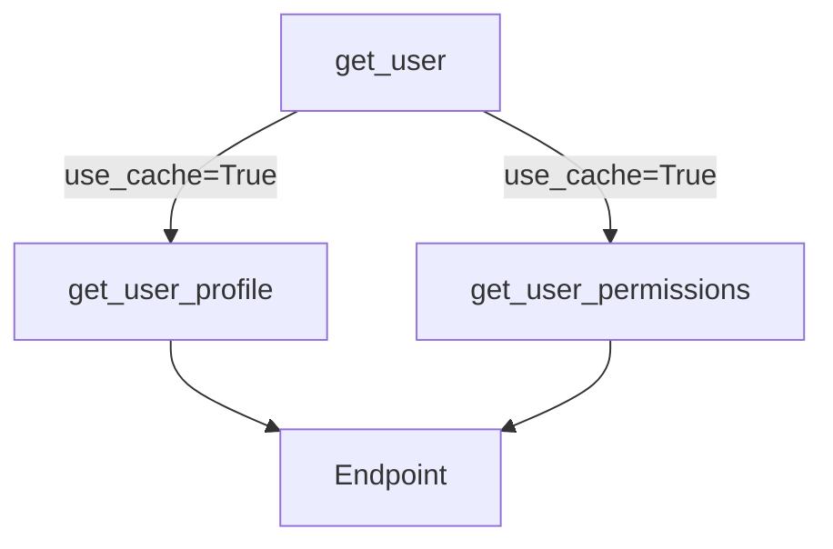

# Dépendances Multiples et Sub-dépendances {#dependances-multiples-et-sub-dependances-19}

Nous avons vu comment utiliser des dépendances pour extraire et réutiliser de la logique. Mais la véritable puissance du système de DI de FastAPI se révèle lorsque l'on commence à les composer. Un seul endpoint peut avoir besoin de plusieurs logiques indépendantes (pagination, authentification, logging), et ces logiques elles-mêmes peuvent être décomposées en briques plus petites.

FastAPI gère cette complexité en construisant un "graphe de dépendances" pour chaque requête. Il comprend quelles dépendances dépendent des autres, les exécute dans le bon ordre, met en cache les résultats au sein d'une même requête, et injecte le tout là où c'est nécessaire.

## Concept 1 : Dépendances Multiples et Indépendantes {#concept-1-dependances-multiples-et-independantes-19}

### Quoi ? {#quoi-19}
Une seule fonction d'opération de chemin peut dépendre de plusieurs fonctions de dépendance distinctes et indépendantes. FastAPI résoudra chacune d'entre elles et passera leurs résultats en tant qu'arguments distincts.

### Pourquoi ? {#pourquoi-19}
Cela permet de combiner de manière modulaire des fonctionnalités transverses. Un endpoint listant des ressources pourrait avoir besoin :
-   D'un ensemble de paramètres de pagination.
-   D'une vérification des permissions de l'utilisateur.
-   D'un paramètre de filtrage optionnel.

Chacune de ces logiques peut être encapsulée dans sa propre dépendance et appliquée de manière "mix and match" aux endpoints qui en ont besoin.

### Comment (Syntaxe + Cas Réel) ? {#comment-syntaxe--cas-reel-19}
Il suffit de déclarer plusieurs paramètres avec `Depends` dans la signature de la fonction.

**Cas Réel : Combiner pagination et vérification de clé API**

```python
from fastapi import FastAPI, Depends, Header, HTTPException

app = FastAPI()

# Dépendance 1 : Gère la pagination
def pagination_params(skip: int = 0, limit: int = 50):
    return {"skip": skip, "limit": limit}

# Dépendance 2 : Vérifie la présence et la validité d'une clé API
def verify_api_key(x_api_key: str = Header(...)):
    if x_api_key != "my-secret-key":
        raise HTTPException(status_code=403, detail="Invalid API Key")
    return x_api_key

@app.get("/data")
# Notre endpoint dépend de DEUX fonctions indépendantes
async def get_data(
    pagination: dict = Depends(pagination_params),
    api_key: str = Depends(verify_api_key)
):
    # Les résultats de chaque dépendance sont disponibles
    return {
        "message": "Data retrieved successfully",
        "pagination": pagination,
        "api_key_used": api_key
    }
```
FastAPI exécutera `pagination_params` et `verify_api_key` (potentiellement en parallèle) avant d'exécuter `get_data`.

### Zone de Danger {#zone-de-danger-19}
Une signature de fonction avec un très grand nombre de dépendances peut devenir difficile à lire et à maintenir. Si vous vous retrouvez avec 5 ou 6 dépendances, demandez-vous si certaines ne pourraient pas être regroupées logiquement en une seule dépendance de plus haut niveau qui dépend elle-même de sub-dépendances.

---

## Concept 2 : Sub-dépendances et Graphe de Dépendances {#concept-2-sub-dependances-et-graphe-de-dependances-19}

### Quoi ? {#quoi-20}
Une dépendance peut elle-même utiliser `Depends` pour déclarer ses propres dépendances. C'est ce qu'on appelle une sub-dépendance. FastAPI analyse cette chaîne pour construire un graphe de toutes les dépendances nécessaires, de la plus basique à la plus complexe.

### Pourquoi ? {#pourquoi-20}
-   **Abstraction :** Permet de construire des couches logiques. Une dépendance de haut niveau comme `get_current_active_user` peut cacher toute la complexité de la validation de token OAuth2, qui elle-même dépend de l'extraction du token depuis l'en-tête.
-   **Modularité :** Chaque maillon de la chaîne peut être testé et maintenu indépendamment.
-   **Clarté :** L'endpoint final ne dépend que de la brique de plus haut niveau, ce qui rend son intention très claire.

```mermaid
graph TD
    subgraph Endpoint
        A("read_items(user: User = Depends(get_current_user))")
    end

    subgraph "Dépendances"
        B("get_current_user(token: str = Depends(oauth2_scheme))")
        C("oauth2_scheme(Authorization: str = Header(...))")
    end

    subgraph Requête HTTP
        D[Header "Authorization: Bearer ..."]
    end

    A -- dépend de --> B
    B -- dépend de --> C
    C -- lit le token depuis --> D
```

### Comment (Syntaxe + Cas Réel) ? {#comment-syntaxe--cas-reel-20}
La syntaxe est identique : une dépendance utilise `Depends` dans sa propre signature.

**Cas Réel : Obtenir un item spécifique à un utilisateur**
Pour obtenir un item, il faut :
1.  Vérifier que l'utilisateur est authentifié (`get_current_user`).
2.  Récupérer l'item de la DB en utilisant son `item_id` (`get_item`).
3.  Vérifier que l'item appartient bien à l'utilisateur courant (`get_user_item`).

```python
from fastapi import FastAPI, Depends, Path, HTTPException

app = FastAPI()

# Dépendance 1 (simulée)
async def get_current_user():
    return {"username": "john.doe", "id": 1}

# Dépendance 2, qui prend un paramètre de chemin
async def get_item(item_id: int = Path(...)):
    # Simule une recherche en DB
    if item_id == 42:
        return {"id": 42, "name": "The Answer", "owner_id": 1}
    raise HTTPException(status_code=404, detail="Item not found")

# Dépendance 3, qui dépend des deux premières !
async def get_user_item(
    user: dict = Depends(get_current_user),
    item: dict = Depends(get_item)
):
    if item["owner_id"] != user["id"]:
        raise HTTPException(status_code=403, detail="Not authorized to access this item")
    return item

@app.get("/items/{item_id}")
# L'endpoint ne dépend que de la logique de plus haut niveau
async def read_user_item(item: dict = Depends(get_user_item)):
    return {"item": item}
```

### Zone de Danger {#zone-de-danger-21}
**Dépendances circulaires :** Si A dépend de B, et B dépend de A, FastAPI lèvera une erreur au démarrage. Cela indique généralement une erreur de conception dans votre logique. Assurez-vous que votre graphe de dépendances est bien un "graphe orienté acyclique" (DAG).

---

## Concept 3 : Partager des Résultats avec `use_cache` {#concept-3-partager-des-resultats-avec-use_cache-19}

### Quoi ? {#quoi-22}
Dans un graphe de dépendances complexe, il est possible que plusieurs branches dépendent de la même sub-dépendance. Par défaut, FastAPI ré-exécuterait cette sub-dépendance pour chaque branche. Le paramètre `use_cache=True` de `Depends` indique à FastAPI d'exécuter la dépendance une seule fois par requête et de réutiliser son résultat pour tous les autres `Depends` qui la demandent.

### Pourquoi ? {#pourquoi-22}
**Performance !** C'est crucial pour éviter des opérations coûteuses redondantes au sein d'une même requête, comme :
-   Ouvrir plusieurs connexions à la base de données.
-   Décoder et valider un token JWT plusieurs fois.
-   Effectuer le même calcul complexe.

Ce problème est parfois appelé le "problème du diamant" dans les graphes de dépendances.


Sans cache, `get_user` serait appelé deux fois. Avec le cache, il n'est appelé qu'une seule fois.

### Comment (Syntaxe + Cas Réel) ? {#comment-syntaxe--cas-reel-22}
Ajoutez `use_cache=True` à chaque `Depends` qui fait référence à la dépendance partagée.

**Cas Réel : Partager un objet utilisateur**

```python
from fastapi import FastAPI, Depends

app = FastAPI()

# La dépendance partagée et "coûteuse"
async def get_user_from_db(user_id: int):
    print(f"--- Récupération de l'utilisateur {user_id} depuis la DB... ---")
    return {"id": user_id, "name": "Jane Doe"}

# Une dépendance qui a besoin de l'utilisateur
async def get_profile(user: dict = Depends(get_user_from_db, use_cache=True)):
    return {"name": user["name"], "profile_info": "Some profile data"}

# Une autre dépendance qui a aussi besoin du même utilisateur
async def get_permissions(user: dict = Depends(get_user_from_db, use_cache=True)):
    return {"permissions": ["read", "write"]}

@app.get("/users/{user_id}/dashboard")
async def get_user_dashboard(
    profile: dict = Depends(get_profile),
    permissions: dict = Depends(get_permissions)
):
    # Grâce à use_cache=True, le message de récupération de la DB
    # n'apparaîtra qu'une seule fois dans la console.
    return {"user_profile": profile, "user_permissions": permissions}
```

### Zone de Danger {#zone-de-danger-23}
Le cache est par instance de dépendance. Si vous avez `Depends(ma_dependance)` et `Depends(ma_dependance, use_cache=False)`, le cache ne sera pas utilisé. La cohérence est clé : si une dépendance est destinée à être partagée, utilisez `use_cache=True` partout où elle est appelée comme sub-dépendance.

---

### 3 Questions Clés {#3-questions-cles-19}
1.  Comment peut-on combiner une logique de pagination et une logique de vérification de permission pour un seul endpoint en utilisant le système de dépendances ?
2.  Qu'est-ce qu'une "sub-dépendance" et quel est l'avantage principal de structurer son code de cette manière ?
3.  Dans un scénario où deux dépendances distinctes ont besoin de l'objet "utilisateur courant", quelle option de `Depends` permet d'éviter de récupérer cet utilisateur de la base de données deux fois ?

### 3 Exercices Progressifs {#3-exercices-progressifs-19}

**Exercice 1 : Combiner Filtres et Tri**
Créez un endpoint `/products` qui utilise deux dépendances indépendantes :
1.  `query_filters(category: Optional[str] = None)`: retourne un dictionnaire avec la catégorie si elle est fournie.
2.  `sorting_params(sort_by: str = "name", order: str = "asc")`: retourne un dictionnaire avec les paramètres de tri.
L'endpoint doit retourner un JSON affichant les filtres et les options de tri qu'il a reçus.

<details>
<summary>Découvrir la solution commentée</summary>

```python
from fastapi import FastAPI, Depends
from typing import Optional

app = FastAPI()

def query_filters(category: Optional[str] = None):
    if category:
        return {"category": category}
    return {}

def sorting_params(sort_by: str = "name", order: str = "asc"):
    return {"sort_by": sort_by, "order": order}

@app.get("/products")
async def list_products(
    filters: dict = Depends(query_filters),
    sorting: dict = Depends(sorting_params)
):
    return {"filters": filters, "sorting": sorting, "data": []}
```
</details>

**Exercice 2 : Chaîne de Validation d'Item**
Construisez une chaîne de dépendances pour valider et récupérer un item d'un "magasin" :
1.  `get_store(store_id: int)`: une dépendance qui vérifie si le magasin existe (ex: `store_id == 1`). Si non, lève une `HTTPException` 404. Elle retourne l'ID du magasin.
2.  `get_item_in_store(item_name: str, store_id: int = Depends(get_store))`: une sub-dépendance qui vérifie si un item existe dans ce magasin (ex: `item_name == "apple"`). Si non, 404. Elle retourne l'item.
3.  Un endpoint `/stores/{store_id}/items/{item_name}` qui dépend de `get_item_in_store` pour retourner les détails de l'item.

<details>
<summary>Découvrir la solution commentée</summary>

```python
from fastapi import FastAPI, Depends, HTTPException

app = FastAPI()

# Dépendance de niveau 1
async def get_store(store_id: int):
    if store_id != 1:
        raise HTTPException(status_code=404, detail="Store not found")
    return store_id

# Dépendance de niveau 2
async def get_item_in_store(item_name: str, store_id: int = Depends(get_store)):
    # Simule la DB du magasin
    store_inventory = {"apple", "banana"}
    if item_name not in store_inventory:
        raise HTTPException(
            status_code=404, 
            detail=f"Item '{item_name}' not found in store {store_id}"
        )
    return {"name": item_name, "store_id": store_id, "price": 0.5}

@app.get("/stores/{store_id}/items/{item_name}")
async def get_item_details(item: dict = Depends(get_item_in_store)):
    return item
```
</details>

**Exercice 3 : Optimiser la Vérification des Permissions**
Créez une hiérarchie de dépendances où le cache est nécessaire :
1.  `get_company(company_id: int)`: une dépendance qui simule une lecture DB coûteuse (avec un `print`). Elle retourne un objet `company`.
2.  `can_read_company_data(company: dict = Depends(get_company, use_cache=True))`: une dépendance qui vérifie si l'utilisateur a le droit de lire les données.
3.  `can_write_company_data(company: dict = Depends(get_company, use_cache=True))`: une autre dépendance qui vérifie les droits d'écriture.
4.  Un endpoint `/companies/{company_id}/access` qui dépend des deux dépendances de permissions (`can_read...` et `can_write...`) et retourne les permissions.
Prouvez que la fonction `get_company` n'est appelée qu'une seule fois.

<details>
<summary>Découvrir la solution commentée</summary>

```python
from fastapi import FastAPI, Depends

app = FastAPI()

# Dépendance coûteuse et partagée
async def get_company(company_id: int):
    print(f"--- Fetching company {company_id} from DB... ---")
    return {"id": company_id, "name": "Awesome Inc."}

# Sub-dépendance qui utilise le cache
async def can_read_company_data(company: dict = Depends(get_company, use_cache=True)):
    # Ici, on aurait une logique de permission complexe
    return True

# Autre sub-dépendance qui utilise le cache
async def can_write_company_data(company: dict = Depends(get_company, use_cache=True)):
    return False

@app.get("/companies/{company_id}/access")
async def get_company_access(
    can_read: bool = Depends(can_read_company_data),
    can_write: bool = Depends(can_write_company_data)
):
    # La console du serveur n'affichera "Fetching company..." qu'une seule fois.
    return {"read_access": can_read, "write_access": can_write}
```
</details>