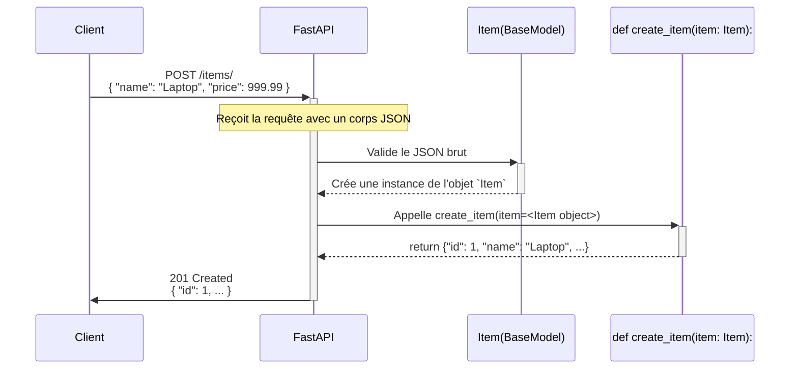

# Request Body : Modèles Pydantic Simples {#request-body-modeles-pydantic-simples-9}

Jusqu'à présent, nos API recevaient des données simples via l'URL (Path et Query Parameters). C'est parfait pour la lecture et le filtrage (`GET`), mais pour créer ou mettre à jour des données complexes (comme un nouvel utilisateur avec 10 champs), l'URL ne suffit plus.

Nous devons envoyer ces informations dans le **corps de la requête** (Request Body), généralement sous forme de JSON. C'est ici que FastAPI révèle sa plus grande force : son intégration native avec **Pydantic** pour créer des modèles de données robustes, validés et auto-documentés.



## Concept 1 : Définir un Modèle avec Pydantic `BaseModel` {#concept-1-definir-un-modele-avec-pydantic-basemodel-9}

### Quoi ? {#quoi-9}
Un modèle Pydantic est une simple classe Python qui hérite de `BaseModel`. Vous y déclarez les champs que vous attendez dans votre JSON en utilisant des annotations de type (type hints) standards. C'est un contrat de données clair et explicite.

### Pourquoi ? {#pourquoi-9}
Utiliser des modèles Pydantic est la méthode recommandée et la plus puissante pour gérer les corps de requêtes. Cela vous offre :
-   **Validation automatique** : FastAPI garantit que les données reçues correspondent aux types définis (un `int` est un `int`, pas une chaîne).
-   **Conversion de type** : Si possible, les types sont convertis (la chaîne `"99.99"` peut être convertie en `float` `99.99`).
-   **Documentation instantanée** : Votre documentation interactive (`/docs`) affichera un exemple exact du JSON attendu.
-   **Erreurs claires** : En cas de données invalides, FastAPI renvoie une réponse JSON précise indiquant quel champ est incorrect et pourquoi.
-   **Autocomplétion** : Dans votre éditeur de code, vous aurez l'autocomplétion pour tous les champs du modèle (ex: `item.name`).

### Comment (Syntaxe + Cas Réel) ? {#comment-syntaxe--cas-reel-9}
1.  Importez `BaseModel` de `pydantic`.
2.  Créez une classe qui en hérite.
3.  Déclarez les attributs avec leurs types.
4.  Utilisez cette classe comme `type hint` dans votre fonction d'opération de chemin.

**Cas Réel : Création d'un nouvel article dans un e-commerce**
Nous voulons créer un endpoint `POST /items/` qui accepte un JSON pour un nouvel article.

```python
from fastapi import FastAPI
from pydantic import BaseModel
from typing import Optional

# 1. & 2. & 3. Définition du modèle Pydantic
class Item(BaseModel):
    name: str
    description: Optional[str] = None # Champ optionnel, peut être None
    price: float
    is_offer: bool = False # Champ optionnel avec une valeur par défaut

app = FastAPI()

# 4. Utilisation du modèle comme type hint
@app.post("/items/")
async def create_item(item: Item):
    # 'item' est maintenant une instance de la classe Item.
    # FastAPI a fait toute la validation pour vous.
    print(f"Article reçu : {item.name}, Prix : {item.price}")
    return item
```
Pour tester, lancez Uvicorn, allez sur `http://127.0.0.1:8000/docs`, et essayez le endpoint `/items/` avec un JSON comme celui-ci :
```json
{
  "name": "Super Chaise de Gaming",
  "price": 150.50
}
```
Vous verrez que même si `description` et `is_offer` sont absents, la requête fonctionne grâce à leurs valeurs par défaut.

> 📸 **CAPTURE D'ÉCRAN REQUISE**
> **Sujet** : Documentation Swagger UI montrant le "Schema" du modèle `Item`.
> **Alt Text** : Section "Schemas" dans la documentation Swagger UI affichant le modèle Item avec ses champs, types, et s'ils sont requis (name, price) ou non (description, is_offer).

### Zone de Danger {#zone-de-danger-9}
L'erreur classique est une incohérence entre les clés du JSON envoyé par le client et les noms des attributs dans votre modèle Pydantic. Si votre modèle attend `price` et que le client envoie `cost`, la validation échouera avec une erreur "field required" pour `price` et "extra fields not permitted" si Pydantic est configuré strictement.

---

## Concept 2 : Accéder et Utiliser les Données du Modèle {#concept-2-acceder-et-utiliser-les-donnees-du-modele-9}

### Quoi ? {#quoi-10}
Une fois que FastAPI a validé et parsé le corps de la requête dans votre modèle Pydantic, le paramètre de votre fonction (ici `item`) n'est pas un dictionnaire, mais une véritable instance de votre classe. Vous pouvez donc y accéder en utilisant la notation par point.

### Pourquoi ? {#pourquoi-10}
C'est bien plus propre et plus sûr que de manipuler des dictionnaires.
-   `item.name` est plus lisible que `item['name']`.
-   Votre éditeur de code peut vous aider avec l'autocomplétion.
-   Vous bénéficiez de la vérification de type statique si vous utilisez des outils comme MyPy.
-   Vous ne risquez pas de faire une faute de frappe dans une clé (`item['naem']`) qui provoquerait une `KeyError` à l'exécution.

### Comment (Syntaxe + Cas Réel) ? {#comment-syntaxe--cas-reel-10}
Reprenons notre exemple et rendons la logique plus "réaliste" en simulant un enregistrement et en retournant un objet modifié.

```python
# ... (importations et définition du modèle Item)

app = FastAPI()

@app.post("/items/")
async def create_item(item: Item):
    print(f"Accès direct aux attributs : {item.name}")

    # Convertir le modèle Pydantic en dictionnaire si nécessaire
    item_dict = item.dict()

    # Logique métier : par exemple, ajouter une taxe
    if item.price > 0:
        price_with_tax = item.price * 1.2
        item_dict.update({"price_with_tax": price_with_tax})

    # Simuler la sauvegarde en base de données et l'obtention d'un ID
    item_dict.update({"id": 1})
    
    return item_dict
```
Dans cet exemple :
-   On accède à `item.name` et `item.price` directement.
-   On utilise `item.dict()` pour obtenir une représentation en dictionnaire du modèle, ce qui est pratique pour manipuler les données ou les passer à d'autres bibliothèques.
-   On modifie ce dictionnaire et on le retourne. FastAPI le convertira automatiquement en JSON pour la réponse.

### Zone de Danger {#zone-de-danger-11}
Attention en accédant à des champs optionnels qui n'ont pas de valeur par défaut (ceux typés avec `Optional[T]` ou `T | None`). L'attribut existera toujours sur le modèle, mais sa valeur sera `None` si le client ne l'a pas fourni. Faites toujours une vérification : `if item.description: ...` avant d'essayer de l'utiliser.

---

### 3 Questions Clés {#3-questions-cles-9}
1.  Pour créer un modèle de données pour un corps de requête, de quelle classe Pydantic votre classe doit-elle hériter ?
2.  Quelle est la méthode pour déclarer un champ `email` (chaîne de caractères) qui est obligatoire, et un champ `age` (entier) qui est optionnel dans un modèle `User` ?
3.  Si votre fonction est définie par `def process_data(data: MyModel):`, quel est le type de la variable `data` à l'intérieur de la fonction, et comment accédez-vous à son champ `name` ?

### 3 Exercices Progressifs {#3-exercices-progressifs-9}

**Exercice 1 : API d'enregistrement de livre**
Créez un endpoint `POST /books` qui accepte un corps de requête pour un nouveau livre. Le modèle `Book` doit avoir :
-   `title` (str, obligatoire)
-   `author` (str, obligatoire)
-   `pages` (int, obligatoire)
L'endpoint doit retourner les données du livre reçu avec un champ supplémentaire `"status": "added"`.

<details>
<summary>Découvrir la solution commentée</summary>

```python
from fastapi import FastAPI
from pydantic import BaseModel

class Book(BaseModel):
    title: str
    author: str
    pages: int

app = FastAPI()

@app.post("/books")
async def add_book(book: Book):
    # Convertit le modèle en dictionnaire pour pouvoir l'étendre facilement.
    book_data = book.dict()
    book_data["status"] = "added"
    return book_data
```
*Pour tester, envoyez une requête POST à `/books` avec un corps JSON comme :*
`{"title": "Dune", "author": "Frank Herbert", "pages": 896}`
</details>

**Exercice 2 : Création d'un événement**
Créez un endpoint `POST /events` qui accepte un modèle `Event`. Il doit contenir :
-   `name` (str, obligatoire)
-   `location` (str, obligatoire)
-   `all_day` (bool, optionnel, avec une valeur par défaut à `False`)
-   `attendees` (int, optionnel, sans valeur par défaut)
L'endpoint doit retourner une phrase de confirmation qui varie si le nombre de participants (`attendees`) est fourni ou non.

<details>
<summary>Découvrir la solution commentée</summary>

```python
from fastapi import FastAPI
from pydantic import BaseModel
from typing import Optional

class Event(BaseModel):
    name: str
    location: str
    all_day: bool = False
    attendees: Optional[int] = None # ou "int | None = None" en Python 3.10+

app = FastAPI()

@app.post("/events")
async def create_event(event: Event):
    confirmation_message = f"Event '{event.name}' in '{event.location}' created."
    if event.attendees is not None: # On vérifie si le champ optionnel a été fourni
        confirmation_message += f" Expected attendees: {event.attendees}."
    else:
        confirmation_message += " Number of attendees not specified."
    
    return {"message": confirmation_message}
```
*Testez avec et sans le champ `attendees` dans votre JSON.*
</details>

**Exercice 3 : Mélanger Path, Query et Body**
Créez un endpoint `POST /users/{user_id}/feedback`.
-   Il doit prendre un `user_id` (entier) comme **paramètre de chemin**.
-   Il doit accepter un paramètre de requête optionnel `notify` (booléen) pour savoir s'il faut envoyer un email de notification.
-   Il doit accepter un corps de requête avec un modèle `Feedback` contenant :
    -   `rating` (int, obligatoire)
    -   `comment` (str, optionnel)
La réponse doit combiner toutes ces informations.

<details>
<summary>Découvrir la solution commentée</summary>

```python
from fastapi import FastAPI, Path
from pydantic import BaseModel
from typing import Optional

class Feedback(BaseModel):
    rating: int
    comment: Optional[str] = None

app = FastAPI()

@app.post("/users/{user_id}/feedback")
async def submit_feedback(
    user_id: int = Path(..., gt=0), # Validation sur le path param
    notify: bool = True,           # Query param avec défaut
    feedback: Feedback             # Request Body
):
    # On assemble toutes les informations reçues
    return {
        "user_id": user_id,
        "feedback_received": {
            "rating": feedback.rating,
            "comment": feedback.comment
        },
        "notification_sent": notify
    }
```
*Un exemple d'appel serait un POST à `/users/123/feedback?notify=false` avec le corps JSON `{"rating": 5, "comment": "Excellent service!"}`.*
</details>