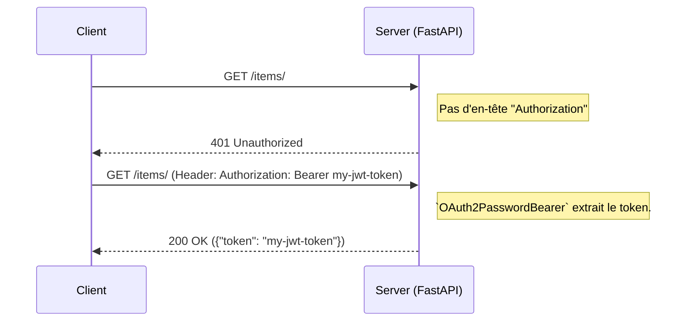

# Sécurité : Introduction à OAuth2 et Token Bearer {#securite-introduction-a-oauth2-et-token-bearer-34}

Sécuriser une API est une nécessité absolue. Parmi les standards de l'industrie, OAuth2 est le framework de référence pour la délégation d'autorisation, et le mécanisme de "Bearer Token" est la méthode la plus courante pour authentifier les requêtes API dans les applications modernes.

FastAPI fournit un ensemble d'outils de sécurité sophistiqués, basés sur le système d'injection de dépendances, qui s'intègrent parfaitement à la spécification OpenAPI. Cela permet non seulement de sécuriser vos endpoints, mais aussi de documenter automatiquement les schémas de sécurité, offrant une expérience de développement exceptionnelle via l'interface Swagger UI.

Ce chapitre, de niveau senior, se concentre sur l'implémentation du flux "Password" d'OAuth2 avec des tokens JWT (JSON Web Tokens).

**Prérequis :** Installez les bibliothèques nécessaires. `passlib` et `bcrypt` sont recommandés pour le hachage de mots de passe.
```bash
pip install python-jose[cryptography] "passlib[bcrypt]"
```

## Concept 1 : Les Schémas de Sécurité et `OAuth2PasswordBearer` {#concept-1-les-schemas-de-securite-et-oauth2passwordbearer-34}

### Quoi ? {#quoi-34}
Un "schéma de sécurité" dans FastAPI est une classe qui définit comment un client doit fournir ses informations d'authentification. `OAuth2PasswordBearer` est un schéma spécifique qui implémente le flux "Resource Owner Password Credentials Grant" (communément appelé "flux de mot de passe") d'OAuth2.

Concrètement, `OAuth2PasswordBearer` est une dépendance qui attend une requête contenant un en-tête `Authorization` avec la valeur `Bearer <token>`. Si l'en-tête est présent et correctement formaté, il extrait et retourne la valeur du token. Sinon, il lève automatiquement une `HTTPException` 401 (Unauthorized).

### Pourquoi ? {#pourquoi-34}
1.  **Standardisation :** Cela suit les standards web (RFC 6750) pour l'utilisation des Bearer Tokens.
2.  **Intégration OpenAPI :** L'utilisation de ce schéma informe la documentation Swagger UI/ReDoc de la méthode d'authentification requise. Cela génère automatiquement un bouton "Authorize" qui permet aux développeurs de s'authentifier et de tester les endpoints protégés directement depuis la documentation.
3.  **Réutilisabilité :** C'est une dépendance, donc vous pouvez la réutiliser sur n'importe quel endpoint nécessitant une authentification par token.

### Comment (Syntaxe + Cas Réel) ? {#comment-syntaxe--cas-reel-34}
On instancie `OAuth2PasswordBearer` en lui fournissant l'URL de l'endpoint qui sera chargé de générer les tokens.

```python
from fastapi import Depends, FastAPI
from fastapi.security import OAuth2PasswordBearer

app = FastAPI()

# 1. Instanciation du schéma
# tokenUrl est le chemin relatif vers l'endpoint qui fournira le token.
oauth2_scheme = OAuth2PasswordBearer(tokenUrl="token")

# 2. Utilisation en tant que dépendance
# Cet endpoint est maintenant protégé. FastAPI vérifiera l'en-tête Authorization.
@app.get("/items/")
async def read_items(token: str = Depends(oauth2_scheme)):
    return {"token": token}
```

Lorsque vous accédez à la documentation interactive (`/docs`), un bouton "Authorize" apparaît.

> 📸 **CAPTURE D'ÉCRAN REQUISE**
> **Sujet** : Interface Swagger UI montrant le bouton "Authorize" en haut à droite.
> **Alt Text** : Capture d'écran de la documentation FastAPI, avec une flèche rouge pointant vers le bouton "Authorize" et la boîte de dialogue modale qui s'ouvre pour saisir le Bearer Token.



### Zone de Danger {#zone-de-danger-34}
Le `OAuth2PasswordBearer` ne fait **aucune validation** du token. Son seul rôle est d'extraire le token de l'en-tête. La validation (vérifier la signature, l'expiration, les permissions, etc.) est de votre responsabilité. C'est ce que nous verrons dans le Concept 3. Penser que `OAuth2PasswordBearer` sécurise magiquement votre API est une erreur de débutant.

---

## Concept 2 : Le Flux "Password" et l'Endpoint de Token {#concept-2-le-flux-password-et-lendpoint-de-token-34}

### Quoi ? {#quoi-35}
L'endpoint de token (celui spécifié dans `tokenUrl`) est le portail d'entrée. C'est là qu'un utilisateur échange ses identifiants (nom d'utilisateur et mot de passe) contre un token d'accès. FastAPI fournit une dépendance utile, `OAuth2PasswordRequestForm`, qui parse le corps de la requête pour extraire `username` et `password` envoyés au format `form-data`.

Le token retourné est généralement un **JSON Web Token (JWT)**, une chaîne de caractères encodée qui contient des informations (les "claims") et qui est signée cryptographiquement.

### Pourquoi ? {#pourquoi-35}
Ce flux est courant pour les applications "first-party" (par exemple, une SPA React communiquant avec sa propre API FastAPI) où l'utilisateur fait confiance à l'application pour manipuler son mot de passe. Le token JWT permet de propager l'identité de l'utilisateur de manière sécurisée et "stateless" (sans état côté serveur).

### Comment (Syntaxe + Cas Réel) ? {#comment-syntaxe--cas-reel-35}
On crée un endpoint `POST` qui utilise `OAuth2PasswordRequestForm` et retourne un token après avoir validé les identifiants.

```python
# Fichier security.py
from datetime import datetime, timedelta
from jose import jwt
from passlib.context import CryptContext

# Configuration de la sécurité
SECRET_KEY = "votre-super-secret-key-a-ne-pas-partager"
ALGORITHM = "HS256"
ACCESS_TOKEN_EXPIRE_MINUTES = 30

pwd_context = CryptContext(schemes=["bcrypt"], deprecated="auto")

def create_access_token(data: dict):
    to_encode = data.copy()
    expire = datetime.utcnow() + timedelta(minutes=ACCESS_TOKEN_EXPIRE_MINUTES)
    to_encode.update({"exp": expire})
    encoded_jwt = jwt.encode(to_encode, SECRET_KEY, algorithm=ALGORITHM)
    return encoded_jwt

# Fichier main.py
from fastapi import Depends, FastAPI, HTTPException, status
from fastapi.security import OAuth2PasswordRequestForm
# from . import security # Importez le fichier security

app = FastAPI()
# ... (oauth2_scheme défini ici)

# Base de données d'utilisateurs factice
fake_users_db = {
    "john.doe": {
        "username": "john.doe",
        "full_name": "John Doe",
        "email": "johndoe@example.com",
        "hashed_password": security.pwd_context.hash("secret123"),
        "disabled": False,
    }
}

@app.post("/token")
async def login_for_access_token(form_data: OAuth2PasswordRequestForm = Depends()):
    user = fake_users_db.get(form_data.username)
    if not user or not security.pwd_context.verify(form_data.password, user["hashed_password"]):
        raise HTTPException(
            status_code=status.HTTP_401_UNAUTHORIZED,
            detail="Incorrect username or password",
            headers={"WWW-Authenticate": "Bearer"},
        )
    access_token = security.create_access_token(
        data={"sub": user["username"]}
    )
    return {"access_token": access_token, "token_type": "bearer"}
```

### Zone de Danger {#zone-de-danger-36}
1.  **Stockage des mots de passe :** Ne **jamais** stocker les mots de passe en clair. Utilisez toujours une bibliothèque de hachage robuste comme `passlib` avec un algorithme fort comme `bcrypt`.
2.  **Secret Key :** Le `SECRET_KEY` du JWT est le cœur de votre sécurité. Il doit être long, complexe, unique, et géré de manière sécurisée (par exemple, via des variables d'environnement ou un gestionnaire de secrets), jamais codé en dur dans la version de production.
3.  **HTTPS :** L'ensemble du flux d'authentification doit se faire via HTTPS pour protéger les identifiants et le token d'accès contre les attaques de type "man-in-the-middle".

---

## Concept 3 : Dépendances pour Valider le Token et Récupérer l'Utilisateur {#concept-3-dependances-pour-valider-le-token-et-recuperer-lutilisateur-34}

### Quoi ? {#quoi-36}
Maintenant que nous savons comment extraire un token, nous devons le valider et l'utiliser pour identifier l'utilisateur actuel. Nous allons créer une dépendance (ex: `get_current_user`) qui :
1.  Dépend elle-même de `oauth2_scheme` pour obtenir le token.
2.  Décode le JWT en utilisant la `SECRET_KEY` et l'algorithme.
3.  Valide les "claims" (comme la date d'expiration `exp`).
4.  Extrait l'identifiant de l'utilisateur (du "claim" `sub`, pour "subject").
5.  Récupère l'utilisateur depuis la base de données.
6.  Retourne l'objet utilisateur.

### Pourquoi ? {#pourquoi-37}
Cette dépendance encapsule toute la logique de validation et d'identification. Elle peut ensuite être utilisée par n'importe quel endpoint protégé pour obtenir l'objet de l'utilisateur authentifié de manière simple et déclarative. Cela sépare les préoccupations : l'endpoint se concentre sur sa logique métier, tandis que la dépendance gère la sécurité.

### Comment (Syntaxe + Cas Réel) ? {#comment-syntaxe--cas-reel-37}
On combine toutes les pièces pour créer un endpoint protégé qui connaît l'utilisateur actuel.

```python
# Ajouts dans main.py
from pydantic import BaseModel
from jose import JWTError, jwt
# ...

class User(BaseModel):
    username: str
    email: str | None = None
    full_name: str | None = None
    disabled: bool | None = None

async def get_current_user(token: str = Depends(oauth2_scheme)):
    credentials_exception = HTTPException(
        status_code=status.HTTP_401_UNAUTHORIZED,
        detail="Could not validate credentials",
        headers={"WWW-Authenticate": "Bearer"},
    )
    try:
        payload = jwt.decode(token, security.SECRET_KEY, algorithms=[security.ALGORITHM])
        username: str = payload.get("sub")
        if username is None:
            raise credentials_exception
    except JWTError:
        raise credentials_exception
    
    user = fake_users_db.get(username)
    if user is None:
        raise credentials_exception
    return User(**user)

@app.get("/users/me", response_model=User)
async def read_users_me(current_user: User = Depends(get_current_user)):
    # L'objet current_user est l'utilisateur authentifié, validé et prêt à l'emploi.
    return current_user
```

### Zone de Danger {#zone-de-danger-38}
**Gestion des erreurs :** La validation de token peut échouer de nombreuses manières : token manquant, malformé, signature invalide, expiré, ou l'utilisateur n'existe plus en base. Votre dépendance `get_current_user` doit gérer tous ces cas de manière robuste et retourner une erreur `401 Unauthorized` claire pour éviter de fuiter des informations. Ne faites jamais confiance au contenu d'un JWT avant d'en avoir vérifié la signature.

---

### 3 Questions Clés {#3-questions-cles-34}
1.  Quel est le rôle unique de la dépendance `OAuth2PasswordBearer`, et quelle tâche de sécurité cruciale ne prend-elle PAS en charge ?
2.  Dans le flux "Password", qu'est-ce que le client échange contre un token d'accès, et pourquoi le token JWT est-il considéré comme "stateless" ?
3.  Expliquez la chaîne de dépendances pour protéger un endpoint `/users/me` : quel composant extrait le token, quel composant le valide, et comment l'endpoint final obtient-il l'objet utilisateur ?

### 3 Exercices Progressifs {#3-exercices-progressifs-34}

**Exercice 1 : Endpoint Protégé Basique**
En utilisant le code fourni, créez un nouvel endpoint `GET /status/protected` qui ne peut être accédé qu'avec un token valide. Il n'a pas besoin de connaître l'utilisateur, juste de s'assurer qu'un token valide a été fourni. Il doit retourner `{"status": "authenticated"}`.

<details>
<summary>Découvrir la solution commentée</summary>

```python
# Dans main.py

@app.get("/status/protected")
async def get_protected_status(token: str = Depends(oauth2_scheme)):
    # La dépendance get_current_user n'est pas nécessaire ici,
    # car nous voulons juste une validation basique que le token existe.
    # Cependant, pour une validation *complète*, on utiliserait Depends(get_current_user).
    # Pour cet exercice, nous allons supposer que nous avons besoin de l'utilisateur complet.
    
    # Solution correcte et sécurisée :
    # On réutilise la dépendance qui fait déjà tout le travail de validation.
    user = await get_current_user(token)
    return {"status": f"authenticated as {user.username}"}
```
*Commentaire : Bien que `Depends(oauth2_scheme)` suffise à extraire le token, il ne le valide pas. La bonne pratique est toujours d'utiliser la dépendance de validation complète comme `Depends(get_current_user)` pour protéger un endpoint.*
</details>

**Exercice 2 : Ajouter des "Scopes" de Permission**
Modifiez le système pour gérer des permissions (scopes).
1.  Modifiez `OAuth2PasswordBearer` pour inclure des scopes : `oauth2_scheme = OAuth2PasswordBearer(tokenUrl="token", scopes={"me": "Read information about the current user.", "items": "Read items."})`
2.  Modifiez l'endpoint `/token` pour qu'il inclue les scopes de l'utilisateur dans le token JWT.
3.  Modifiez l'endpoint `/items/` pour qu'il nécessite le scope `"items"` en utilisant `Security`: `from fastapi import Security` et `Depends(check_scopes)` où `check_scopes` est une nouvelle dépendance que vous écrirez.

<details>
<summary>Découvrir la solution commentée</summary>

```python
# ... (Beaucoup de code est ommis pour la clarté)

# 1. Mise à jour du schéma
oauth2_scheme = OAuth2PasswordBearer(
    tokenUrl="token",
    scopes={"me": "Read own user info", "items": "Read items."}
)

# 2. Mise à jour de la génération de token
@app.post("/token")
async def login_for_access_token(form_data: OAuth2PasswordRequestForm = Depends()):
    # ... (logique d'authentification)
    # Imaginons que l'utilisateur ait des scopes définis
    user_scopes = ["me", "items"] 
    access_token = security.create_access_token(
        data={"sub": user["username"], "scopes": user_scopes}
    )
    return {"access_token": access_token, "token_type": "bearer"}


# 3. Dépendance de vérification des scopes
def check_scopes(required_scopes: SecurityScopes, token: str = Depends(oauth2_scheme)):
    # ... (logique de get_current_user pour décoder le token)
    payload = jwt.decode(token, security.SECRET_KEY, algorithms=[security.ALGORITHM])
    token_scopes = payload.get("scopes", [])
    for scope in required_scopes.scopes:
        if scope not in token_scopes:
            raise HTTPException(
                status_code=status.HTTP_403_FORBIDDEN,
                detail="Not enough permissions",
            )

# 4. Protection de l'endpoint
@app.get("/items/")
async def read_items(dependencies=Security(check_scopes, scopes=["items"])):
    return {"data": "Some items"}
```
*Note : `Security` est une variante de `Depends` qui fonctionne avec les schémas de sécurité et les scopes.*
</details>

**Exercice 3 : Implémenter une dépendance `get_current_active_user`**
Créez une nouvelle dépendance `get_current_active_user` qui dépend elle-même de `get_current_user`. Cette nouvelle dépendance doit vérifier si le champ `disabled` de l'utilisateur est `True`. Si c'est le cas, elle doit lever une `HTTPException` 403 (Forbidden). Protégez un nouvel endpoint `/users/me/active` avec cette dépendance.

<details>
<summary>Découvrir la solution commentée</summary>

```python
# Dans main.py

async def get_current_active_user(current_user: User = Depends(get_current_user)):
    if current_user.disabled:
        raise HTTPException(status_code=403, detail="Inactive user")
    return current_user

@app.get("/users/me/active", response_model=User)
async def read_users_me_active(current_user: User = Depends(get_current_active_user)):
    # Si le code arrive ici, on est sûr que l'utilisateur est authentifié ET actif.
    return current_user

# Pour tester, vous pouvez ajouter un utilisateur désactivé à votre DB factice :
# "jane.doe": {
#     "username": "jane.doe",
#     "hashed_password": security.pwd_context.hash("secret456"),
#     "disabled": True,
# }
```
*Cet exercice illustre la puissance de la composition des dépendances pour construire des règles de sécurité et d'autorisation complexes de manière modulaire et lisible.*
</details>