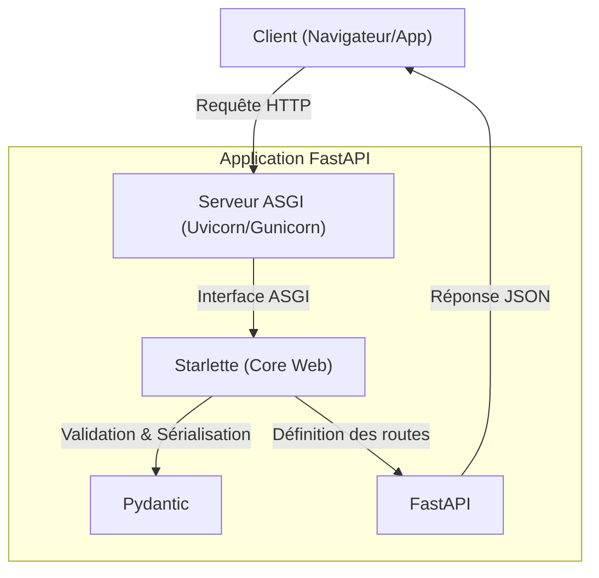

# Avant-propos : Bienvenue dans l'écosystème FastAPI {#avant-propos-0}

Bienvenue dans cette formation dédiée à **FastAPI**, le framework web moderne et ultra-performant pour construire des API avec Python.

### Prérequis {#prérequis-0}

Pour tirer le meilleur parti de ce cours, vous devez posséder :
- Une maîtrise solide de **Python 3.8+**, notamment les concepts de programmation asynchrone (`async` / `await`).
- Une compréhension des fondamentaux du protocole **HTTP** (méthodes, codes de statut, headers).
- Des notions de base sur les **types hints** en Python, qui sont au cœur du fonctionnement de FastAPI.

### Objectifs pédagogiques {#objectifs-pédagogiques-0}

À l'issue de cette formation, vous serez capable de :
1. Concevoir et déployer des API RESTful robustes et typées.
2. Tirer parti de la validation automatique des données via **Pydantic**.
3. Maîtriser l'injection de dépendances pour structurer votre code.
4. Intégrer des bases de données de manière asynchrone.
5. Sécuriser vos endpoints avec OAuth2 et JWT.

### Pourquoi FastAPI ? {#pourquoi-fastapi-0}

FastAPI se distingue par sa vitesse, sa simplicité et sa capacité à générer automatiquement une documentation interactive.

### L'écosystème FastAPI {#l-écosystème-fastapi-0}

FastAPI ne réinvente pas la roue ; il s'appuie sur des standards éprouvés :
- **Starlette** : Pour la partie web (routage, requêtes, réponses).
- **Pydantic** : Pour la validation des données et la gestion des types.
- **OpenAPI (Swagger)** : Pour la documentation automatique de vos endpoints.

---

> 📸 **CAPTURE D'ÉCRAN REQUISE**
> **Sujet** : Interface Swagger UI générée automatiquement par FastAPI sur `/docs`.
> **Alt Text** : Interface web interactive affichant les routes API, les modèles de données et permettant de tester les requêtes.

---

### Aller plus loin {#aller-plus-loin-0}

À la fin de ce parcours, vous réaliserez un **projet final de synthèse** : une API de gestion de micro-services métier intégrant une authentification complète, une base de données PostgreSQL asynchrone, et une suite de tests unitaires et d'intégration. Ce projet validera votre capacité à mettre en production une architecture FastAPI professionnelle.