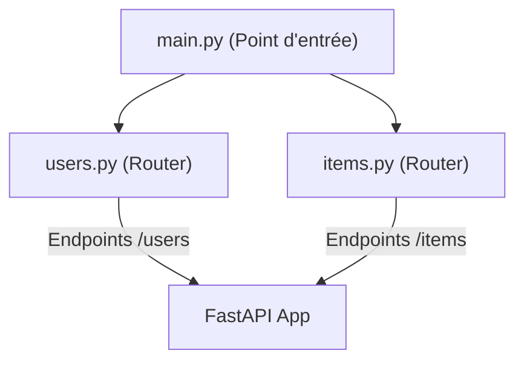

# Chapitre 2 : Structure d'une application {#chapitre-2-:-structure-d-une-application}

Architecture de projet, routage, décorateurs, méthodes HTTP

## Architecture de base {#architecture-de-base-2}

### 1. Quoi
Une application FastAPI est structurée autour d'une instance principale `app = FastAPI()`. Le **routage** consiste à associer une URL et une méthode HTTP à une fonction Python spécifique via des **décorateurs**.

### 2. Pourquoi
Cette approche déclarative permet de séparer clairement la logique métier de la gestion des requêtes HTTP, tout en facilitant la lecture et la maintenance du code.

### 3. Comment
A. **Syntaxe de routage** :
```python
from fastapi import FastAPI

app = FastAPI()

# Décorateur pour mapper la route /items avec la méthode GET
@app.get("/items")
async def read_items():
    return {"items": ["Livre", "Ordinateur"]}

# Décorateur pour la méthode POST
@app.post("/items")
async def create_item():
    return {"message": "Item créé"}
```

B. **Organisation recommandée** :
Pour des projets plus larges, il est conseillé de séparer les routes dans des modules distincts en utilisant `APIRouter`.



### 4. Zone de Danger
❌ **À ne pas faire** : Mettre toute la logique métier (accès base de données, calculs complexes) directement dans la fonction de route.
✅ **Bonne Pratique** : Utiliser des fonctions de service ou des classes dédiées pour la logique métier et ne garder dans la route que la gestion de la requête et de la réponse.

---

## Méthodes HTTP et Routage {#méthodes-http-et-routage-2}

### 1. Quoi
Le routage utilise les **méthodes HTTP** (`GET`, `POST`, `PUT`, `DELETE`) pour définir l'intention de l'action sur une ressource.

### 2. Pourquoi
Le respect des standards REST permet à votre API d'être intuitive et facilement consommable par des clients tiers (Frontend, applications mobiles).

### 3. Comment
A. **Exemples de méthodes** :
```python
@app.get("/users/{user_id}") # Récupération
async def get_user(user_id: int):
    return {"user_id": user_id}

@app.put("/users/{user_id}") # Mise à jour
async def update_user(user_id: int):
    return {"user_id": user_id, "status": "updated"}
```

> 📸 **CAPTURE D'ÉCRAN REQUISE**
> **Sujet** : Documentation Swagger UI (/docs) montrant les différentes méthodes HTTP (GET, POST, PUT) pour une même ressource.
> **Alt Text** : Interface Swagger affichant les routes colorées par méthode HTTP.

### 4. Zone de Danger
❌ **À ne pas faire** : Utiliser `GET` pour modifier des données sensibles (cela viole les standards HTTP).
✅ **Bonne Pratique** : Utiliser `POST` pour la création, `PUT` ou `PATCH` pour la modification, et `DELETE` pour la suppression.

---

## Questions clés (validation des acquis du chapitre) {#questions-clés-(validation-des-acquis-du-chapitre)-2}

- **Quel est le rôle d'un décorateur comme `@app.get` dans FastAPI ?**
  *Réponse : Il permet d'associer une fonction Python à un chemin d'URL spécifique et à une méthode HTTP (GET).*

- **Pourquoi est-il préférable d'utiliser `APIRouter` dans des projets de taille moyenne ou grande ?**
  *Réponse : Cela permet de modulariser le code en séparant les routes par domaine fonctionnel, rendant l'application plus maintenable.*

- **Quelle méthode HTTP est la plus appropriée pour supprimer une ressource ?**
  *Réponse : La méthode `DELETE`.*