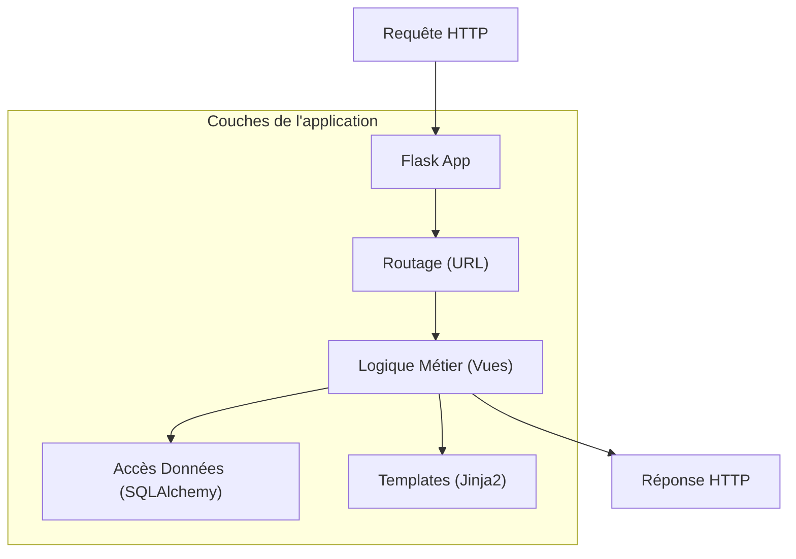

# Avant-propos {#avant-propos-0}

Bienvenue dans cette formation dédiée à **Flask**, le micro-framework Python conçu pour la flexibilité et la simplicité.

## Prérequis {#prérequis-0}

Pour aborder cette formation sereinement, vous devez maîtriser les éléments suivants :

- **Python (Intermédiaire)** : Compréhension des fonctions, des décorateurs, des classes et de la gestion des modules.
- **Protocoles Web** : Notions de base sur le fonctionnement de HTTP (méthodes GET, POST, codes de statut).
- **Environnement de développement** : Savoir utiliser un terminal et gérer des environnements virtuels (`venv` ou `conda`).

## Objectifs pédagogiques {#objectifs-pédagogiques-0}

À l'issue de cette formation, vous serez capable de :

1. **Concevoir** des API RESTful robustes et évolutives.
2. **Structurer** des applications web complexes grâce aux *Blueprints*.
3. **Interagir** avec des bases de données via des ORM (SQLAlchemy).
4. **Sécuriser** vos endpoints et gérer l'authentification des utilisateurs.
5. **Déployer** une application Flask dans un environnement de production.

## Pourquoi Flask ? {#pourquoi-flask-0}

Flask se distingue par sa philosophie "micro". Contrairement à des frameworks "batteries incluses" comme Django, Flask vous laisse le choix de vos outils (ORM, moteur de template, validation de données), vous offrant une maîtrise totale sur l'architecture de votre application.

## Aller plus loin : Le projet final {#aller-plus-loin-le-projet-final-0}

Tout au long de cette formation, nous construirons une application de gestion de tâches collaborative (**TaskMaster API**). Ce projet intégrera :

- Une API REST complète avec authentification JWT.
- Une base de données relationnelle persistante.
- Une gestion fine des permissions par rôle.
- Des tests unitaires et d'intégration pour garantir la qualité du code.

Préparez votre environnement, nous commençons dès le prochain chapitre par l'installation et la mise en place de votre première route.