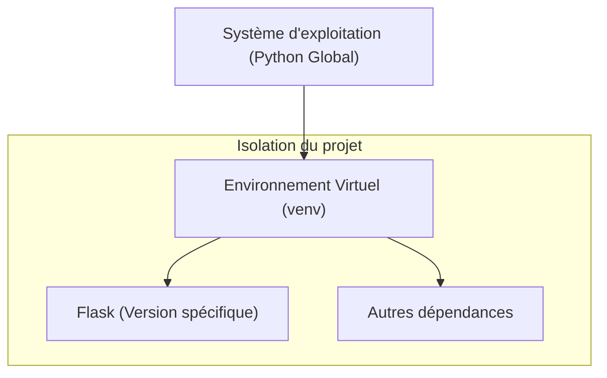

# Chapitre 1 : Installation et environnement

Python, Environnement virtuel, Gestionnaire de paquets, Flask

## Architecture de l'environnement {#architecture-de-l-environnement-1}

Pour garantir la stabilité de vos projets, il est crucial d'isoler les dépendances de chaque application.



## Python et Environnement Virtuel {#python-et-environnement-virtuel-1}

### 1. Quoi
Un **environnement virtuel** est un répertoire isolé contenant une installation spécifique de Python et des bibliothèques nécessaires à un projet donné.

### 2. Pourquoi
Il évite les conflits de versions entre différents projets sur une même machine. Sans isolation, installer une bibliothèque pour le "Projet A" pourrait casser le "Projet B".

### 3. Comment
A. **Création de l'environnement** :
```bash
# Créer le dossier de l'environnement
python -m venv .venv
```

B. **Activation** :
- Sur Windows : `.venv\Scripts\activate`
- Sur macOS/Linux : `source .venv/bin/activate`

C. **Vérification** :
Le nom de l'environnement doit apparaître entre parenthèses dans votre terminal.

> 📸 **CAPTURE D'ÉCRAN REQUISE**
> **Sujet** : Terminal affichant l'environnement virtuel activé (préfixe .venv).
> **Alt Text** : Terminal montrant le prompt avec (.venv) au début.

### 4. Zone de Danger
❌ **À ne pas faire** : Installer des paquets avec `pip` sans avoir activé l'environnement virtuel (cela pollue l'installation globale de Python).
✅ **Bonne Pratique** : Toujours vérifier l'activation de l'environnement avant toute commande `pip`.

## Installation de Flask {#installation-de-flask-1}

### 1. Quoi
**Flask** est une bibliothèque Python légère (micro-framework) qui fournit les outils nécessaires pour gérer les requêtes HTTP et construire des applications web.

### 2. Pourquoi
Il permet de démarrer rapidement un serveur web sans la lourdeur des frameworks monolithiques, tout en offrant une extensibilité totale.

### 3. Comment
A. **Installation** :
```bash
# Installation via le gestionnaire de paquets pip
pip install flask
```

B. **Configuration et vérification** :
Créez un fichier `app.py` et vérifiez l'installation :
```python
import flask
# Affiche la version installée pour confirmer le succès
print(f"Flask version: {flask.__version__}")
```

### 4. Zone de Danger
❌ **À ne pas faire** : Nommer votre fichier principal `flask.py`. Cela crée un conflit de nommage avec la bibliothèque elle-même.
✅ **Bonne Pratique** : Utilisez des noms comme `app.py`, `main.py` ou `server.py`.

## Questions clés (validation des acquis du chapitre) {#questions-clés-(validation-des-acquis-du-chapitre)-1}

1. **Pourquoi est-il indispensable d'utiliser un environnement virtuel ?**
   Réponse : Pour isoler les dépendances d'un projet et éviter les conflits de versions entre différents projets.

2. **Quelle commande permet de créer un environnement virtuel avec Python ?**
   Réponse : `python -m venv .venv`.

3. **Quel est le risque de nommer son fichier principal "flask.py" ?**
   Réponse : Cela crée un conflit d'importation, car Python tentera d'importer votre fichier au lieu de la bibliothèque Flask.