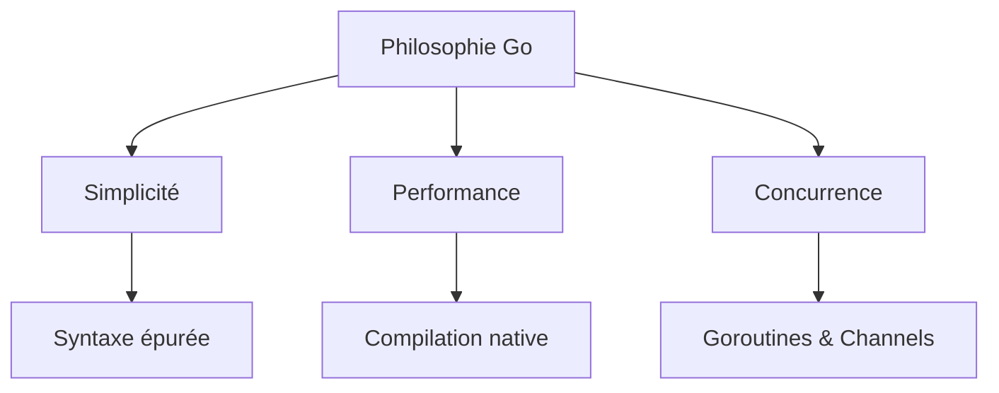

# Chapitre 0 : Avant-propos {#chapitre-0-:-avant-propos}

## Prérequis {#prérequis-0}

Pour aborder cette formation dans les meilleures conditions, nous recommandons :
- Une compréhension de base des concepts de programmation (variables, boucles, fonctions).
- Une familiarité avec l'utilisation d'un terminal (ligne de commande).
- Une connaissance rudimentaire des systèmes de gestion de versions (Git).
- Aucune expérience préalable avec Go n'est requise, mais une curiosité pour la performance et la simplicité est un atout majeur.

## Objectifs pédagogiques {#objectifs-pédagogiques-0}

À l'issue de cette formation, vous serez capable de :
- Maîtriser la syntaxe fondamentale et les idiomes du langage **Go**.
- Comprendre le modèle de concurrence unique de Go (Goroutines et Channels).
- Concevoir des applications robustes, performantes et maintenables.
- Déployer des services backend efficaces en production.
- Adopter la philosophie "Go Way" : privilégier la simplicité et la lisibilité sur la complexité inutile.

## Pourquoi choisir Go ? {#pourquoi-choisir-go-0}

Go a été conçu par Google pour répondre aux défis des systèmes modernes : montée en charge massive, maintenance de bases de code gigantesques et besoin de performance native.

## Aller plus loin : Projet final {#aller-plus-loin-:-projet-final-0}

Cette formation ne se limite pas à la théorie. Pour valider vos acquis, vous développerez un **système de micro-services haute performance**.

Ce projet récapitulatif vous amènera à :
1. **Construire une API REST** robuste utilisant la bibliothèque standard et des outils modernes.
2. **Implémenter une architecture orientée événements** en utilisant la concurrence native de Go.
3. **Optimiser les performances** via le profilage et l'analyse de la mémoire.
4. **Assurer la fiabilité** par des tests unitaires et d'intégration rigoureux.

Préparez votre environnement, ouvrez votre terminal, et plongeons ensemble dans l'univers de Go.