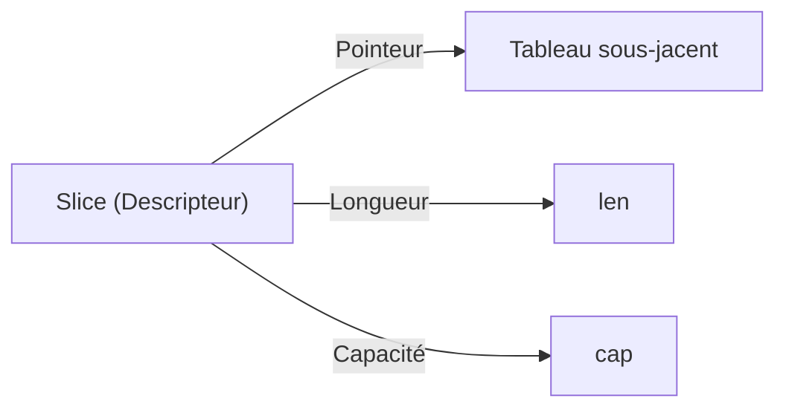

# Chapitre 10 : Tableaux et Slices {#chapitre-10-:-tableaux-et-slices}

Tableaux fixes, slices dynamiques, manipulation de collections, append, copy.

## Les Tableaux {#les-tableaux-10}

### 1. Quoi
Un **tableau** est une structure de données de taille fixe contenant des éléments de même type. La taille fait partie intégrante du type du tableau.

### 2. Pourquoi
Ils sont utiles lorsque le nombre d'éléments est connu à l'avance et ne changera jamais (ex: les jours de la semaine).

### 3. Comment
A. **Syntaxe de base** :
```go
var arr [3]int // Tableau de 3 entiers, initialisé à 0
arr[0] = 10    // Assignation
```

B. **Cas concret** :
```go
package main

import "fmt"

func main() {
    // Déclaration avec initialisation
    notes := [3]int{12, 15, 10}
    fmt.Println(notes[1]) // Accès par index
}
```

### 4. Zone de Danger
❌ **À ne pas faire** : Essayer de changer la taille d'un tableau après sa déclaration.
✅ **Bonne Pratique** : Utilisez des **slices** pour la quasi-totalité des besoins de collections dynamiques.

---

## Les Slices {#les-slices-10}

### 1. Quoi
Une **slice** est une vue dynamique, flexible et légère sur un tableau sous-jacent. Contrairement aux tableaux, leur taille peut varier.

### 2. Pourquoi
C'est la structure de collection la plus utilisée en Go pour gérer des listes de données dont la taille peut évoluer (ex: liste d'utilisateurs, résultats de recherche).

### 3. Comment
A. **Syntaxe de base** :
```go
s := []int{1, 2, 3} // Slice littérale
s = append(s, 4)    // Ajout dynamique
```

B. **Flux logique** :


C. **Exemples pratiques** :
- **Ajout** : `append(slice, valeur)` pour ajouter des éléments.
- **Découpage** : `slice[1:3]` pour extraire une sous-partie.
- **Copie** : `copy(dest, src)` pour dupliquer des données.

### 4. Zone de Danger
❌ **À ne pas faire** : Accéder à un index en dehors de la longueur (`len`) de la slice (panic).
✅ **Bonne Pratique** : Vérifiez toujours la longueur avec `len(s)` avant d'accéder à un index dynamique.

### 🚨 Limitations des Slices
- **Problèmes** : `append` peut provoquer une réallocation mémoire coûteuse si la capacité est dépassée.
- **Solutions modernes** : Si la taille finale est connue, pré-allouez avec `make([]T, 0, taillePrevue)` pour éviter les réallocations.
- **Pourquoi l'enseigner** : C'est le fondement de la manipulation de données en Go.

---

## Questions clés (validation des acquis du chapitre) {#questions-clés-(validation-des-acquis-du-chapitre)-10}

- **Quelle est la différence majeure entre un tableau et une slice ?**
  *Réponse : La taille d'un tableau est fixe et fait partie de son type, alors qu'une slice est dynamique.*

- **Quel mot-clé permet d'ajouter un élément à une slice ?**
  *Réponse : Le mot-clé `append`.*

- **Que se passe-t-il si on accède à un index inexistant dans une slice ?**
  *Réponse : Le programme panique (runtime panic).*

---

## Exercices : {#exercices-:-10}

### Exercice 1 - Initialisation de slice {#exercice-1---initialisation-de-slice}

🎯 **Objectif** : Créer et afficher une slice.

💼 **Mise en situation** : Vous gérez une liste de tâches.

📝 **Énoncé** : Créez une slice de chaînes de caractères contenant "Coder", "Tester", "Déployer". Affichez le deuxième élément.

📺 **Résultat attendu** : `Tester`.

💡 **Solution** :
<details><summary>Voir le code complet commenté</summary>

```go
package main

import "fmt"

func main() {
    taches := []string{"Coder", "Tester", "Déployer"}
    // Accès à l'index 1 (le deuxième élément)
    fmt.Println(taches[1])
}
```
</details>

### Exercice 2 - Dynamisme avec append {#exercice-2---dynamisme-avec-append}

🎯 **Objectif** : Utiliser `append`.

💼 **Mise en situation** : Vous ajoutez des nouveaux membres à une équipe.

📝 **Énoncé** : Créez une slice `equipe := []string{"Alice"}`. Ajoutez "Bob" puis "Charlie" avec `append`. Affichez la slice finale.

📺 **Résultat attendu** : `[Alice Bob Charlie]`.

💡 **Solution** :
<details><summary>Voir le code complet commenté</summary>

```go
package main

import "fmt"

func main() {
    equipe := []string{"Alice"}
    // append retourne une nouvelle slice avec l'élément ajouté
    equipe = append(equipe, "Bob")
    equipe = append(equipe, "Charlie")
    fmt.Println(equipe)
}
```
</details>

### Exercice 3 - Pré-allocation efficace {#exercice-3---pré-allocation-efficace}

🎯 **Objectif** : Optimiser avec `make`.

💼 **Mise en situation** : Vous savez que vous allez traiter 1000 éléments.

📝 **Énoncé** : Utilisez `make` pour créer une slice d'entiers avec une longueur de 0 et une capacité de 1000. Ajoutez un élément et vérifiez la capacité avec `cap()`.

📺 **Résultat attendu** : `Capacité : 1000`.

💡 **Solution** :
<details><summary>Voir le code complet commenté</summary>

```go
package main

import "fmt"

func main() {
    // make([]type, length, capacity)
    nombres := make([]int, 0, 1000)
    nombres = append(nombres, 42)
    
    // La capacité est de 1000, évitant des réallocations inutiles
    fmt.Printf("Capacité : %d\n", cap(nombres))
}
```
</details>