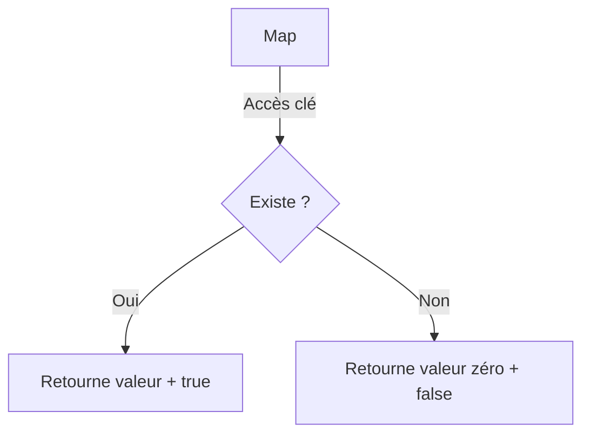

# Chapitre 11 : Maps et dictionnaires {#chapitre-11-:-maps-et-dictionnaires}

Création de maps, insertion, suppression, vérification d'existence, itération.

## Création et manipulation de maps {#création-et-manipulation-de-maps-11}

### 1. Quoi
Une **map** est une structure de données intégrée en Go qui implémente une table de hachage (dictionnaire). Elle associe des **clés** uniques à des **valeurs**.

### 2. Pourquoi
Les maps sont indispensables pour effectuer des recherches, des insertions et des suppressions rapides (complexité moyenne O(1)) basées sur une clé, plutôt que sur un index numérique.

### 3. Comment
A. **Syntaxe de base** :
```go
// Déclaration et initialisation avec make
m := make(map[string]int)

// Initialisation littérale
utilisateurs := map[string]int{"Alice": 25, "Bob": 30}
```

B. **Cas concret** :
```go
package main

import "fmt"

func main() {
    // Création d'un répertoire téléphonique
    annuaire := make(map[string]string)
    
    // Insertion
    annuaire["Alice"] = "0601020304"
    
    // Accès
    fmt.Println(annuaire["Alice"])
    
    // Suppression
    delete(annuaire, "Alice")
}
```

C. **Exemples pratiques** :
- **Cache** : Stocker des résultats de calculs coûteux pour les réutiliser.
- **Compteur** : Compter les occurrences de mots dans un texte.
- **Configuration** : Associer des noms de paramètres à leurs valeurs.

### 4. Zone de Danger
❌ **À ne pas faire** : Écrire dans une map non initialisée (déclarée avec `var m map[string]int`), cela provoque une panique.
✅ **Bonne Pratique** : Utilisez toujours `make()` ou une initialisation littérale avant d'insérer des données.

---

## Vérification d'existence et itération {#vérification-d'existence-et-itération-11}

### 1. Quoi
Go utilise une syntaxe spécifique pour vérifier si une clé existe dans une map, et le `range` pour parcourir l'ensemble des paires clé-valeur.

### 2. Pourquoi
Il est crucial de distinguer une valeur "zéro" (ex: 0 pour un int) d'une clé qui n'existe pas réellement dans la map.

### 3. Comment
A. **Syntaxe de vérification** :
```go
valeur, existe := m["clé"]
if existe {
    // La clé est présente
}
```

B. **Flux logique** :


C. **Exemples pratiques** :
- **Itération** :
```go
for nom, tel := range annuaire {
    fmt.Printf("%s : %s\n", nom, tel)
}
```

### 4. Zone de Danger
❌ **À ne pas faire** : Supposer que l'ordre d'itération sur une map est constant. L'ordre est **aléatoire** en Go.
✅ **Bonne Pratique** : Si vous avez besoin d'un ordre spécifique, extrayez les clés dans une slice, triez-les, puis itérez sur la slice.

### 🚨 Limitations des Maps
- **Problèmes** : Les maps ne sont pas sécurisées pour un accès concurrent (plusieurs goroutines écrivant en même temps provoquent un crash).
- **Solutions modernes** : Utilisez `sync.Map` ou un `sync.RWMutex` pour protéger l'accès concurrent.
- **Pourquoi l'enseigner** : C'est une structure fondamentale pour tout développeur Go, même si la gestion de la concurrence nécessite des outils avancés.

---

## Questions clés (validation des acquis du chapitre) {#questions-clés-(validation-des-acquis-du-chapitre)-11}

- **Comment initialiser une map en Go ?**
  *Réponse : Avec `make(map[clé]valeur)` ou une initialisation littérale.*

- **Comment vérifier si une clé existe dans une map ?**
  *Réponse : En utilisant la syntaxe `valeur, existe := m[clé]`.*

- **L'ordre des éléments dans une map est-il garanti ?**
  *Réponse : Non, il est aléatoire.*

---

## Exercices : {#exercices-:-11}

### Exercice 1 - Annuaire simple {#exercice-1---annuaire-simple}

🎯 **Objectif** : Créer et manipuler une map.

💼 **Mise en situation** : Vous gérez un annuaire d'utilisateurs.

📝 **Énoncé** : Créez une map `annuaire` associant un nom (string) à un âge (int). Ajoutez "Alice": 25 et "Bob": 30. Affichez l'âge d'Alice.

📺 **Résultat attendu** : `Alice a 25 ans`.

💡 **Solution** :
<details><summary>Voir le code complet commenté</summary>

```go
package main

import "fmt"

func main() {
    annuaire := map[string]int{
        "Alice": 25,
        "Bob":   30,
    }
    
    fmt.Printf("Alice a %d ans\n", annuaire["Alice"])
}
```
</details>

### Exercice 2 - Vérification d'existence {#exercice-2---vérification-d'existence}

🎯 **Objectif** : Utiliser la syntaxe `valeur, existe`.

💼 **Mise en situation** : Vous vérifiez si un utilisateur est dans votre base.

📝 **Énoncé** : Utilisez la map de l'exercice précédent. Vérifiez si "Charlie" existe. S'il n'existe pas, affichez "Charlie non trouvé".

📺 **Résultat attendu** : `Charlie non trouvé`.

💡 **Solution** :
<details><summary>Voir le code complet commenté</summary>

```go
package main

import "fmt"

func main() {
    annuaire := map[string]int{"Alice": 25}
    
    _, existe := annuaire["Charlie"]
    if !existe {
        fmt.Println("Charlie non trouvé")
    }
}
```
</details>

### Exercice 3 - Itération sur map {#exercice-3---itération-sur-map}

🎯 **Objectif** : Parcourir une map.

💼 **Mise en situation** : Vous affichez tous les utilisateurs.

📝 **Énoncé** : Parcourez la map `annuaire` avec `range` et affichez chaque nom et son âge.

📺 **Résultat attendu** : `Alice : 25`, etc.

💡 **Solution** :
<details><summary>Voir le code complet commenté</summary>

```go
package main

import "fmt"

func main() {
    annuaire := map[string]int{"Alice": 25, "Bob": 30}
    
    // Itération sur toutes les paires clé-valeur
    for nom, age := range annuaire {
        fmt.Printf("%s : %d\n", nom, age)
    }
}
```
</details>