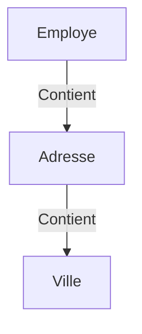

# Chapitre 12 : Structures (struct) {#chapitre-12-:-structures-(struct)}

Définition de structures, champs, instanciation, accès aux champs.

## Définition et utilisation des structures {#définition-et-utilisation-des-structures-12}

### 1. Quoi
Une **struct** (structure) est un type de données composite qui permet de regrouper des variables de types différents sous un seul nom. C'est le bloc de construction principal pour modéliser des objets ou des entités dans Go.

### 2. Pourquoi
Les structures permettent de représenter des concepts du monde réel (ex: un utilisateur, un produit, une commande) de manière organisée et typée, rendant le code plus cohérent.

### 3. Comment
A. **Syntaxe de base** :
```go
type NomDeLaStruct struct {
    Champ1 type
    Champ2 type
}
```

B. **Cas concret** :
```go
package main

import "fmt"

type Utilisateur struct {
    Nom   string
    Email string
    Age   int
}

func main() {
    // Instanciation
    u := Utilisateur{
        Nom:   "Alice",
        Email: "alice@example.com",
        Age:   25,
    }
    fmt.Println(u.Nom) // Accès au champ
}
```

C. **Exemples pratiques** :
- **Modèle de données** : Représenter une ligne de base de données.
- **Configuration** : Regrouper les paramètres d'un service.
- **API** : Définir la structure d'un objet JSON reçu ou envoyé.

### 4. Zone de Danger
❌ **À ne pas faire** : Oublier d'initialiser un champ, ce qui lui donnera sa valeur "zéro" par défaut (ex: `""` pour string, `0` pour int).
✅ **Bonne Pratique** : Utilisez des constructeurs (fonctions `New...`) si une structure nécessite une initialisation complexe ou des valeurs par défaut spécifiques.

---

## Composition et imbrication {#composition-et-imbrication-12}

### 1. Quoi
Go ne possède pas d'héritage classique. Il utilise la **composition** : une structure peut contenir une autre structure comme champ.

### 2. Pourquoi
La composition est plus flexible que l'héritage, permettant de construire des types complexes à partir de types simples et réutilisables.

### 3. Comment
A. **Syntaxe de base** :
```go
type Adresse struct {
    Ville string
}

type Employe struct {
    Nom     string
    Adresse Adresse // Composition
}
```

B. **Flux logique** :


C. **Exemples pratiques** :
- **Hiérarchie** : Un `Produit` contient une `Categorie`.
- **Profil** : Un `Utilisateur` contient des `Preferences`.

### 4. Zone de Danger
❌ **À ne pas faire** : Créer des structures trop profondément imbriquées, ce qui rend l'accès aux données verbeux (ex: `a.b.c.d.e.f`).
✅ **Bonne Pratique** : Gardez vos structures "plates" autant que possible.

### 🚨 Limitations des Structs
- **Problèmes** : Pas de méthodes privées/publiques basées sur le nom de la classe (la visibilité est gérée par la casse : majuscule = exporté, minuscule = privé).
- **Solutions modernes** : Utilisez des interfaces pour définir des comportements communs.
- **Pourquoi l'enseigner** : C'est la base de la modélisation en Go.

---

## Questions clés (validation des acquis du chapitre) {#questions-clés-(validation-des-acquis-du-chapitre)-12}

- **Comment définit-on une nouvelle structure en Go ?**
  *Réponse : Avec le mot-clé `type` suivi du nom et de `struct`.*

- **Comment accède-t-on à un champ d'une structure ?**
  *Réponse : En utilisant l'opérateur point (`.`) : `instance.Champ`.*

- **Go supporte-t-il l'héritage de classes ?**
  *Réponse : Non, Go utilise la composition.*

---

## Exercices : {#exercices-:-12}

### Exercice 1 - Création de structure {#exercice-1---création-de-structure}

🎯 **Objectif** : Définir et instancier une structure.

💼 **Mise en situation** : Vous gérez un inventaire de livres.

📝 **Énoncé** : Définissez une structure `Livre` avec les champs `Titre` (string) et `Pages` (int). Instanciez un livre et affichez son titre.

📺 **Résultat attendu** : `Titre : Le Petit Prince`.

💡 **Solution** :
<details><summary>Voir le code complet commenté</summary>

```go
package main

import "fmt"

type Livre struct {
    Titre string
    Pages int
}

func main() {
    l := Livre{Titre: "Le Petit Prince", Pages: 96}
    fmt.Printf("Titre : %s\n", l.Titre)
}
```
</details>

### Exercice 2 - Modification de structure {#exercice-2---modification-de-structure}

🎯 **Objectif** : Modifier les champs d'une structure.

💼 **Mise en situation** : Vous mettez à jour le prix d'un article.

📝 **Énoncé** : Définissez une structure `Produit` avec `Nom` et `Prix`. Créez une instance, modifiez son prix, puis affichez le nouveau prix.

📺 **Résultat attendu** : `Nouveau prix : 25`.

💡 **Solution** :
<details><summary>Voir le code complet commenté</summary>

```go
package main

import "fmt"

type Produit struct {
    Nom  string
    Prix int
}

func main() {
    p := Produit{Nom: "Chaise", Prix: 20}
    p.Prix = 25 // Modification directe
    fmt.Printf("Nouveau prix : %d\n", p.Prix)
}
```
</details>

### Exercice 3 - Composition {#exercice-3---composition}

🎯 **Objectif** : Utiliser la composition.

💼 **Mise en situation** : Vous gérez des employés avec une adresse.

📝 **Énoncé** : Créez une structure `Adresse` (Ville) et `Employe` (Nom, Adresse). Instanciez un employé avec une adresse et affichez sa ville.

📺 **Résultat attendu** : `Ville : Paris`.

💡 **Solution** :
<details><summary>Voir le code complet commenté</summary>

```go
package main

import "fmt"

type Adresse struct {
    Ville string
}

type Employe struct {
    Nom     string
    Adresse Adresse
}

func main() {
    e := Employe{
        Nom:     "Jean",
        Adresse: Adresse{Ville: "Paris"},
    }
    fmt.Printf("Ville : %s\n", e.Adresse.Ville)
}
```
</details>