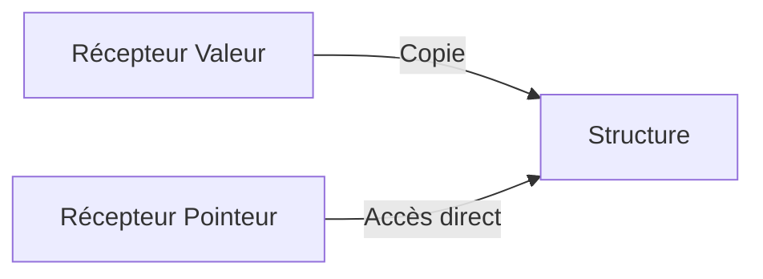

# Chapitre 13 : Méthodes et récepteurs {#chapitre-13-:-méthodes-et-récepteurs}

Définition de méthodes, récepteurs de valeur vs récepteurs de pointeur.

## Définition des méthodes {#définition-des-méthodes-13}

### 1. Quoi
Une **méthode** est une fonction associée à un type spécifique (généralement une `struct`). Elle est définie avec un **récepteur** (receiver) placé entre le mot-clé `func` et le nom de la méthode.

### 2. Pourquoi
Les méthodes permettent d'encapsuler le comportement lié à une donnée. Au lieu d'avoir des fonctions isolées manipulant des structures, vous attachez les actions directement aux objets concernés, rendant le code plus intuitif.

### 3. Comment
A. **Syntaxe de base** :
```go
func (r Type) NomDeLaMethode() typeDeRetour {
    // Corps de la méthode
}
```

B. **Cas concret** :
```go
package main

import "fmt"

type Rectangle struct {
    Largeur, Hauteur float64
}

// Méthode avec récepteur de valeur
func (r Rectangle) Aire() float64 {
    return r.Largeur * r.Hauteur
}

func main() {
    rect := Rectangle{Largeur: 10, Hauteur: 5}
    fmt.Println(rect.Aire())
}
```

C. **Exemples pratiques** :
- **Calculs** : `Aire()` pour une forme géométrique.
- **Formatage** : `String()` pour retourner une représentation textuelle d'un objet.
- **Actions** : `Activer()` ou `Desactiver()` pour un service.

### 4. Zone de Danger
❌ **À ne pas faire** : Définir des méthodes sur des types intégrés (ex: `int`, `string`) directement.
✅ **Bonne Pratique** : Si vous devez ajouter des méthodes à un type de base, créez un type personnalisé : `type MonInt int`.

---

## Récepteurs de valeur vs pointeur {#récepteurs-de-valeur-vs-pointeur-13}

### 1. Quoi
Le récepteur peut être une **valeur** `(r T)` ou un **pointeur** `(r *T)`.
- **Valeur** : La méthode travaille sur une copie de la structure.
- **Pointeur** : La méthode travaille sur l'instance originale.

### 2. Pourquoi
Utiliser un pointeur permet de modifier l'état interne de la structure. Utiliser une valeur est plus sûr (pas d'effet de bord) mais peut être coûteux si la structure est grande.

### 3. Comment
A. **Visualisation** :


B. **Exemple de modification** :
```go
// Récepteur de pointeur pour modifier l'état
func (r *Rectangle) Redimensionner(facteur float64) {
    r.Largeur *= facteur
    r.Hauteur *= facteur
}
```

C. **Tableau comparatif** :

| Récepteur | Copie ? | Peut modifier l'original ? |
|-----------|---------|----------------------------|
| Valeur    | Oui     | Non                        |
| Pointeur  | Non     | Oui                        |

### 4. Zone de Danger
❌ **À ne pas faire** : Utiliser un récepteur de valeur quand la méthode doit modifier la structure.
✅ **Bonne Pratique** : Par cohérence, si une méthode de votre type utilise un récepteur de pointeur, faites en sorte que toutes les méthodes du type utilisent des pointeurs.

### 🚨 Limitations des méthodes
- **Problèmes** : Les méthodes ne permettent pas l'héritage de comportement (pas de polymorphisme de classe).
- **Solutions modernes** : Utilisez les **interfaces** pour définir des contrats de comportement partagés entre différents types.
- **Pourquoi l'enseigner** : C'est le mécanisme central pour structurer le code orienté objet en Go.

---

## Questions clés (validation des acquis du chapitre) {#questions-clés-(validation-des-acquis-du-chapitre)-13}

- **Où place-t-on le récepteur dans la définition d'une méthode ?**
  *Réponse : Entre le mot-clé `func` et le nom de la méthode.*

- **Quelle est la différence entre un récepteur de valeur et un récepteur de pointeur ?**
  *Réponse : Le récepteur de valeur travaille sur une copie, le récepteur de pointeur travaille sur l'original et peut le modifier.*

- **Peut-on modifier une structure avec un récepteur de valeur ?**
  *Réponse : Non, car la méthode opère sur une copie.*

---

## Exercices : {#exercices-:-13}

### Exercice 1 - Méthode simple {#exercice-1---méthode-simple}

🎯 **Objectif** : Créer une méthode avec récepteur de valeur.

💼 **Mise en situation** : Vous gérez des cercles.

📝 **Énoncé** : Définissez une structure `Cercle` avec un champ `Rayon`. Créez une méthode `Diametre()` qui retourne le diamètre (rayon * 2).

📺 **Résultat attendu** : `Diamètre : 10`.

💡 **Solution** :
<details><summary>Voir le code complet commenté</summary>

```go
package main

import "fmt"

type Cercle struct {
    Rayon float64
}

func (c Cercle) Diametre() float64 {
    return c.Rayon * 2
}

func main() {
    c := Cercle{Rayon: 5}
    fmt.Printf("Diamètre : %.0f\n", c.Diametre())
}
```
</details>

### Exercice 2 - Méthode avec pointeur {#exercice-2---méthode-avec-pointeur}

🎯 **Objectif** : Modifier une structure via un récepteur de pointeur.

💼 **Mise en situation** : Vous réinitialisez un compteur.

📝 **Énoncé** : Définissez une structure `Compteur` avec un champ `Valeur`. Créez une méthode `Reset()` qui met `Valeur` à 0.

📺 **Résultat attendu** : `Valeur après reset : 0`.

💡 **Solution** :
<details><summary>Voir le code complet commenté</summary>

```go
package main

import "fmt"

type Compteur struct {
    Valeur int
}

// Récepteur de pointeur nécessaire pour modifier l'original
func (c *Compteur) Reset() {
    c.Valeur = 0
}

func main() {
    c := Compteur{Valeur: 10}
    c.Reset()
    fmt.Printf("Valeur après reset : %d\n", c.Valeur)
}
```
</details>

### Exercice 3 - Méthode de formatage {#exercice-3---méthode-de-formatage}

🎯 **Objectif** : Créer une méthode `String()`.

💼 **Mise en situation** : Vous voulez afficher vos objets proprement.

📝 **Énoncé** : Définissez une structure `Personne` (Nom, Age). Créez une méthode `String() string` qui retourne une phrase formatée.

📺 **Résultat attendu** : `Alice a 25 ans`.

💡 **Solution** :
<details><summary>Voir le code complet commenté</summary>

```go
package main

import "fmt"

type Personne struct {
    Nom string
    Age int
}

func (p Personne) String() string {
    return fmt.Sprintf("%s a %d ans", p.Nom, p.Age)
}

func main() {
    p := Personne{Nom: "Alice", Age: 25}
    // fmt.Println appelle automatiquement String() si elle existe
    fmt.Println(p)
}
```
</details>