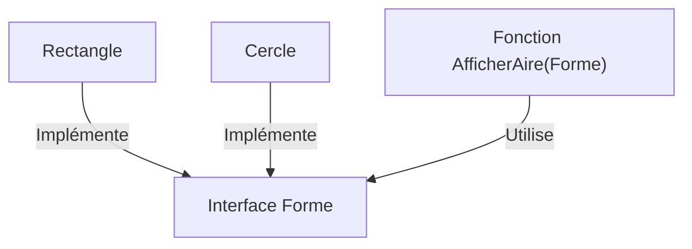

# Chapitre 14 : Interfaces de base {#chapitre-14-:-interfaces-de-base}

Définition d'interfaces, implémentation implicite, polymorphisme.

## Comprendre les interfaces {#comprendre-les-interfaces-14}

### 1. Quoi
Une **interface** en Go est un type qui définit un ensemble de signatures de méthodes. Contrairement à d'autres langages, une interface est implémentée **implicitement** : si un type possède toutes les méthodes définies par une interface, il implémente cette interface automatiquement.

### 2. Pourquoi
Les interfaces permettent de découpler le code. Elles permettent d'écrire des fonctions qui acceptent n'importe quel type tant qu'il respecte un comportement donné, favorisant ainsi la réutilisabilité et la testabilité.

### 3. Comment
A. **Syntaxe de base** :
```go
type NomInterface interface {
    Methode1() typeDeRetour
}
```

B. **Cas concret** :
```go
package main

import "fmt"

// Définition de l'interface
type Forme interface {
    Aire() float64
}

type Rectangle struct {
    Largeur, Hauteur float64
}

// Rectangle implémente Forme car il possède la méthode Aire()
func (r Rectangle) Aire() float64 {
    return r.Largeur * r.Hauteur
}

func AfficherAire(f Forme) {
    fmt.Printf("Aire : %.2f\n", f.Aire())
}

func main() {
    r := Rectangle{Largeur: 10, Hauteur: 5}
    AfficherAire(r) // Rectangle est accepté car il implémente Forme
}
```

C. **Exemples pratiques** :
- **Abstraction** : Créer une interface `Lecteur` pour lire des données depuis un fichier, une base de données ou une API.
- **Polymorphisme** : Créer une liste d'objets différents qui partagent tous une méthode `Dessiner()`.
- **Mocking** : Remplacer des dépendances réelles par des versions simulées lors des tests unitaires.

### 4. Zone de Danger
❌ **À ne pas faire** : Créer des interfaces trop larges (ex: 10+ méthodes).
✅ **Bonne Pratique** : Suivez la philosophie Go : "Plus l'interface est petite, plus elle est puissante". Visez 1 à 3 méthodes par interface.

---

## Polymorphisme et flexibilité {#polymorphisme-et-flexibilité-14}

### 1. Quoi
Le polymorphisme permet à une fonction de traiter des objets de types différents via une interface commune.

### 2. Pourquoi
Cela permet d'étendre votre application sans modifier le code existant (principe ouvert/fermé).

### 3. Comment
A. **Flux logique** :


B. **Tableau comparatif** :

| Approche | Héritage (Java/C++) | Interfaces (Go) |
|----------|---------------------|-----------------|
| Implémentation | Explicite (`implements`) | Implicite (automatique) |
| Flexibilité | Rigide | Très élevée |
| Couplage | Fort | Faible |

### 4. Zone de Danger
❌ **À ne pas faire** : Utiliser `interface{}` (l'interface vide) pour tout et n'importe quoi, car cela annule la sécurité du typage statique.
✅ **Bonne Pratique** : Utilisez des interfaces spécifiques. N'utilisez `interface{}` que lorsque vous devez réellement accepter n'importe quel type (ex: fonctions de log ou de sérialisation).

### 🚨 Limitations des Interfaces
- **Problèmes** : Le typage dynamique via interfaces peut cacher des erreurs à la compilation si mal utilisé.
- **Solutions modernes** : Utilisez les **Generics** (introduits en Go 1.18) pour des collections typées tout en gardant la flexibilité.
- **Pourquoi l'enseigner** : C'est le pilier de l'architecture logicielle en Go.

---

## Questions clés (validation des acquis du chapitre) {#questions-clés-(validation-des-acquis-du-chapitre)-14}

- **Comment implémente-t-on une interface en Go ?**
  *Réponse : Implicitement, en définissant les méthodes requises par l'interface sur un type.*

- **Qu'est-ce qu'une interface vide `interface{}` ?**
  *Réponse : Une interface qui ne définit aucune méthode, donc tout type l'implémente.*

- **Pourquoi privilégier de petites interfaces ?**
  *Réponse : Pour faciliter la réutilisation et le découplage des composants.*

---

## Exercices : {#exercices-:-14}

### Exercice 1 - Interface simple {#exercice-1---interface-simple}

🎯 **Objectif** : Implémenter une interface.

💼 **Mise en situation** : Vous créez un système de notification.

📝 **Énoncé** : Définissez une interface `Notifier` avec une méthode `Envoyer(message string)`. Créez une structure `Email` qui implémente cette interface.

📺 **Résultat attendu** : `Email envoyé : Hello`.

💡 **Solution** :
<details><summary>Voir le code complet commenté</summary>

```go
package main

import "fmt"

type Notifier interface {
    Envoyer(message string)
}

type Email struct{}

func (e Email) Envoyer(message string) {
    fmt.Printf("Email envoyé : %s\n", message)
}

func main() {
    var n Notifier = Email{}
    n.Envoyer("Hello")
}
```
</details>

### Exercice 2 - Polymorphisme {#exercice-2---polymorphisme}

🎯 **Objectif** : Utiliser une interface avec plusieurs types.

💼 **Mise en situation** : Vous gérez différents types de notifications.

📝 **Énoncé** : Ajoutez une structure `SMS` qui implémente aussi `Notifier`. Créez une fonction `EnvoyerNotification(n Notifier, msg string)` qui accepte les deux types.

📺 **Résultat attendu** : `Email envoyé : ...` puis `SMS envoyé : ...`.

💡 **Solution** :
<details><summary>Voir le code complet commenté</summary>

```go
package main

import "fmt"

type Notifier interface {
    Envoyer(message string)
}

type Email struct{}
func (e Email) Envoyer(msg string) { fmt.Println("Email envoyé :", msg) }

type SMS struct{}
func (s SMS) Envoyer(msg string) { fmt.Println("SMS envoyé :", msg) }

func EnvoyerNotification(n Notifier, msg string) {
    n.Envoyer(msg)
}

func main() {
    EnvoyerNotification(Email{}, "Hello")
    EnvoyerNotification(SMS{}, "World")
}
```
</details>

### Exercice 3 - Interface vide {#exercice-3---interface-vide}

🎯 **Objectif** : Comprendre l'interface vide.

💼 **Mise en situation** : Vous créez une fonction de log générique.

📝 **Énoncé** : Créez une fonction `Log(v interface{})` qui affiche la valeur passée. Appelez-la avec un `int` et une `string`.

📺 **Résultat attendu** : `Log : 10`, `Log : Test`.

💡 **Solution** :
<details><summary>Voir le code complet commenté</summary>

```go
package main

import "fmt"

// interface{} accepte n'importe quel type
func Log(v interface{}) {
    fmt.Printf("Log : %v\n", v)
}

func main() {
    Log(10)
    Log("Test")
}
```
</details>