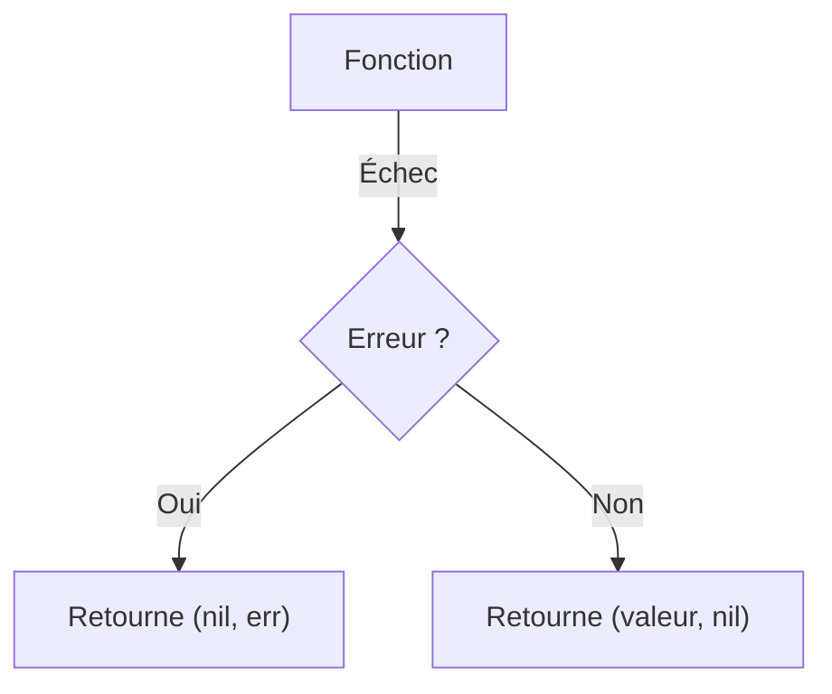

# Chapitre 15 : Gestion des erreurs {#chapitre-15-:-gestion-des-erreurs}

Type error, retour multiple, vérification d'erreurs, création d'erreurs personnalisées.

## Le type error {#le-type-error-15}

### 1. Quoi
En Go, une **erreur** est une valeur de type `error`, qui est une interface intégrée. Elle possède une seule méthode : `Error() string`.

### 2. Pourquoi
Go ne possède pas de mécanisme d'exception (try/catch). Les erreurs sont traitées comme des valeurs normales, ce qui force le développeur à gérer explicitement les cas d'échec, rendant le code plus robuste et prévisible.

### 3. Comment
A. **Syntaxe de base** :
```go
// Une fonction qui peut échouer retourne souvent (valeur, error)
func diviser(a, b float64) (float64, error) {
    if b == 0 {
        return 0, errors.New("division par zéro")
    }
    return a / b, nil
}
```

B. **Cas concret** :
```go
package main

import (
    "errors"
    "fmt"
)

func main() {
    res, err := diviser(10, 0)
    if err != nil {
        // Gestion de l'erreur
        fmt.Println("Erreur détectée :", err)
        return
    }
    fmt.Println("Résultat :", res)
}
```

C. **Exemples pratiques** :
- **Validation** : Vérifier si un input utilisateur est valide.
- **I/O** : Gérer l'échec d'ouverture d'un fichier.
- **Réseau** : Gérer une connexion perdue.

### 4. Zone de Danger
❌ **À ne pas faire** : Ignorer une erreur retournée en utilisant `_`.
✅ **Bonne Pratique** : Vérifiez toujours `if err != nil` immédiatement après l'appel d'une fonction qui retourne une erreur.

---

## Création et propagation {#création-et-propagation-15}

### 1. Quoi
Vous pouvez créer des erreurs simples avec `errors.New()` ou des erreurs formatées avec `fmt.Errorf()`.

### 2. Pourquoi
Les erreurs formatées permettent d'ajouter du contexte (ex: "impossible d'ouvrir le fichier X : permission refusée"), ce qui facilite grandement le débogage.

### 3. Comment
A. **Flux logique** :


B. **Exemple de contexte** :
```go
if err != nil {
    // On enveloppe l'erreur pour ajouter du contexte
    return fmt.Errorf("échec de l'opération : %w", err)
}
```

C. **Tableau comparatif** :

| Méthode | Usage |
|---------|-------|
| `errors.New` | Erreurs statiques simples |
| `fmt.Errorf` | Erreurs dynamiques avec contexte |

### 4. Zone de Danger
❌ **À ne pas faire** : Utiliser `panic` pour gérer des erreurs prévisibles (ex: erreur de saisie). `panic` est réservé aux erreurs fatales imprévisibles.
✅ **Bonne Pratique** : Utilisez `panic` uniquement pour des états impossibles (ex: corruption mémoire).

### 🚨 Limitations de la gestion d'erreurs
- **Problèmes** : La répétition du bloc `if err != nil` peut rendre le code verbeux.
- **Solutions modernes** : Depuis Go 1.13, utilisez `errors.Is` et `errors.As` pour comparer ou inspecter les erreurs. Pour les gros projets, des bibliothèques comme `pkg/errors` (ou les nouvelles fonctionnalités de Go 1.20+) permettent de gérer des piles d'appels (stack traces).
- **Pourquoi l'enseigner** : C'est le style idiomatique de Go. Comprendre ce pattern est essentiel pour lire et écrire du code Go professionnel.

---

## Questions clés (validation des acquis du chapitre) {#questions-clés-(validation-des-acquis-du-chapitre)-15}

- **Comment Go gère-t-il les erreurs par rapport à Java ou Python ?**
  *Réponse : Go utilise des valeurs de retour explicites au lieu d'exceptions (try/catch).*

- **Quelle est la valeur de retour standard pour une absence d'erreur ?**
  *Réponse : `nil`.*

- **Quelle fonction permet d'ajouter du contexte à une erreur ?**
  *Réponse : `fmt.Errorf` avec le verbe `%w`.*

---

## Exercices : {#exercices-:-15}

### Exercice 1 - Retourner une erreur {#exercice-1---retourner-une-erreur}

🎯 **Objectif** : Créer une fonction qui retourne une erreur.

💼 **Mise en situation** : Vous validez l'âge d'un utilisateur.

📝 **Énoncé** : Créez une fonction `ValiderAge(age int) error`. Si l'âge est inférieur à 18, retournez une erreur. Sinon, retournez `nil`.

📺 **Résultat attendu** : `Erreur : âge insuffisant` (si âge < 18).

💡 **Solution** :
<details><summary>Voir le code complet commenté</summary>

```go
package main

import (
    "errors"
    "fmt"
)

func ValiderAge(age int) error {
    if age < 18 {
        return errors.New("âge insuffisant")
    }
    return nil
}

func main() {
    if err := ValiderAge(16); err != nil {
        fmt.Println("Erreur :", err)
    }
}
```
</details>

### Exercice 2 - Ajout de contexte {#exercice-2---ajout-de-contexte}

🎯 **Objectif** : Utiliser `fmt.Errorf` pour enrichir l'erreur.

💼 **Mise en situation** : Vous tentez d'ouvrir un fichier inexistant.

📝 **Énoncé** : Simulez une erreur d'ouverture de fichier. Retournez une erreur formatée : "impossible d'ouvrir le fichier [nom] : [erreur originale]".

📺 **Résultat attendu** : `Erreur : impossible d'ouvrir le fichier config.json : fichier introuvable`.

💡 **Solution** :
<details><summary>Voir le code complet commenté</summary>

```go
package main

import (
    "errors"
    "fmt"
)

func OuvrirFichier(nom string) error {
    err := errors.New("fichier introuvable")
    // %w permet d'envelopper l'erreur originale
    return fmt.Errorf("impossible d'ouvrir le fichier %s : %w", nom, err)
}

func main() {
    if err := OuvrirFichier("config.json"); err != nil {
        fmt.Println("Erreur :", err)
    }
}
```
</details>

### Exercice 3 - Vérification d'erreur {#exercice-3---vérification-d'erreur}

🎯 **Objectif** : Utiliser `errors.Is`.

💼 **Mise en situation** : Vous gérez des erreurs spécifiques.

📝 **Énoncé** : Définissez une erreur globale `var ErrNotFound = errors.New("non trouvé")`. Créez une fonction qui retourne cette erreur. Dans `main`, vérifiez si l'erreur retournée est `ErrNotFound` avec `errors.Is`.

📺 **Résultat attendu** : `Erreur spécifique détectée : non trouvé`.

💡 **Solution** :
<details><summary>Voir le code complet commenté</summary>

```go
package main

import (
    "errors"
    "fmt"
)

var ErrNotFound = errors.New("non trouvé")

func Chercher() error {
    return ErrNotFound
}

func main() {
    err := Chercher()
    if errors.Is(err, ErrNotFound) {
        fmt.Println("Erreur spécifique détectée :", err)
    }
}
```
</details>