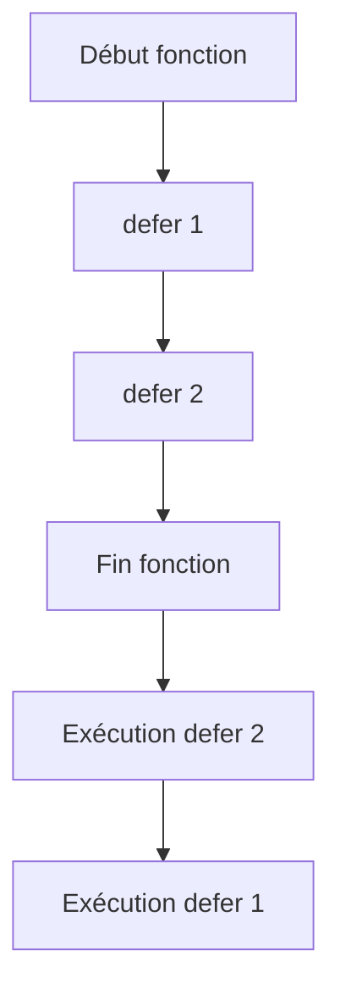

# Chapitre 16 : Defer et nettoyage {#chapitre-16-:-defer-et-nettoyage}

Utilisation de defer, exécution différée, gestion des ressources.

## Le mécanisme defer {#le-mécanisme-defer-16}

### 1. Quoi
Le mot-clé `defer` permet de planifier l'exécution d'une fonction juste avant que la fonction parente ne se termine, quel que soit le chemin emprunté (retour normal ou erreur).

### 2. Pourquoi
Il garantit que les opérations de nettoyage (fermeture de fichiers, libération de verrous, déconnexion de base de données) sont effectuées, évitant ainsi les fuites de ressources.

### 3. Comment
A. **Syntaxe de base** :
```go
func maFonction() {
    f := ouvrirFichier()
    defer f.Close() // Sera exécuté à la fin de maFonction
    
    // ... code utilisant le fichier
}
```

B. **Cas concret** :
```go
package main

import (
    "fmt"
    "os"
)

func main() {
    f, err := os.Create("test.txt")
    if err != nil {
        return
    }
    // On planifie la fermeture immédiatement après l'ouverture
    defer f.Close() 
    
    fmt.Fprintln(f, "Données importantes")
}
```

C. **Exemples pratiques** :
- **Fichiers** : Fermer un descripteur de fichier.
- **Réseau** : Fermer une connexion TCP ou HTTP.
- **Mutex** : Libérer un verrou (`mutex.Unlock()`).

### 4. Zone de Danger
❌ **À ne pas faire** : Utiliser `defer` dans une boucle (ex: ouvrir 1000 fichiers dans une boucle avec `defer` ne les fermera qu'à la fin de la fonction parente, risquant une erreur "trop de fichiers ouverts").
✅ **Bonne Pratique** : Si vous devez ouvrir/fermer des ressources dans une boucle, créez une fonction anonyme ou une fonction dédiée pour encapsuler l'opération.

---

## Ordre d'exécution et comportement {#ordre-d'exécution-et-comportement-16}

### 1. Quoi
Les appels `defer` sont empilés (LIFO - Last In, First Out). La dernière fonction différée est la première à être exécutée.

### 2. Pourquoi
Cela permet de gérer les dépendances de nettoyage dans l'ordre inverse de leur création.

### 3. Comment
A. **Flux logique** :


B. **Exemple LIFO** :
```go
defer fmt.Println("Premier")
defer fmt.Println("Second")
// Affiche : Second, Premier
```

### 4. Zone de Danger
❌ **À ne pas faire** : Oublier que les arguments des fonctions `defer` sont évalués au moment où `defer` est appelé, pas au moment de l'exécution.
✅ **Bonne Pratique** : Si vous avez besoin de la valeur finale d'une variable, utilisez une fonction anonyme dans le `defer`.

### 🚨 Limitations de defer
- **Problèmes** : `defer` ajoute un léger surcoût en performance (négligeable dans 99% des cas).
- **Solutions modernes** : Pour des besoins complexes de gestion de cycle de vie, utilisez des contextes (`context.Context`) ou des patterns de gestionnaire de ressources.
- **Pourquoi l'enseigner** : C'est un pattern fondamental pour écrire du code Go sûr et propre.

---

## Questions clés (validation des acquis du chapitre) {#questions-clés-(validation-des-acquis-du-chapitre)-16}

- **Quand une fonction `defer` est-elle exécutée ?**
  *Réponse : Juste avant que la fonction parente ne retourne.*

- **Quel est l'ordre d'exécution de plusieurs `defer` ?**
  *Réponse : LIFO (Last In, First Out).*

- **Pourquoi ne pas utiliser `defer` dans une boucle ?**
  *Réponse : Pour éviter d'accumuler des ressources ouvertes jusqu'à la fin de la fonction parente.*

---

## Exercices : {#exercices-:-16}

### Exercice 1 - Nettoyage simple {#exercice-1---nettoyage-simple}

🎯 **Objectif** : Utiliser `defer` pour fermer une ressource.

💼 **Mise en situation** : Vous affichez un message de début et de fin.

📝 **Énoncé** : Créez une fonction qui affiche "Début". Utilisez `defer` pour afficher "Fin" juste après.

📺 **Résultat attendu** : `Début`, puis `Fin`.

💡 **Solution** :
<details><summary>Voir le code complet commenté</summary>

```go
package main

import "fmt"

func main() {
    defer fmt.Println("Fin")
    fmt.Println("Début")
}
```
</details>

### Exercice 2 - Ordre LIFO {#exercice-2---ordre-lifo}

🎯 **Objectif** : Vérifier l'ordre d'exécution LIFO.

💼 **Mise en situation** : Vous empilez des opérations de nettoyage.

📝 **Énoncé** : Utilisez trois `defer` affichant "1", "2", "3". Quel est l'ordre d'affichage ?

📺 **Résultat attendu** : `3`, `2`, `1`.

💡 **Solution** :
<details><summary>Voir le code complet commenté</summary>

```go
package main

import "fmt"

func main() {
    defer fmt.Println("1")
    defer fmt.Println("2")
    defer fmt.Println("3")
}
```
</details>

### Exercice 3 - Fermeture sécurisée {#exercice-3---fermeture-sécurisée}

🎯 **Objectif** : Gérer une ressource avec `defer`.

💼 **Mise en situation** : Vous simulez une connexion à une base de données.

📝 **Énoncé** : Créez une fonction `Connecter()` qui affiche "Connexion ouverte". Utilisez `defer` pour afficher "Connexion fermée" dès que la fonction est appelée.

📺 **Résultat attendu** : `Connexion ouverte`, puis `Connexion fermée`.

💡 **Solution** :
<details><summary>Voir le code complet commenté</summary>

```go
package main

import "fmt"

func Connecter() {
    fmt.Println("Connexion ouverte")
    defer fmt.Println("Connexion fermée")
}

func main() {
    Connecter()
}
```
</details>