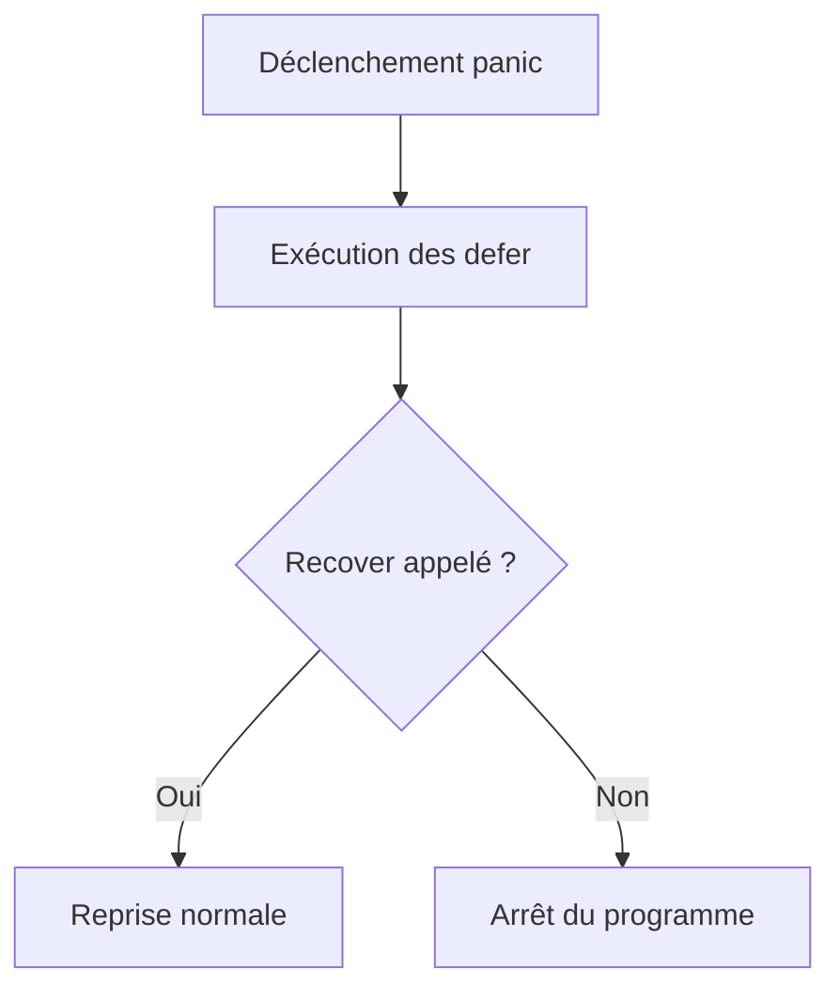

# Chapitre 17 : Panic et Recover {#chapitre-17-:-panic-et-recover}

Gestion des erreurs fatales, paniques, récupération de contrôle.

## Comprendre Panic et Recover {#comprendre-panic-et-recover-17}

### 1. Quoi
- **Panic** : Une fonction intégrée qui arrête le flux d'exécution normal d'un programme Go. Lorsqu'une fonction appelle `panic`, son exécution s'arrête, les fonctions différées (`defer`) sont exécutées, puis le programme se termine avec un message d'erreur.
- **Recover** : Une fonction intégrée qui permet de reprendre le contrôle après une panique. Elle ne peut être utilisée qu'à l'intérieur d'une fonction différée (`defer`).

### 2. Pourquoi
`panic` est utilisé pour des erreurs irrécupérables qui rendent le programme instable (ex: accès à un index de tableau hors limites, erreur de configuration critique au démarrage). `recover` permet de "sauver" le programme d'un crash total, par exemple pour isoler une requête HTTP défaillante dans un serveur web.

### 3. Comment
A. **Syntaxe de base** :
```go
func maFonction() {
    defer func() {
        if r := recover(); r != nil {
            fmt.Println("Récupéré de la panique :", r)
        }
    }()
    panic("quelque chose a mal tourné")
}
```

B. **Cas concret** :
```go
package main

import "fmt"

func traiterDonnees(donnee string) {
    defer func() {
        if r := recover(); r != nil {
            fmt.Println("Traitement annulé :", r)
        }
    }()

    if donnee == "" {
        panic("donnée vide") // Déclenche la panique
    }
    fmt.Println("Traitement :", donnee)
}

func main() {
    traiterDonnees("Go")
    traiterDonnees("") // Déclenchera le recover
    fmt.Println("Programme toujours en vie")
}
```

C. **Exemples pratiques** :
- **Serveurs Web** : Empêcher un crash global si une seule requête provoque une panique.
- **Plugins** : Isoler l'exécution de code tiers non fiable.

### 4. Zone de Danger
❌ **À ne pas faire** : Utiliser `panic` pour gérer des erreurs métier classiques (ex: erreur de validation de formulaire). Utilisez toujours le retour `error`.
✅ **Bonne Pratique** : Réservez `panic` aux situations où le programme ne peut absolument pas continuer.

---

## Cycle de vie d'une panique {#cycle-de-vie-d'une-panique-17}

### 1. Quoi
Le cycle de vie suit une séquence précise : déclenchement, exécution des `defer`, arrêt ou récupération.

### 2. Pourquoi
Comprendre ce flux est crucial pour s'assurer que les ressources sont correctement nettoyées même en cas de crash.

### 3. Comment
A. **Flux logique** :


B. **Tableau comparatif** :

| Mécanisme | Usage |
|-----------|-------|
| `error` | Erreurs attendues (flux normal) |
| `panic` | Erreurs inattendues/fatales |

### 4. Zone de Danger
❌ **À ne pas faire** : Ignorer silencieusement une panique avec `recover()`.
✅ **Bonne Pratique** : Loguez toujours la cause de la panique dans votre bloc `recover` pour pouvoir diagnostiquer le problème plus tard.

### 🚨 Limitations de Panic/Recover
- **Problèmes** : Une utilisation excessive rend le code difficile à suivre et à déboguer.
- **Solutions modernes** : Dans les applications complexes, utilisez des middlewares (ex: `net/http` recovery middleware) pour centraliser la gestion des paniques.
- **Pourquoi l'enseigner** : Pour comprendre comment Go gère les erreurs critiques et comment construire des systèmes résilients.

---

## Questions clés (validation des acquis du chapitre) {#questions-clés-(validation-des-acquis-du-chapitre)-17}

- **Quelle est la différence entre `error` et `panic` ?**
  *Réponse : `error` est pour les erreurs prévisibles, `panic` pour les erreurs fatales.*

- **Où doit-on appeler `recover` ?**
  *Réponse : Uniquement à l'intérieur d'une fonction différée (`defer`).*

- **Que se passe-t-il si `recover` n'est pas appelé après une panique ?**
  *Réponse : Le programme s'arrête (crash).*

---

## Exercices : {#exercices-:-17}

### Exercice 1 - Déclencher une panique {#exercice-1---déclencher-une-panique}

🎯 **Objectif** : Provoquer une panique volontaire.

💼 **Mise en situation** : Vous vérifiez une configuration critique.

📝 **Énoncé** : Créez une fonction `VerifierConfig(config string)`. Si `config` est "invalide", appelez `panic`.

📺 **Résultat attendu** : Le programme s'arrête avec le message de panique.

💡 **Solution** :
<details><summary>Voir le code complet commenté</summary>

```go
package main

func VerifierConfig(config string) {
    if config == "invalide" {
        panic("configuration invalide")
    }
}

func main() {
    VerifierConfig("invalide")
}
```
</details>

### Exercice 2 - Récupérer d'une panique {#exercice-2---récupérer-d'une-panique}

🎯 **Objectif** : Utiliser `recover` pour éviter le crash.

💼 **Mise en situation** : Vous voulez isoler une fonction risquée.

📝 **Énoncé** : Reprenez l'exercice 1 et ajoutez un `defer` avec `recover` pour afficher "Panique récupérée" au lieu de crasher.

📺 **Résultat attendu** : `Panique récupérée : configuration invalide`.

💡 **Solution** :
<details><summary>Voir le code complet commenté</summary>

```go
package main

import "fmt"

func VerifierConfig(config string) {
    defer func() {
        if r := recover(); r != nil {
            fmt.Println("Panique récupérée :", r)
        }
    }()
    
    if config == "invalide" {
        panic("configuration invalide")
    }
}

func main() {
    VerifierConfig("invalide")
    fmt.Println("Programme continue")
}
```
</details>

### Exercice 3 - Nettoyage et panique {#exercice-3---nettoyage-et-panique}

🎯 **Objectif** : Vérifier que les `defer` s'exécutent malgré la panique.

💼 **Mise en situation** : Vous voulez garantir le nettoyage.

📝 **Énoncé** : Créez une fonction avec un `defer` qui affiche "Nettoyage" et un `panic`. Vérifiez que "Nettoyage" s'affiche avant le crash.

📺 **Résultat attendu** : `Nettoyage`, puis le message de panique.

💡 **Solution** :
<details><summary>Voir le code complet commenté</summary>

```go
package main

import "fmt"

func OperationRisquee() {
    defer fmt.Println("Nettoyage")
    panic("crash")
}

func main() {
    OperationRisquee()
}
```
</details>