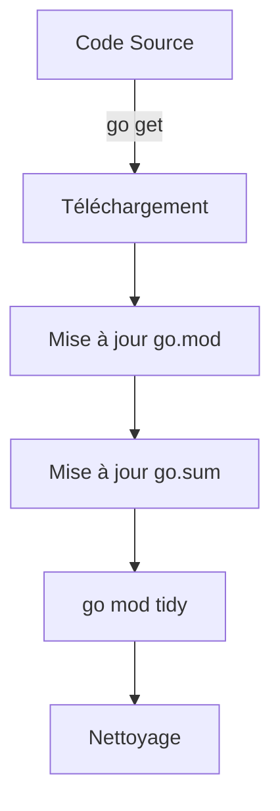

# Chapitre 18 : Gestion des dépendances {#chapitre-18-:-gestion-des-dépendances}

Modules Go, go.mod, go.sum, gestion des versions.

## Le système de modules Go {#le-système-de-modules-go-18}

### 1. Quoi
Un **module** est une collection de paquets Go liés entre eux, versionnés ensemble. Le fichier `go.mod` à la racine du projet définit le nom du module et ses dépendances.

### 2. Pourquoi
Avant les modules, gérer les dépendances était complexe (nécessitait le `GOPATH`). Les modules offrent une gestion des versions reproductible, sécurisée et simple, permettant de partager et d'utiliser du code tiers facilement.

### 3. Comment
A. **Initialisation** :
```bash
go mod init github.com/utilisateur/mon-projet
```

B. **Ajout d'une dépendance** :
```bash
go get github.com/google/uuid
```

C. **Exemple de fichier go.mod** :
```go
module github.com/utilisateur/mon-projet

go 1.21

require github.com/google/uuid v1.6.0
```

D. **Tableau comparatif** :

| Fichier | Rôle |
|---------|------|
| `go.mod` | Définit le module et les dépendances directes |
| `go.sum` | Contient les sommes de contrôle (hash) pour garantir l'intégrité |

### 4. Zone de Danger
❌ **À ne pas faire** : Modifier manuellement le fichier `go.sum`. Il est généré et mis à jour automatiquement par les outils Go.
✅ **Bonne Pratique** : Utilisez toujours `go mod tidy` après avoir ajouté ou supprimé des imports dans votre code pour nettoyer le `go.mod` et le `go.sum`.

---

## Cycle de vie des dépendances {#cycle-de-vie-des-dépendances-18}

### 1. Quoi
Le cycle de vie inclut l'initialisation, l'ajout, la mise à jour et le nettoyage des dépendances.

### 2. Pourquoi
Pour maintenir un projet sain, il est crucial de ne garder que les dépendances nécessaires et de les maintenir à jour pour bénéficier des correctifs de sécurité.

### 3. Comment
A. **Flux de gestion** :


B. **Commandes essentielles** :
- `go mod tidy` : Supprime les dépendances inutilisées et ajoute celles manquantes.
- `go list -m all` : Liste tous les modules utilisés.
- `go get -u` : Met à jour les dépendances vers les dernières versions mineures.

### 4. Zone de Danger
❌ **À ne pas faire** : Commiter le dossier `vendor` (si utilisé) sans raison valable, ou ignorer les mises à jour de sécurité.
✅ **Bonne Pratique** : Vérifiez régulièrement les vulnérabilités de vos dépendances avec `govulncheck`.

### 🚨 Limitations des modules
- **Problèmes** : Les dépendances transitives (dépendances de vos dépendances) peuvent parfois causer des conflits de version.
- **Solutions modernes** : Go utilise le "Minimal Version Selection" (MVS) pour résoudre les conflits de manière déterministe.
- **Pourquoi l'enseigner** : C'est l'outil standard pour tout développeur Go. Sans lui, impossible de travailler sur des projets réels.

---

## Questions clés (validation des acquis du chapitre) {#questions-clés-(validation-des-acquis-du-chapitre)-18}

- **Quel fichier définit le nom de votre module ?**
  *Réponse : `go.mod`.*

- **Quelle commande permet de nettoyer les dépendances inutilisées ?**
  *Réponse : `go mod tidy`.*

- **Pourquoi le fichier `go.sum` est-il important ?**
  *Réponse : Il garantit l'intégrité et l'authenticité des dépendances téléchargées.*

---

## Exercices : {#exercices-:-18}

### Exercice 1 - Initialiser un module {#exercice-1---initialiser-un-module}

🎯 **Objectif** : Créer un nouveau module.

💼 **Mise en situation** : Vous démarrez un nouveau projet.

📝 **Énoncé** : Créez un dossier `mon-app`, entrez dedans et initialisez un module nommé `exemple.com/mon-app`.

📺 **Résultat attendu** : Un fichier `go.mod` est créé.

💡 **Solution** :
<details><summary>Voir le code complet commenté</summary>

```bash
mkdir mon-app
cd mon-app
go mod init exemple.com/mon-app
```
</details>

### Exercice 2 - Ajouter une dépendance {#exercice-2---ajouter-une-dépendance}

🎯 **Objectif** : Installer une bibliothèque tierce.

💼 **Mise en situation** : Vous avez besoin de générer des identifiants uniques.

📝 **Énoncé** : Installez le paquet `github.com/google/uuid`. Vérifiez que `go.mod` a été mis à jour.

📺 **Résultat attendu** : `require github.com/google/uuid v1.x.x` apparaît dans `go.mod`.

💡 **Solution** :
<details><summary>Voir le code complet commenté</summary>

```bash
go get github.com/google/uuid
# Le fichier go.mod est automatiquement mis à jour
```
</details>

### Exercice 3 - Nettoyer le module {#exercice-3---nettoyer-le-module}

🎯 **Objectif** : Utiliser `go mod tidy`.

💼 **Mise en situation** : Vous avez supprimé le code qui utilisait `uuid`.

📝 **Énoncé** : Supprimez l'import de `uuid` dans votre fichier `main.go`. Exécutez `go mod tidy` pour supprimer la dépendance inutile de `go.mod`.

📺 **Résultat attendu** : La ligne `require` disparaît de `go.mod`.

💡 **Solution** :
<details><summary>Voir le code complet commenté</summary>

```bash
# Après avoir supprimé l'import dans le code :
go mod tidy
```
</details>