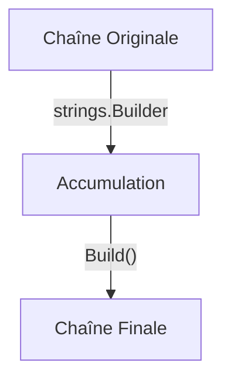

# Chapitre 19 : Manipulation de chaînes {#chapitre-19-:-manipulation-de-chaînes}

Package strings, recherche, transformation, découpage.

## Le package strings {#le-package-strings-19}

### 1. Quoi
En Go, les chaînes de caractères (`string`) sont immuables. Le package `strings` de la bibliothèque standard fournit des fonctions pour manipuler ces chaînes efficacement sans modifier l'originale.

### 2. Pourquoi
La manipulation de texte est omniprésente (parsing, formatage, nettoyage d'inputs). Utiliser la bibliothèque standard garantit des performances optimales et une gestion correcte des caractères UTF-8.

### 3. Comment
A. **Syntaxe de base** :
```go
import "strings"

// Exemple : vérifier la présence d'une sous-chaîne
existe := strings.Contains("Go est génial", "génial")
```

B. **Cas concret** :
```go
package main

import (
    "fmt"
    "strings"
)

func main() {
    texte := "  Bonjour, Monde !  "
    
    // Nettoyage des espaces
    propre := strings.TrimSpace(texte)
    
    // Conversion en majuscules
    majuscule := strings.ToUpper(propre)
    
    // Découpage
    parties := strings.Split(majuscule, ",")
    
    fmt.Println(parties[0]) // Affiche : BONJOUR
}
```

C. **Exemples pratiques** :
- **Nettoyage** : `TrimSpace` pour supprimer les espaces inutiles en début/fin de saisie utilisateur.
- **Recherche** : `Contains` ou `HasPrefix` pour valider des formats d'URL ou d'emails.
- **Transformation** : `ReplaceAll` pour masquer des données sensibles dans un log.

### 4. Zone de Danger
❌ **À ne pas faire** : Concaténer des chaînes dans une boucle avec `+` (ex: `s += "a"`). Cela crée une nouvelle chaîne à chaque itération, ce qui est très coûteux en mémoire.
✅ **Bonne Pratique** : Utilisez `strings.Builder` pour construire des chaînes complexes ou dans des boucles.

---

## Efficacité et transformation {#efficacité-et-transformation-19}

### 1. Quoi
La transformation de chaînes implique souvent la création de nouvelles allocations mémoire. `strings.Builder` est l'outil recommandé pour minimiser ces allocations.

### 2. Pourquoi
Dans des systèmes à haute performance (serveurs, traitement de gros fichiers), réduire les allocations mémoire est crucial pour éviter la pression sur le Garbage Collector.

### 3. Comment
A. **Flux logique** :


B. **Exemple avec strings.Builder** :
```go
var b strings.Builder
for i := 0; i < 10; i++ {
    b.WriteString("Go") // Ajout efficace sans réallocation
}
resultat := b.String()
```

C. **Tableau comparatif** :

| Méthode | Usage | Performance |
|---------|-------|-------------|
| `+` | Concaténation simple | Faible (en boucle) |
| `strings.Join` | Joindre une slice | Excellente |
| `strings.Builder` | Construction complexe | Optimale |

### 4. Zone de Danger
❌ **À ne pas faire** : Utiliser `strings.Split` si vous n'avez besoin que du premier élément.
✅ **Bonne Pratique** : Utilisez `strings.Cut` (Go 1.18+) qui est plus performant et plus lisible pour séparer une chaîne en deux.

### 🚨 Limitations de strings
- **Problèmes** : Les chaînes en Go sont des séquences d'octets UTF-8. Manipuler des caractères (runes) peut être complexe si on ne fait pas attention.
- **Solutions modernes** : Pour des manipulations complexes de texte, utilisez le package `unicode/utf8`.
- **Pourquoi l'enseigner** : C'est la base de toute manipulation de données textuelles en Go.

---

## Questions clés (validation des acquis du chapitre) {#questions-clés-(validation-des-acquis-du-chapitre)-19}

- **Pourquoi ne faut-il pas utiliser `+` dans une boucle pour concaténer des chaînes ?**
  *Réponse : Car les chaînes sont immuables, cela crée une nouvelle chaîne à chaque itération, ce qui est coûteux.*

- **Quel outil utiliser pour construire une chaîne complexe efficacement ?**
  *Réponse : `strings.Builder`.*

- **Quelle fonction permet de supprimer les espaces en début et fin de chaîne ?**
  *Réponse : `strings.TrimSpace`.*

---

## Exercices : {#exercices-:-19}

### Exercice 1 - Nettoyage d'input {#exercice-1---nettoyage-d'input}

🎯 **Objectif** : Utiliser `TrimSpace` et `ToLower`.

💼 **Mise en situation** : Vous normalisez des noms d'utilisateurs.

📝 **Énoncé** : Prenez la chaîne `"  GoLang  "`. Supprimez les espaces et convertissez-la en minuscules.

📺 **Résultat attendu** : `golang`.

💡 **Solution** :
<details><summary>Voir le code complet commenté</summary>

```go
package main

import (
    "fmt"
    "strings"
)

func main() {
    s := "  GoLang  "
    // On nettoie les espaces puis on met en minuscule
    res := strings.ToLower(strings.TrimSpace(s))
    fmt.Println(res)
}
```
</details>

### Exercice 2 - Découpage efficace {#exercice-2---découpage-efficace}

🎯 **Objectif** : Utiliser `strings.Cut`.

💼 **Mise en situation** : Vous parsez une clé-valeur (ex: "port:8080").

📝 **Énoncé** : Utilisez `strings.Cut` pour séparer `"port:8080"` en deux parties : `port` et `8080`.

📺 **Résultat attendu** : `Clé : port, Valeur : 8080`.

💡 **Solution** :
<details><summary>Voir le code complet commenté</summary>

```go
package main

import (
    "fmt"
    "strings"
)

func main() {
    s := "port:8080"
    // Cut est plus efficace que Split pour séparer en deux
    cle, valeur, _ := strings.Cut(s, ":")
    fmt.Printf("Clé : %s, Valeur : %s\n", cle, valeur)
}
```
</details>

### Exercice 3 - Construction de chaîne {#exercice-3---construction-de-chaîne}

🎯 **Objectif** : Utiliser `strings.Builder`.

💼 **Mise en situation** : Vous construisez un message de log.

📝 **Énoncé** : Utilisez `strings.Builder` pour construire la chaîne `"Go est super !"` à partir de trois parties.

📺 **Résultat attendu** : `Go est super !`.

💡 **Solution** :
<details><summary>Voir le code complet commenté</summary>

```go
package main

import (
    "fmt"
    "strings"
)

func main() {
    var b strings.Builder
    b.WriteString("Go")
    b.WriteString(" est")
    b.WriteString(" super !")
    
    fmt.Println(b.String())
}
```
</details>