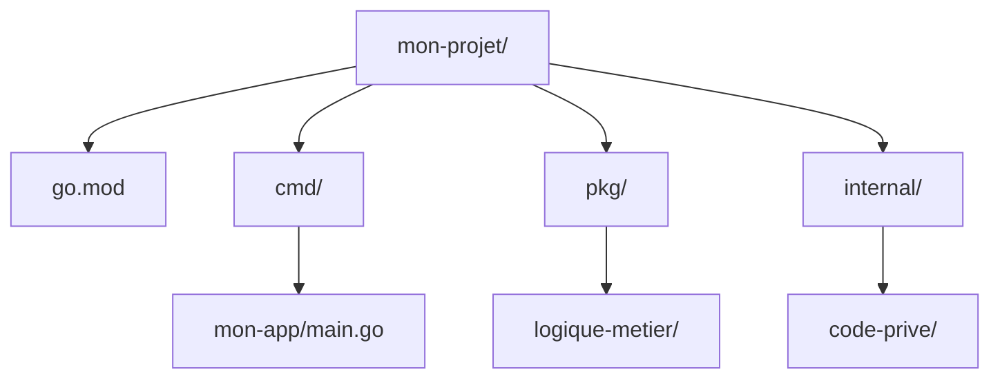

# Chapitre 2 : Structure d'un projet Go {#chapitre-2-:-structure-d'un-projet-go}

Packages, fichiers .go, organisation des répertoires, module Go

## Organisation des fichiers et packages {#organisation-des-fichiers-et-packages-2}

### 1. Quoi
En Go, le code est organisé en **packages**. Un package est un répertoire contenant un ou plusieurs fichiers `.go` qui partagent le même nom de package. Le fichier `go.mod` à la racine définit le module, qui sert de conteneur global pour vos packages.

### 2. Pourquoi
Cette organisation permet une encapsulation efficace, une réutilisation du code facilitée et une compilation rapide. Elle évite également les conflits de noms en structurant le code par domaine fonctionnel.

### 3. Comment
A. **Structure standard** :
```text
mon-projet/
├── go.mod          # Définit le module et les dépendances
├── main.go         # Point d'entrée (package main)
└── utils/          # Sous-package
    └── math.go     # Code réutilisable (package utils)
```

B. **Exemple de package** :
Dans `utils/math.go` :
```go
package utils // Définit le nom du package

func Additionner(a, b int) int {
    return a + b // Logique métier simple
}
```

C. **Tableau comparatif** :
| Composant | Rôle |
|-----------|------|
| `go.mod` | Identifie le module et gère les versions des dépendances |
| `package main` | Indique que le package est un exécutable |
| `package <nom>` | Indique une bibliothèque réutilisable |

### 4. Zone de Danger
❌ **À ne pas faire** : Mettre tout votre code dans un seul fichier `main.go` pour des projets de taille moyenne ou grande.
✅ **Bonne Pratique** : Découpez votre logique en packages logiques (ex: `models`, `handlers`, `services`) dès que le projet dépasse quelques centaines de lignes.

---

## Architecture d'un projet Go {#architecture-d'un-projet-go-2}

### 1. Quoi
La structure de répertoires d'un projet Go suit généralement des conventions communautaires, notamment pour les applications backend.

### 2. Pourquoi
Une structure standardisée permet aux autres développeurs Go de comprendre immédiatement où se trouve la logique métier, les configurations ou les tests, facilitant ainsi la collaboration.

### 3. Comment
A. **Architecture type** :


B. **Règles de nommage** :
- `cmd/` : Contient les points d'entrée (exécutables).
- `pkg/` : Code pouvant être importé par d'autres projets.
- `internal/` : Code privé, non importable par d'autres projets (protection forte).

C. **Configuration et vérification** :
- Utilisez `go build ./cmd/mon-app` pour compiler un exécutable spécifique.
- Utilisez `go test ./...` pour lancer tous les tests du projet.

### 4. Zone de Danger
❌ **À ne pas faire** : Exposer du code sensible ou spécifique à votre application dans le dossier `pkg/` au lieu de `internal/`.
✅ **Bonne Pratique** : Utilisez `internal/` pour tout ce qui ne doit pas être utilisé par des bibliothèques externes.

---

## Questions clés (validation des acquis du chapitre) {#questions-clés-(validation-des-acquis-du-chapitre)-2}

- **Quelle est la différence entre un module et un package en Go ?**
  *Réponse : Un module est une collection de packages versionnés ensemble (défini par `go.mod`), tandis qu'un package est une unité d'organisation de code source.*

- **Quel dossier est utilisé pour stocker les points d'entrée (exécutables) d'un projet ?**
  *Réponse : Le dossier `cmd/`.*

- **Pourquoi utiliser le dossier `internal/` ?**
  *Réponse : Pour empêcher d'autres projets d'importer votre code interne, garantissant ainsi une encapsulation stricte.*