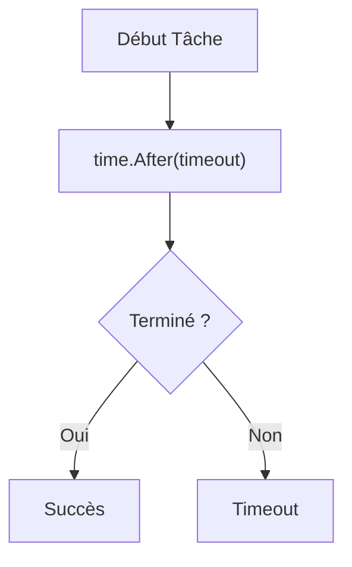

# Chapitre 20 : Gestion du temps {#chapitre-20-:-gestion-du-temps}

Package time, horloges, durées, formatage, temporisation.

## Le package time {#le-package-time-20}

### 1. Quoi
Le package `time` fournit des fonctionnalités pour mesurer et afficher le temps. Il repose sur deux types principaux : `time.Time` pour représenter un instant précis et `time.Duration` pour représenter une durée écoulée.

### 2. Pourquoi
La gestion du temps est critique pour les applications : logs, timeouts de requêtes réseau, planification de tâches (cron), ou simplement mesurer les performances d'un bloc de code.

### 3. Comment
A. **Syntaxe de base** :
```go
import "time"

// Obtenir l'instant présent
maintenant := time.Now()

// Créer une durée
duree := 5 * time.Second
```

B. **Cas concret** :
```go
package main

import (
    "fmt"
    "time"
)

func main() {
    debut := time.Now()
    
    // Simulation d'un travail
    time.Sleep(100 * time.Millisecond)
    
    // Calcul de la durée écoulée
    fmt.Printf("Travail terminé en %v\n", time.Since(debut))
}
```

C. **Exemples pratiques** :
- **Mesure** : `time.Since(debut)` pour profiler une fonction.
- **Temporisation** : `time.Sleep` pour mettre en pause une exécution.
- **Formatage** : `t.Format("2006-01-02")` pour convertir une date en chaîne.

### 4. Zone de Danger
❌ **À ne pas faire** : Utiliser des chaînes de caractères pour manipuler des dates.
✅ **Bonne Pratique** : Utilisez toujours le type `time.Time`. Pour le formatage, rappelez-vous que Go utilise une date de référence spécifique : `Mon Jan 2 15:04:05 MST 2006`.

---

## Temporisation et formatage {#temporisation-et-formatage-20}

### 1. Quoi
La gestion des timeouts et le formatage des dates sont des opérations courantes. Go offre des outils robustes pour ces besoins.

### 2. Pourquoi
Un serveur sans timeout peut rester bloqué indéfiniment. Un formatage correct est essentiel pour l'interopérabilité (ex: JSON, APIs).

### 3. Comment
A. **Flux logique** :


B. **Exemple de formatage** :
```go
t := time.Now()
// Le format est basé sur la date : 01/02 03:04:05PM '06 -0700
fmt.Println(t.Format("2006-01-02 15:04:05"))
```

C. **Tableau comparatif** :

| Fonction | Usage |
|----------|-------|
| `time.Sleep` | Pause bloquante |
| `time.After` | Canal pour timeout (non bloquant) |
| `time.Since` | Calcul de durée écoulée |

### 4. Zone de Danger
❌ **À ne pas faire** : Oublier de gérer les fuseaux horaires (`time.Location`) dans des applications internationales.
✅ **Bonne Pratique** : Travaillez toujours en UTC en interne et convertissez vers le fuseau horaire local uniquement pour l'affichage utilisateur.

### 🚨 Limitations de time
- **Problèmes** : `time.Sleep` bloque toute la goroutine.
- **Solutions modernes** : Pour des systèmes complexes, utilisez `context.Context` pour gérer les timeouts et les annulations de manière hiérarchique.
- **Pourquoi l'enseigner** : C'est un fondamental pour écrire des services réseau robustes.

---

## Questions clés (validation des acquis du chapitre) {#questions-clés-(validation-des-acquis-du-chapitre)-20}

- **Quel type représente un instant précis ?**
  *Réponse : `time.Time`.*

- **Quelle est la date de référence pour le formatage en Go ?**
  *Réponse : `2006-01-02 15:04:05`.*

- **Quelle fonction est idéale pour mesurer le temps écoulé depuis un point de départ ?**
  *Réponse : `time.Since(debut)`.*

---

## Exercices : {#exercices-:-20}

### Exercice 1 - Mesurer le temps {#exercice-1---mesurer-le-temps}

🎯 **Objectif** : Utiliser `time.Since`.

💼 **Mise en situation** : Vous voulez mesurer la performance d'une boucle.

📝 **Énoncé** : Mesurez combien de temps prend une boucle qui compte jusqu'à 1 million.

📺 **Résultat attendu** : `La boucle a pris : [durée]`.

💡 **Solution** :
<details><summary>Voir le code complet commenté</summary>

```go
package main

import (
    "fmt"
    "time"
)

func main() {
    debut := time.Now()
    for i := 0; i < 1000000; i++ {}
    fmt.Println("La boucle a pris :", time.Since(debut))
}
```
</details>

### Exercice 2 - Formatage de date {#exercice-2---formatage-de-date}

🎯 **Objectif** : Utiliser `time.Format`.

💼 **Mise en situation** : Vous affichez la date du jour dans un log.

📝 **Énoncé** : Affichez la date actuelle au format `JJ/MM/AAAA`.

📺 **Résultat attendu** : `Date actuelle : 24/05/2024` (selon la date réelle).

💡 **Solution** :
<details><summary>Voir le code complet commenté</summary>

```go
package main

import (
    "fmt"
    "time"
)

func main() {
    // 02 = jour, 01 = mois, 2006 = année
    fmt.Println("Date actuelle :", time.Now().Format("02/01/2006"))
}
```
</details>

### Exercice 3 - Temporisation {#exercice-3---temporisation}

🎯 **Objectif** : Utiliser `time.Sleep`.

💼 **Mise en situation** : Vous créez un compte à rebours.

📝 **Énoncé** : Affichez "3", "2", "1" avec une pause d'une seconde entre chaque.

📺 **Résultat attendu** : Affiche les chiffres avec 1s d'intervalle.

💡 **Solution** :
<details><summary>Voir le code complet commenté</summary>

```go
package main

import (
    "fmt"
    "time"
)

func main() {
    for i := 3; i > 0; i-- {
        fmt.Println(i)
        time.Sleep(1 * time.Second)
    }
}
```
</details>