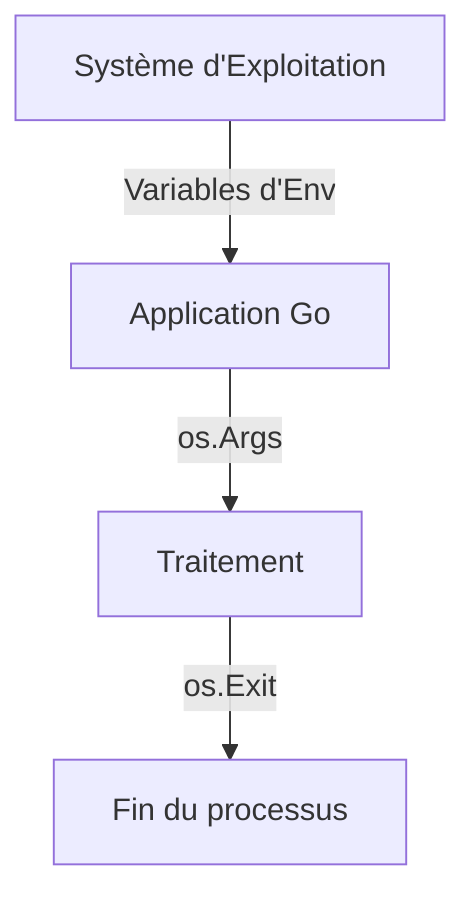

# Chapitre 21 : Interaction avec le système d'exploitation {#chapitre-21-:-interaction-avec-le-système-d'exploitation}

Package os, variables d'environnement, arguments de ligne de commande, manipulation de fichiers.

## Le package os {#le-package-os-21}

### 1. Quoi
Le package `os` fournit une interface indépendante de la plateforme pour interagir avec le système d'exploitation (fichiers, processus, variables d'environnement, signaux).

### 2. Pourquoi
Pour créer des outils système, des CLI (Command Line Interfaces) ou des services qui doivent lire des configurations, manipuler des fichiers ou interagir avec l'environnement d'exécution.

### 3. Comment
A. **Syntaxe de base** :
```go
import "os"

// Lire une variable d'environnement
valeur := os.Getenv("PORT")

// Lire les arguments de la ligne de commande
args := os.Args
```

B. **Cas concret** :
```go
package main

import (
    "fmt"
    "os"
)

func main() {
    // Récupérer le nom de l'utilisateur depuis l'environnement
    user := os.Getenv("USER")
    if user == "" {
        user = "Inconnu"
    }
    
    // Afficher les arguments passés au programme
    fmt.Printf("Bonjour %s, arguments reçus : %v\n", user, os.Args[1:])
}
```

C. **Exemples pratiques** :
- **Configuration** : `os.Getenv` pour lire les secrets ou ports depuis l'environnement (standard dans les conteneurs).
- **CLI** : `os.Args` pour traiter les commandes utilisateur (ex: `mon-app --verbose`).
- **Fichiers** : `os.Open` ou `os.Create` pour manipuler le système de fichiers.

### 4. Zone de Danger
❌ **À ne pas faire** : Utiliser `os.Exit()` dans une fonction qui n'est pas `main`. Cela arrête immédiatement le programme sans exécuter les `defer`.
✅ **Bonne Pratique** : Retournez des erreurs (`error`) et laissez la fonction `main` décider si elle doit appeler `os.Exit(1)`.

---

## Processus et environnement {#processus-et-environnement-21}

### 1. Quoi
La gestion des processus et de l'environnement permet de contrôler comment votre application s'exécute et interagit avec son hôte.

### 2. Pourquoi
Indispensable pour le déploiement (Cloud, Docker) où la configuration est injectée via des variables d'environnement.

### 3. Comment
A. **Flux logique** :


B. **Tableau comparatif** :

| Fonction | Usage |
|----------|-------|
| `os.Getenv` | Lecture de config |
| `os.Args` | Lecture d'arguments CLI |
| `os.Exit` | Arrêt immédiat du programme |

### 4. Zone de Danger
❌ **À ne pas faire** : Stocker des mots de passe en clair dans des variables d'environnement si elles sont exposées dans les logs.
✅ **Bonne Pratique** : Utilisez des outils de gestion de secrets (Vault, AWS Secrets Manager) pour les données sensibles.

### 🚨 Limitations de os
- **Problèmes** : `os.Args` est basique. Pour des CLI complexes, il est difficile de gérer les flags (`--help`, `-v`).
- **Solutions modernes** : Utilisez des bibliothèques comme `github.com/spf13/cobra` ou `github.com/urfave/cli` pour des interfaces en ligne de commande robustes.
- **Pourquoi l'enseigner** : C'est la base pour comprendre comment Go interagit avec le monde extérieur.

---

## Questions clés (validation des acquis du chapitre) {#questions-clés-(validation-des-acquis-du-chapitre)-21}

- **Quelle fonction permet de lire une variable d'environnement ?**
  *Réponse : `os.Getenv`.*

- **Pourquoi faut-il éviter `os.Exit` en dehors de `main` ?**
  *Réponse : Car il arrête le programme sans exécuter les `defer`.*

- **Où trouve-t-on les arguments passés au programme ?**
  *Réponse : Dans la slice `os.Args`.*

---

## Exercices : {#exercices-:-21}

### Exercice 1 - Lire l'environnement {#exercice-1---lire-l'environnement}

🎯 **Objectif** : Utiliser `os.Getenv`.

💼 **Mise en situation** : Vous configurez le port de votre serveur.

📝 **Énoncé** : Lisez la variable d'environnement `PORT`. Si elle n'est pas définie, affichez "Port par défaut : 8080".

📺 **Résultat attendu** : Affiche le port configuré ou 8080.

💡 **Solution** :
<details><summary>Voir le code complet commenté</summary>

```go
package main

import (
    "fmt"
    "os"
)

func main() {
    port := os.Getenv("PORT")
    if port == "" {
        fmt.Println("Port par défaut : 8080")
    } else {
        fmt.Println("Port configuré :", port)
    }
}
```
</details>

### Exercice 2 - Traiter les arguments {#exercice-2---traiter-les-arguments}

🎯 **Objectif** : Utiliser `os.Args`.

💼 **Mise en situation** : Vous créez un outil qui salue l'utilisateur.

📝 **Énoncé** : Le programme doit prendre un nom en argument (ex: `go run main.go Alice`) et afficher "Bonjour Alice".

📺 **Résultat attendu** : `Bonjour Alice`.

💡 **Solution** :
<details><summary>Voir le code complet commenté</summary>

```go
package main

import (
    "fmt"
    "os"
)

func main() {
    // os.Args[0] est le nom du programme, os.Args[1] est le premier argument
    if len(os.Args) < 2 {
        fmt.Println("Usage: go run main.go [nom]")
        return
    }
    fmt.Println("Bonjour", os.Args[1])
}
```
</details>

### Exercice 3 - Arrêt propre {#exercice-3---arrêt-propre}

🎯 **Objectif** : Comprendre `os.Exit`.

💼 **Mise en situation** : Vous gérez une erreur fatale.

📝 **Énoncé** : Créez un programme qui vérifie si un fichier existe. S'il n'existe pas, affichez une erreur et quittez avec `os.Exit(1)`.

📺 **Résultat attendu** : Message d'erreur et code de sortie 1.

💡 **Solution** :
<details><summary>Voir le code complet commenté</summary>

```go
package main

import (
    "fmt"
    "os"
)

func main() {
    _, err := os.Stat("config.json")
    if os.IsNotExist(err) {
        fmt.Println("Erreur : config.json introuvable")
        os.Exit(1) // Arrêt immédiat avec code d'erreur
    }
}
```
</details>