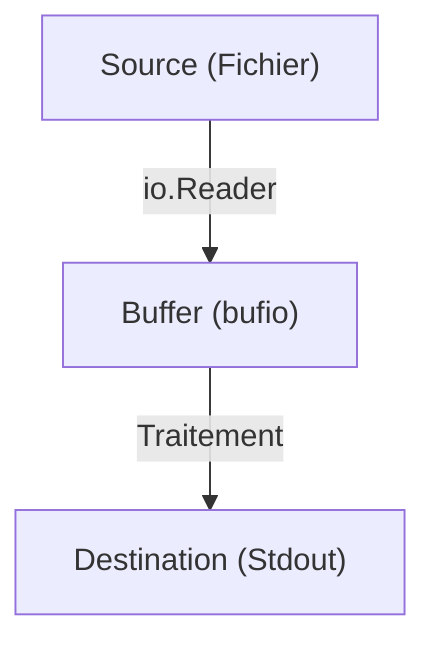

# Chapitre 22 : Entrées/Sorties fichiers {#chapitre-22-:-entrées/sorties-fichiers}

Package io, os, lecture, écriture, buffers, interfaces Reader/Writer.

## Les interfaces Reader et Writer {#les-interfaces-reader-et-writer-22}

### 1. Quoi
En Go, les entrées/sorties (I/O) sont abstraites par deux interfaces fondamentales : `io.Reader` (pour lire des données) et `io.Writer` (pour écrire des données). Tout ce qui peut être lu ou écrit implémente ces interfaces.

### 2. Pourquoi
Cette abstraction permet de traiter de manière identique un fichier, une connexion réseau, une chaîne de caractères ou une réponse HTTP. C'est la clé de la modularité et de la réutilisabilité du code Go.

### 3. Comment
A. **Syntaxe de base** :
```go
// Interface Reader
type Reader interface {
    Read(p []byte) (n int, err error)
}

// Interface Writer
type Writer interface {
    Write(p []byte) (n int, err error)
}
```

B. **Cas concret (Lecture/Écriture)** :
```go
package main

import (
    "os"
)

func main() {
    // Création d'un fichier (implémente io.Writer)
    f, _ := os.Create("test.txt")
    defer f.Close()

    // Écriture
    f.Write([]byte("Bonjour Go"))

    // Lecture
    data, _ := os.ReadFile("test.txt")
    os.Stdout.Write(data) // Affiche le contenu
}
```

C. **Exemples pratiques** :
- **Lecture rapide** : `os.ReadFile` pour lire un petit fichier en une fois.
- **Écriture rapide** : `os.WriteFile` pour écrire un fichier.
- **Streaming** : Utiliser `io.Copy` pour transférer des données d'un `Reader` vers un `Writer` sans charger tout le contenu en mémoire.

### 4. Zone de Danger
❌ **À ne pas faire** : Charger un fichier de plusieurs Go en mémoire avec `os.ReadFile`.
✅ **Bonne Pratique** : Utilisez `io.Copy` ou un `bufio.Scanner` pour traiter les fichiers ligne par ligne ou par blocs (streaming).

---

## Streaming et Buffers {#streaming-et-buffers-22}

### 1. Quoi
Le streaming consiste à traiter les données par petits morceaux (buffers) plutôt que d'un seul bloc. Le package `bufio` facilite cela.

### 2. Pourquoi
Pour manipuler des fichiers volumineux sans saturer la RAM de la machine.

### 3. Comment
A. **Flux logique** :


B. **Exemple avec bufio** :
```go
file, _ := os.Open("gros_fichier.txt")
defer file.Close()

scanner := bufio.NewScanner(file)
for scanner.Scan() {
    fmt.Println(scanner.Text()) // Traitement ligne par ligne
}
```

C. **Tableau comparatif** :

| Approche | Usage | Mémoire |
|----------|-------|---------|
| `ReadFile` | Petits fichiers | Élevée |
| `bufio` | Fichiers ligne par ligne | Faible |
| `io.Copy` | Transfert direct | Très faible |

### 4. Zone de Danger
❌ **À ne pas faire** : Oublier de fermer un fichier (`file.Close()`).
✅ **Bonne Pratique** : Utilisez `defer file.Close()` immédiatement après l'ouverture réussie du fichier.

### 🚨 Limitations de l'approche standard
- **Problèmes** : La gestion manuelle des buffers peut être verbeuse.
- **Solutions modernes** : Pour des systèmes complexes, utilisez des bibliothèques de haut niveau ou des frameworks de traitement de données.
- **Pourquoi l'enseigner** : C'est le socle de la manipulation de données en Go.

---

## Questions clés (validation des acquis du chapitre) {#questions-clés-(validation-des-acquis-du-chapitre)-22}

- **Quelle est la différence entre `io.Reader` et `io.Writer` ?**
  *Réponse : `Reader` est pour lire des données, `Writer` pour en écrire.*

- **Pourquoi utiliser `bufio.Scanner` ?**
  *Réponse : Pour lire des fichiers ligne par ligne sans charger tout le fichier en mémoire.*

- **Quelle fonction utiliser pour transférer des données d'un Reader vers un Writer ?**
  *Réponse : `io.Copy`.*

---

## Exercices : {#exercices-:-22}

### Exercice 1 - Écrire un fichier {#exercice-1---écrire-un-fichier}

🎯 **Objectif** : Utiliser `os.WriteFile`.

💼 **Mise en situation** : Vous sauvegardez un log simple.

📝 **Énoncé** : Écrivez la chaîne "Log système : OK" dans un fichier nommé `log.txt`.

📺 **Résultat attendu** : Fichier `log.txt` créé avec le contenu.

💡 **Solution** :
<details><summary>Voir le code complet commenté</summary>

```go
package main

import (
    "os"
)

func main() {
    // WriteFile gère l'ouverture, l'écriture et la fermeture
    os.WriteFile("log.txt", []byte("Log système : OK"), 0644)
}
```
</details>

### Exercice 2 - Lire un fichier {#exercice-2---lire-un-fichier}

🎯 **Objectif** : Utiliser `os.ReadFile`.

💼 **Mise en situation** : Vous lisez une configuration.

📝 **Énoncé** : Lisez le contenu du fichier `log.txt` créé précédemment et affichez-le dans la console.

📺 **Résultat attendu** : `Log système : OK`.

💡 **Solution** :
<details><summary>Voir le code complet commenté</summary>

```go
package main

import (
    "fmt"
    "os"
)

func main() {
    data, _ := os.ReadFile("log.txt")
    fmt.Println(string(data))
}
```
</details>

### Exercice 3 - Lecture ligne par ligne {#exercice-3---lecture-ligne-par-ligne}

🎯 **Objectif** : Utiliser `bufio.Scanner`.

💼 **Mise en situation** : Vous traitez un fichier de données.

📝 **Énoncé** : Créez un fichier avec trois lignes. Lisez-le ligne par ligne en utilisant `bufio.Scanner` et affichez chaque ligne.

📺 **Résultat attendu** : Affiche chaque ligne du fichier.

💡 **Solution** :
<details><summary>Voir le code complet commenté</summary>

```go
package main

import (
    "bufio"
    "fmt"
    "os"
)

func main() {
    file, _ := os.Open("log.txt")
    defer file.Close()

    scanner := bufio.NewScanner(file)
    for scanner.Scan() {
        fmt.Println("Ligne :", scanner.Text())
    }
}
```
</details>