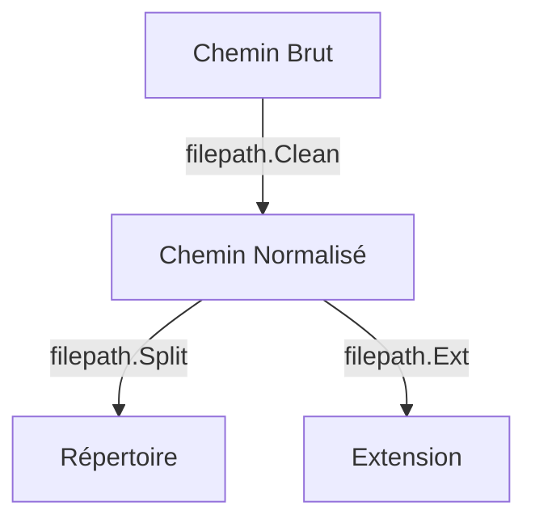

# Chapitre 23 : Gestion des chemins de fichiers {#chapitre-23-:-gestion-des-chemins-de-fichiers}

Package path/filepath, chemins absolus/relatifs, nettoyage de chemins, extension, séparation.

## Le package path/filepath {#le-package-path/filepath-23}

### 1. Quoi
Le package `path/filepath` fournit des fonctions pour manipuler les chemins de fichiers de manière compatible avec le système d'exploitation hôte (Windows, Linux, macOS).

### 2. Pourquoi
Les séparateurs de chemins diffèrent selon l'OS (`/` sur Unix, `\` sur Windows). Utiliser `filepath` garantit que votre code fonctionnera partout sans modification manuelle des chaînes de caractères.

### 3. Comment
A. **Syntaxe de base** :
```go
import "path/filepath"

// Joindre des éléments de chemin
chemin := filepath.Join("dossier", "sous-dossier", "fichier.txt")
```

B. **Cas concret** :
```go
package main

import (
    "fmt"
    "path/filepath"
)

func main() {
    // Création d'un chemin propre
    chemin := filepath.Join("config", "app", "../data", "settings.json")
    
    // Nettoyage (résout les ".." et les séparateurs)
    propre := filepath.Clean(chemin)
    
    fmt.Println("Chemin propre :", propre)
    fmt.Println("Extension :", filepath.Ext(propre))
}
```

C. **Exemples pratiques** :
- **Construction** : `filepath.Join` pour créer des chemins dynamiques.
- **Analyse** : `filepath.Ext` pour vérifier le type de fichier (ex: `.json`, `.png`).
- **Normalisation** : `filepath.Abs` pour obtenir le chemin absolu d'un fichier.

### 4. Zone de Danger
❌ **À ne pas faire** : Concaténer des chemins avec `+` ou `fmt.Sprintf` (ex: `dossier + "/" + fichier`). Cela casse la portabilité sur Windows.
✅ **Bonne Pratique** : Utilisez toujours `filepath.Join` pour construire des chemins.

---

## Manipulation et Analyse {#manipulation-et-analyse-23}

### 1. Quoi
L'analyse des chemins permet d'extraire des informations (répertoire, nom de fichier, extension) ou de transformer des chemins relatifs en absolus.

### 2. Pourquoi
Indispensable pour sécuriser l'accès aux fichiers et éviter les erreurs de chemin lors de l'exécution sur différents environnements.

### 3. Comment
A. **Flux logique** :


B. **Tableau comparatif** :

| Fonction | Usage |
|----------|-------|
| `filepath.Join` | Construction sécurisée |
| `filepath.Clean` | Nettoyage (supprime les redondances) |
| `filepath.Ext` | Extraction de l'extension |
| `filepath.Abs` | Conversion en chemin absolu |

### 4. Zone de Danger
❌ **À ne pas faire** : Faire confiance aveuglément aux entrées utilisateur pour construire des chemins (risque de "Path Traversal").
✅ **Bonne Pratique** : Utilisez `filepath.Clean` et vérifiez que le chemin résultant est bien à l'intérieur du dossier autorisé.

### 🚨 Limitations de path/filepath
- **Problèmes** : Ne vérifie pas si le fichier existe réellement sur le disque.
- **Solutions modernes** : Combinez avec `os.Stat` pour vérifier l'existence ou les permissions.
- **Pourquoi l'enseigner** : C'est la base pour écrire des applications robustes qui manipulent des fichiers.

---

## Questions clés (validation des acquis du chapitre) {#questions-clés-(validation-des-acquis-du-chapitre)-23}

- **Pourquoi utiliser `filepath.Join` au lieu de `+` ?**
  *Réponse : Pour assurer la portabilité entre les différents systèmes d'exploitation.*

- **Quelle fonction permet de supprimer les redondances comme `..` dans un chemin ?**
  *Réponse : `filepath.Clean`.*

- **Comment extraire l'extension d'un fichier ?**
  *Réponse : `filepath.Ext`.*

---

## Exercices : {#exercices-:-23}

### Exercice 1 - Construire un chemin {#exercice-1---construire-un-chemin}

🎯 **Objectif** : Utiliser `filepath.Join`.

💼 **Mise en situation** : Vous construisez le chemin vers un fichier de log.

📝 **Énoncé** : Construisez le chemin `logs/2023/app.log` en utilisant `filepath.Join`.

📺 **Résultat attendu** : `logs/2023/app.log` (ou avec `\` sur Windows).

💡 **Solution** :
<details><summary>Voir le code complet commenté</summary>

```go
package main

import (
    "fmt"
    "path/filepath"
)

func main() {
    // Join gère automatiquement les séparateurs selon l'OS
    chemin := filepath.Join("logs", "2023", "app.log")
    fmt.Println(chemin)
}
```
</details>

### Exercice 2 - Nettoyer un chemin {#exercice-2---nettoyer-un-chemin}

🎯 **Objectif** : Utiliser `filepath.Clean`.

💼 **Mise en situation** : Vous recevez un chemin mal formé.

📝 **Énoncé** : Nettoyez le chemin `"dossier/./sous-dossier/../fichier.txt"`.

📺 **Résultat attendu** : `dossier/fichier.txt`.

💡 **Solution** :
<details><summary>Voir le code complet commenté</summary>

```go
package main

import (
    "fmt"
    "path/filepath"
)

func main() {
    // Clean résout les "." et ".."
    chemin := filepath.Clean("dossier/./sous-dossier/../fichier.txt")
    fmt.Println(chemin)
}
```
</details>

### Exercice 3 - Extraire l'extension {#exercice-3---extraire-l'extension}

🎯 **Objectif** : Utiliser `filepath.Ext`.

💼 **Mise en situation** : Vous validez le type de fichier uploadé.

📝 **Énoncé** : Extrayez l'extension du fichier `"image.png"`.

📺 **Résultat attendu** : `.png`.

💡 **Solution** :
<details><summary>Voir le code complet commenté</summary>

```go
package main

import (
    "fmt"
    "path/filepath"
)

func main() {
    // Ext retourne l'extension incluant le point
    ext := filepath.Ext("image.png")
    fmt.Println(ext)
}
```
</details>