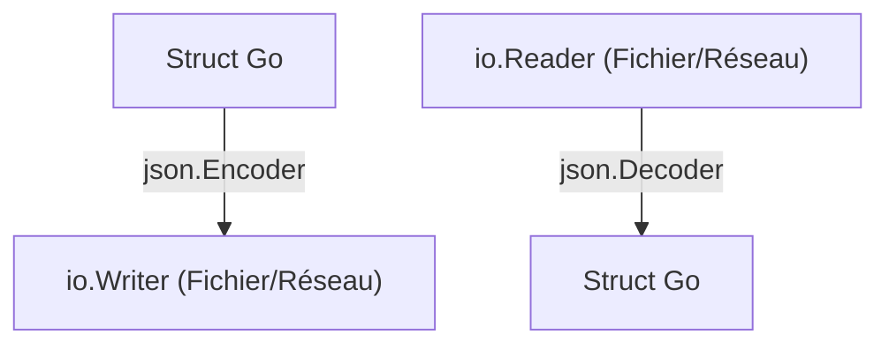

# Chapitre 24 : Encodage JSON {#chapitre-24-:-encodage-json}

Package encoding/json, struct tags, marshaling, unmarshaling.

## Sérialisation et Désérialisation JSON {#sérialisation-et-désérialisation-json-24}

### 1. Quoi
Le format **JSON** (JavaScript Object Notation) est le standard pour l'échange de données sur le web. En Go, le package `encoding/json` permet de convertir des structures Go en JSON (**Marshaling**) et inversement (**Unmarshaling**).

### 2. Pourquoi
La majorité des APIs REST communiquent en JSON. Savoir convertir des objets Go en JSON et vice-versa est indispensable pour construire des services backend.

### 3. Comment
A. **Syntaxe de base** :
```go
import "encoding/json"

// Marshaling : struct -> JSON
data, _ := json.Marshal(monObjet)

// Unmarshaling : JSON -> struct
json.Unmarshal(data, &monObjet)
```

B. **Cas concret avec Struct Tags** :
```go
package main

import (
    "encoding/json"
    "fmt"
)

type Utilisateur struct {
    Nom   string `json:"nom"`
    Email string `json:"email"`
    Age   int    `json:"age,omitempty"` // omitempty ignore le champ s'il est vide
}

func main() {
    u := Utilisateur{Nom: "Alice", Email: "alice@example.com"}
    
    // Conversion en JSON
    b, _ := json.MarshalIndent(u, "", "  ")
    fmt.Println(string(b))
}
```

C. **Exemples pratiques** :
- **API** : Envoyer une réponse JSON à un client HTTP.
- **Configuration** : Lire un fichier `config.json` pour initialiser une application.
- **Logs** : Sérialiser des objets métier en JSON pour les envoyer vers un système de logging centralisé.

### 4. Zone de Danger
❌ **À ne pas faire** : Utiliser des champs non exportés (commençant par une minuscule) dans vos structs. Le package `json` ne pourra pas les voir et ils seront ignorés.
✅ **Bonne Pratique** : Exportez toujours vos champs (majuscule) et utilisez des `struct tags` pour définir le nom exact attendu dans le JSON.

---

## Flux de données JSON {#flux-de-données-json-24}

### 1. Quoi
Le traitement de JSON peut se faire via des fonctions directes (`Marshal`/`Unmarshal`) ou via des flux (`Encoder`/`Decoder`) pour les gros volumes de données.

### 2. Pourquoi
Les flux (`Encoder`/`Decoder`) permettent de lire/écrire directement depuis/vers des fichiers ou des connexions réseau sans charger toute la donnée en mémoire.

### 3. Comment
A. **Flux logique** :


B. **Tableau comparatif** :

| Méthode | Usage | Performance |
|----------|-------|-------------|
| `Marshal` | Petit objet | Simple |
| `Encoder` | Flux / Fichiers | Optimale |

### 4. Zone de Danger
❌ **À ne pas faire** : Ignorer les erreurs retournées par `Unmarshal`. Si le JSON est mal formé, votre programme risque de continuer avec des données corrompues.
✅ **Bonne Pratique** : Vérifiez systématiquement l'erreur retournée par `json.Unmarshal` ou `json.NewDecoder().Decode()`.

### 🚨 Limitations de encoding/json
- **Problèmes** : La réflexion (reflection) utilisée par le package est relativement lente pour des besoins de très haute performance.
- **Solutions modernes** : Pour des besoins critiques en performance, utilisez des bibliothèques comme `github.com/segmentio/encoding/json` ou `github.com/goccy/go-json`.
- **Pourquoi l'enseigner** : C'est la bibliothèque standard, elle est disponible partout sans dépendances externes.

---

## Questions clés (validation des acquis du chapitre) {#questions-clés-(validation-des-acquis-du-chapitre)-24}

- **Comment renommer un champ JSON par rapport au champ Go ?**
  *Réponse : En utilisant des struct tags : `json:"nom_souhaité"`.*

- **Pourquoi les champs non exportés sont-ils ignorés par le package json ?**
  *Réponse : Car le package utilise la réflexion et ne peut accéder qu'aux champs publics (majuscule).*

- **Quelle est la différence entre `Marshal` et `Encoder` ?**
  *Réponse : `Marshal` travaille sur des slices de bytes en mémoire, `Encoder` travaille sur des flux (`io.Writer`).*

---

## Exercices : {#exercices-:-24}

### Exercice 1 - Sérialisation simple {#exercice-1---sérialisation-simple}

🎯 **Objectif** : Utiliser `json.Marshal`.

💼 **Mise en situation** : Vous préparez une réponse API.

📝 **Énoncé** : Créez une struct `Produit` avec `Nom` et `Prix`. Sérialisez une instance de cette struct en JSON.

📺 **Résultat attendu** : `{"Nom":"Clavier","Prix":50}`.

💡 **Solution** :
<details><summary>Voir le code complet commenté</summary>

```go
package main

import (
    "encoding/json"
    "fmt"
)

type Produit struct {
    Nom  string  `json:"Nom"`
    Prix float64 `json:"Prix"`
}

func main() {
    p := Produit{Nom: "Clavier", Prix: 50}
    b, _ := json.Marshal(p)
    fmt.Println(string(b))
}
```
</details>

### Exercice 2 - Désérialisation {#exercice-2---désérialisation}

🎯 **Objectif** : Utiliser `json.Unmarshal`.

💼 **Mise en situation** : Vous recevez des données d'une API.

📝 **Énoncé** : Désérialisez la chaîne `{"Nom":"Souris","Prix":25}` dans une struct `Produit`.

📺 **Résultat attendu** : Affiche le nom et le prix de l'objet Go.

💡 **Solution** :
<details><summary>Voir le code complet commenté</summary>

```go
package main

import (
    "encoding/json"
    "fmt"
)

type Produit struct {
    Nom  string  `json:"Nom"`
    Prix float64 `json:"Prix"`
}

func main() {
    data := []byte(`{"Nom":"Souris","Prix":25}`)
    var p Produit
    json.Unmarshal(data, &p)
    fmt.Printf("Produit: %s, Prix: %.2f\n", p.Nom, p.Prix)
}
```
</details>

### Exercice 3 - Utilisation de omitempty {#exercice-3---utilisation-de-omitempty}

🎯 **Objectif** : Utiliser les struct tags.

💼 **Mise en situation** : Vous voulez une réponse JSON légère.

📝 **Énoncé** : Ajoutez `omitempty` au champ `Prix` de la struct `Produit`. Sérialisez un produit avec un prix à 0.

📺 **Résultat attendu** : `{"Nom":"Clavier"}` (le prix est absent).

💡 **Solution** :
<details><summary>Voir le code complet commenté</summary>

```go
package main

import (
    "encoding/json"
    "fmt"
)

type Produit struct {
    Nom  string  `json:"Nom"`
    Prix float64 `json:"Prix,omitempty"` // omitempty cache le champ si valeur zéro
}

func main() {
    p := Produit{Nom: "Clavier", Prix: 0}
    b, _ := json.Marshal(p)
    fmt.Println(string(b))
}
```
</details>