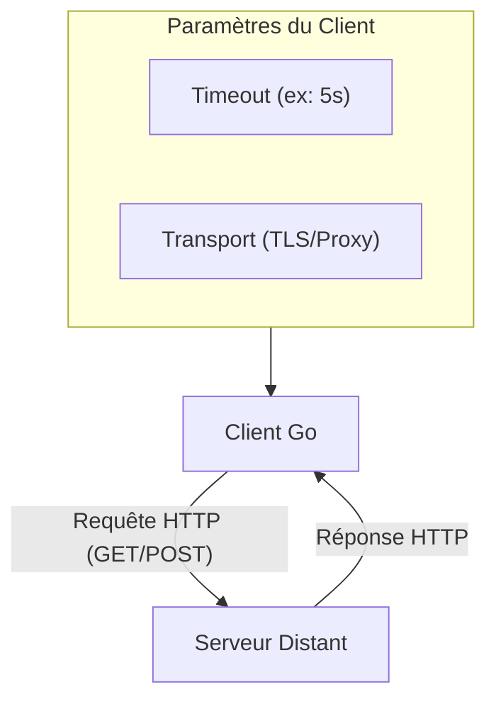

# Chapitre 25 : Client HTTP de base {#chapitre-25-client-http-de-base}

Concepts clés : net/http, GET, POST, Client, Response, Request

## Utilisation du package net/http {#utilisation-du-package-net-http}

### 1. Quoi {#quoi}
Le package **net/http** est la bibliothèque standard de Go pour interagir avec le protocole **HTTP**. Il permet de créer des serveurs, mais aussi de se comporter comme un **client** pour effectuer des requêtes vers des API externes ou des services web.

### 2. Pourquoi {#pourquoi}
Dans un environnement professionnel, votre application Go devra fréquemment communiquer avec d'autres microservices ou des API tierces (ex: Stripe, Twilio, API météo). Maîtriser le client HTTP natif est indispensable pour comprendre comment les données transitent sur le réseau sans dépendre de bibliothèques tierces complexes.

### 3. Comment {#comment}

#### A. Syntaxe de base
Pour effectuer une requête simple, on utilise `http.Get`.

```go
package main

import (
	"fmt"
	"net/http"
	"io"
)

func main() {
	// Effectue une requête GET
	resp, err := http.Get("https://api.example.com/data")
	if err != nil {
		panic(err)
	}
	// Important : fermer le corps de la réponse pour libérer les ressources réseau
	defer resp.Body.Close()

	body, _ := io.ReadAll(resp.Body)
	fmt.Println(string(body))
}
```

#### B. Cas concret : Client robuste avec Timeout
En production, ne jamais utiliser `http.Get` directement car il n'a pas de timeout par défaut. Utilisez un `http.Client` configuré.



```go
package main

import (
	"net/http"
	"time"
	"fmt"
)

func main() {
	// Configuration d'un client avec un timeout strict pour éviter de bloquer l'app
	client := &http.Client{
		Timeout: 5 * time.Second,
	}

	resp, err := client.Get("https://api.example.com/status")
	if err != nil {
		fmt.Printf("Erreur réseau : %v\n", err)
		return
	}
	defer resp.Body.Close()

	fmt.Printf("Code de statut : %d\n", resp.StatusCode)
}
```

#### C. Exemples pratiques
1. **GET simple** : Récupérer des données publiques.
2. **POST avec JSON** : Envoyer des données à une API en utilisant `bytes.NewBuffer`.
3. **Ajout de Headers** : Ajouter un token d'authentification `Authorization: Bearer <token>`.

### 4. Zone de Danger {#zone-de-danger}

- ❌ **Oublier de fermer le Body** : `resp.Body.Close()` est obligatoire. Sinon, vous créez une fuite de ressources (file descriptors) qui fera planter votre serveur sous charge.
- ❌ **Utiliser `http.Get` par défaut** : Sans timeout, si le serveur distant est lent, votre goroutine restera bloquée indéfiniment.
- ✅ **Bonne pratique** : Utilisez toujours `http.Client` avec un `Timeout` défini.

### 🚨 Limitations de l'approche standard {#limitations-de-l-approche-standard}

Le client `net/http` est bas niveau. Pour des besoins complexes (retries automatiques, gestion de pools de connexions avancée, middleware), il est courant d'utiliser des bibliothèques comme `resty` ou `go-retryablehttp`. Cependant, comprendre `net/http` est le prérequis obligatoire pour déboguer les problèmes de réseau en Go.

## Questions clés (validation des acquis du chapitre) {#questions-clés-(validation-des-acquis-du-chapitre)-25}

- **Pourquoi faut-il toujours appeler `resp.Body.Close()` ?** (Réponse : Pour libérer la connexion réseau et éviter les fuites de mémoire/descripteurs de fichiers).
- **Quelle est la différence entre `http.Get` et `http.Client` ?** (Réponse : `http.Get` est un raccourci sans timeout, `http.Client` permet de configurer des timeouts et des politiques de transport).
- **Comment envoyer un corps JSON dans une requête POST ?** (Réponse : En utilisant `http.NewRequest` avec un `bytes.Buffer` et en définissant le header `Content-Type: application/json`).

## Exercices : {#exercices-:-25}

### Exercice 1 - Le vérificateur de site {#exercice-1---le-vérificateur-de-site}
🎯 **Objectif** : Créer un outil qui vérifie si un site est en ligne.
💼 **Mise en situation** : Vous devez créer un script de monitoring simple pour vérifier la disponibilité de vos services.
📝 **Énoncé** : Écrivez un programme qui effectue une requête GET sur "https://google.com" et affiche "En ligne" si le code de statut est 200, sinon "Hors ligne".
📺 **Résultat attendu** : `En ligne`

<details><summary>Voir le code complet commenté</summary>

```go
package main

import (
	"fmt"
	"net/http"
	"time"
)

func main() {
	client := http.Client{Timeout: 2 * time.Second}
	resp, err := client.Get("https://google.com")
	if err != nil {
		fmt.Println("Hors ligne")
		return
	}
	defer resp.Body.Close()

	if resp.StatusCode == http.StatusOK {
		fmt.Println("En ligne")
	} else {
		fmt.Println("Hors ligne")
	}
}
```
</details>

### Exercice 2 - L'espion d'API {#exercice-2---l-espion-d-api}
🎯 **Objectif** : Lire et afficher les headers d'une réponse.
💼 **Mise en situation** : Vous voulez inspecter les headers de sécurité d'une API.
📝 **Énoncé** : Effectuez une requête GET sur "https://api.github.com" et affichez la valeur du header "Content-Type".
📺 **Résultat attendu** : `application/json; charset=utf-8`

<details><summary>Voir le code complet commenté</summary>

```go
package main

import (
	"fmt"
	"net/http"
)

func main() {
	resp, err := http.Get("https://api.github.com")
	if err != nil {
		panic(err)
	}
	defer resp.Body.Close()

	// Accès aux headers via la map Header
	fmt.Println(resp.Header.Get("Content-Type"))
}
```
</details>

### Exercice 3 - Le messager JSON {#exercice-3---le-messager-json}
🎯 **Objectif** : Envoyer des données via POST.
💼 **Mise en situation** : Vous devez envoyer un log d'erreur à un service de monitoring.
📝 **Énoncé** : Envoyez une requête POST vers un endpoint fictif avec un JSON `{"message": "Erreur critique"}`.
📺 **Résultat attendu** : Afficher le code de statut de la réponse.

<details><summary>Voir le code complet commenté</summary>

```go
package main

import (
	"bytes"
	"net/http"
	"fmt"
)

func main() {
	url := "https://httpbin.org/post"
	jsonStr := []byte(`{"message": "Erreur critique"}`)
	
	// Création de la requête POST
	resp, err := http.Post(url, "application/json", bytes.NewBuffer(jsonStr))
	if err != nil {
		panic(err)
	}
	defer resp.Body.Close()

	fmt.Printf("Statut reçu : %d\n", resp.StatusCode)
}
```
</details>