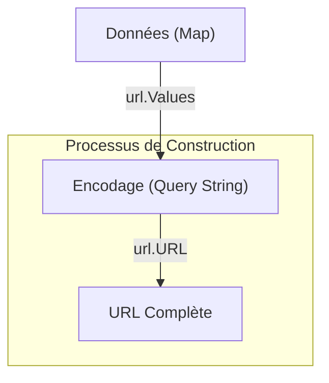

# Chapitre 26 : Manipulation d'URLs {#chapitre-26-manipulation-d-urls}

net/url, Parse, URL, Query Parameters, Escaping

## Le package net/url {#le-package-net-url}

### 1. Quoi {#quoi}
Le package **net/url** fournit des outils pour analyser, construire et manipuler des **URLs** (Uniform Resource Locators) selon la norme RFC 3986. Il permet de décomposer une chaîne de caractères en ses composants (schéma, hôte, chemin, paramètres de requête) et de les modifier en toute sécurité.

### 2. Pourquoi {#pourquoi}
Dans une application Go, vous devrez souvent construire des URLs dynamiquement (ex: ajouter des filtres de recherche à une API) ou extraire des informations d'une URL reçue. Manipuler ces chaînes manuellement avec de la concaténation est dangereux (risques d'injections, caractères spéciaux mal encodés). `net/url` garantit que vos URLs sont toujours valides et correctement encodées.

### 3. Comment {#comment}

#### A. Syntaxe de base
Pour analyser une URL, on utilise `url.Parse`.

```go
package main

import (
	"fmt"
	"net/url"
)

func main() {
	rawURL := "https://api.service.com/v1/users?id=123&active=true"
	u, err := url.Parse(rawURL)
	if err != nil {
		panic(err)
	}

	fmt.Println("Hôte :", u.Host)
	fmt.Println("Chemin :", u.Path)
	fmt.Println("Query :", u.RawQuery)
}
```

#### B. Cas concret : Construction dynamique
Pour construire une URL proprement, on utilise `url.Values` pour gérer les paramètres de requête.



```go
package main

import (
	"fmt"
	"net/url"
)

func main() {
	// Base de l'URL
	u, _ := url.Parse("https://api.service.com/search")

	// Gestion des paramètres de requête
	params := url.Values{}
	params.Add("q", "golang tutoriel")
	params.Add("lang", "fr")

	// Attachement des paramètres à l'URL
	u.RawQuery = params.Encode()

	fmt.Println("URL finale :", u.String())
}
```

#### C. Exemples pratiques
1. **Extraction de paramètres** : Récupérer une valeur spécifique d'une query string.
2. **Encodage sécurisé** : Transformer des espaces ou caractères spéciaux en format URL (`%20`, `%2B`).
3. **Modification de chemin** : Utiliser `url.JoinPath` pour construire des chemins de manière robuste.

### 4. Zone de Danger {#zone-de-danger}

- ❌ **Concaténation manuelle** : `url + "?id=" + id`. Cela casse si `id` contient des caractères spéciaux comme `&` ou `?`.
- ✅ **Bonne pratique** : Utilisez toujours `url.Values` pour construire les query strings.
- ❌ **Ignorer les erreurs de parsing** : `url.Parse` peut échouer si l'URL est mal formée. Toujours vérifier l'erreur.

### 🚨 Limitations de l'approche standard {#limitations-de-l-approche-standard}

Bien que `net/url` soit parfait pour la manipulation standard, il ne valide pas la sémantique de l'URL (ex: vérifier si le domaine existe réellement). Pour des besoins de validation complexes, des bibliothèques tierces de validation de schéma peuvent être nécessaires. Cependant, pour la construction et le parsing, `net/url` reste la référence absolue en Go.

## Questions clés (validation des acquis du chapitre) {#questions-clés-(validation-des-acquis-du-chapitre)-26}

- **Pourquoi ne faut-il pas construire une URL avec `+` ?** (Réponse : Risque d'erreurs d'encodage et vulnérabilités aux injections).
- **Quelle méthode permet de transformer `url.Values` en chaîne de requête ?** (Réponse : `Encode()`).
- **Que retourne `url.Parse` en cas d'URL invalide ?** (Réponse : Une erreur non nulle).

## Exercices : {#exercices-:-26}

### Exercice 1 - Le constructeur de filtres {#exercice-1---le-constructeur-de-filtres}
🎯 **Objectif** : Construire une URL de recherche avec des filtres.
💼 **Mise en situation** : Vous développez un moteur de recherche et devez ajouter des filtres "catégorie" et "page" à l'URL.
📝 **Énoncé** : Partez de `https://mon-site.com/api/items` et ajoutez les paramètres `cat=livres` et `page=2` en utilisant `url.Values`.
📺 **Résultat attendu** : `https://mon-site.com/api/items?cat=livres&page=2`

<details><summary>Voir le code complet commenté</summary>

```go
package main

import (
	"fmt"
	"net/url"
)

func main() {
	u, _ := url.Parse("https://mon-site.com/api/items")
	
	// Préparation des filtres
	params := url.Values{}
	params.Add("cat", "livres")
	params.Add("page", "2")
	
	// Application des paramètres
	u.RawQuery = params.Encode()
	
	fmt.Println(u.String())
}
```
</details>

### Exercice 2 - L'extracteur de données {#exercice-2---l-extracteur-de-données}
🎯 **Objectif** : Extraire un paramètre spécifique d'une URL.
💼 **Mise en situation** : Vous recevez une URL de tracking et devez extraire l'ID de campagne.
📝 **Énoncé** : Analysez l'URL `https://promo.com/click?campaign_id=abc-123&source=email` et affichez uniquement la valeur de `campaign_id`.
📺 **Résultat attendu** : `abc-123`

<details><summary>Voir le code complet commenté</summary>

```go
package main

import (
	"fmt"
	"net/url"
)

func main() {
	raw := "https://promo.com/click?campaign_id=abc-123&source=email"
	u, _ := url.Parse(raw)
	
	// ParseQuery retourne une map des paramètres
	query, _ := url.ParseQuery(u.RawQuery)
	
	// Récupération de la valeur
	fmt.Println(query.Get("campaign_id"))
}
```
</details>

### Exercice 3 - Le nettoyeur d'URL {#exercice-3---le-nettoyeur-d-url}
🎯 **Objectif** : Gérer les caractères spéciaux.
💼 **Mise en situation** : Un utilisateur entre une recherche contenant des espaces et des caractères spéciaux.
📝 **Énoncé** : Construisez une URL avec le paramètre `q` ayant pour valeur `Go & Golang`. Vérifiez que l'espace et le `&` sont correctement encodés.
📺 **Résultat attendu** : `https://search.com?q=Go+%26+Golang`

<details><summary>Voir le code complet commenté</summary>

```go
package main

import (
	"fmt"
	"net/url"
)

func main() {
	u, _ := url.Parse("https://search.com")
	
	params := url.Values{}
	// L'encodage automatique gère les caractères spéciaux
	params.Add("q", "Go & Golang")
	
	u.RawQuery = params.Encode()
	
	fmt.Println(u.String())
}
```
</details>