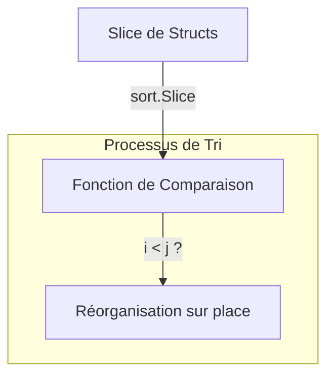

# Chapitre 27 : Tri de collections {#chapitre-27-tri-de-collections}

sort, slices, sort.Slice, sort.Strings, sort.Ints

## Le package sort {#le-package-sort}

### 1. Quoi {#quoi}
Le package **sort** de la bibliothèque standard de Go fournit des primitives pour trier des tranches (**slices**) et des collections définies par l'utilisateur. Depuis Go 1.21, le package **slices** est devenu la méthode recommandée pour trier des types génériques, mais comprendre `sort` reste essentiel pour maintenir des bases de code existantes.

### 2. Pourquoi {#pourquoi}
Le tri est une opération fondamentale en informatique : afficher des listes de produits par prix, organiser des logs par date, ou préparer des données pour une recherche binaire. Go offre des outils performants pour effectuer ces opérations de manière stable et efficace.

### 3. Comment {#comment}

#### A. Syntaxe de base
Pour des types simples (int, string), Go propose des fonctions utilitaires directes.

```go
package main

import (
	"fmt"
	"sort"
)

func main() {
	nombres := []int{5, 2, 9, 1}
	sort.Ints(nombres) // Trie la tranche sur place
	fmt.Println(nombres) // [1 2 5 9]
}
```

#### B. Cas concret : Tri de structures complexes
Pour trier des objets (ex: une liste d'utilisateurs par âge), on utilise `sort.Slice`.



```go
package main

import (
	"fmt"
	"sort"
)

type User struct {
	Name string
	Age  int
}

func main() {
	users := []User{
		{"Alice", 30},
		{"Bob", 25},
		{"Charlie", 35},
	}

	// Tri par âge croissant
	sort.Slice(users, func(i, j int) bool {
		return users[i].Age < users[j].Age
	})

	fmt.Println(users)
}
```

#### C. Exemples pratiques
1. **Tri alphabétique** : Utiliser `sort.Strings` pour une liste de noms.
2. **Tri inverse** : Inverser la logique dans `sort.Slice` (`>` au lieu de `<`).
3. **Tri stable** : Utiliser `sort.SliceStable` si l'ordre des éléments égaux doit être préservé.

### 4. Zone de Danger {#zone-de-danger}

- ❌ **Tri sur une copie** : `sort` modifie la tranche originale. Si vous avez besoin de conserver l'ordre initial, copiez la tranche avant.
- ❌ **Accès hors limites** : Dans `sort.Slice`, assurez-vous que votre fonction de comparaison ne dépasse pas les index de la tranche.
- ✅ **Bonne pratique** : Utilisez `sort.Slice` pour les structures complexes et les fonctions utilitaires (`sort.Ints`, `sort.Strings`) pour les types primitifs.

### 🚨 Limitations de l'approche standard {#limitations-de-l-approche-standard}

`sort.Slice` utilise la réflexion (interface{}), ce qui est légèrement moins performant et moins typé que les nouvelles fonctions génériques introduites dans le package `slices` (Go 1.21+).
*   **Solution moderne** : Utilisez `slices.SortFunc(slice, func(a, b T) int { ... })`.
*   **Pourquoi l'enseigner** : Beaucoup de projets Go existants utilisent encore `sort.Slice`. Il est crucial de savoir le lire et le maintenir.

## Questions clés (validation des acquis du chapitre) {#questions-clés-(validation-des-acquis-du-chapitre)-27}

- **Quelle est la différence entre `sort.Slice` et `sort.SliceStable` ?** (Réponse : `SliceStable` préserve l'ordre relatif des éléments qui sont considérés comme égaux par la fonction de comparaison).
- **Le tri se fait-il sur une copie ou sur la tranche originale ?** (Réponse : Sur la tranche originale, il modifie la donnée sur place).
- **Quelle fonction utiliser pour trier une liste d'entiers ?** (Réponse : `sort.Ints`).

## Exercices : {#exercices-:-27}

### Exercice 1 - Le classement des scores {#exercice-1---le-classement-des-scores}
🎯 **Objectif** : Trier une liste d'entiers par ordre décroissant.
💼 **Mise en situation** : Vous gérez les scores d'un jeu vidéo et voulez afficher le podium.
📝 **Énoncé** : Triez la tranche `[]int{10, 50, 20, 5}` du plus grand au plus petit.
📺 **Résultat attendu** : `[50 20 10 5]`

<details><summary>Voir le code complet commenté</summary>

```go
package main

import (
	"fmt"
	"sort"
)

func main() {
	scores := []int{10, 50, 20, 5}
	// On utilise sort.Slice pour définir une logique personnalisée (décroissant)
	sort.Slice(scores, func(i, j int) bool {
		return scores[i] > scores[j]
	})
	fmt.Println(scores)
}
```
</details>

### Exercice 2 - Annuaire alphabétique {#exercice-2---annuaire-alphabétique}
🎯 **Objectif** : Trier une liste de chaînes.
💼 **Mise en situation** : Vous devez afficher une liste de contacts par ordre alphabétique.
📝 **Énoncé** : Triez la tranche `[]string{"Zoe", "Alice", "Marc"}`.
📺 **Résultat attendu** : `[Alice Marc Zoe]`

<details><summary>Voir le code complet commenté</summary>

```go
package main

import (
	"fmt"
	"sort"
)

func main() {
	noms := []string{"Zoe", "Alice", "Marc"}
	// sort.Strings est optimisé pour les chaînes de caractères
	sort.Strings(noms)
	fmt.Println(noms)
}
```
</details>

### Exercice 3 - Organisation de bibliothèque {#exercice-3---organisation-de-bibliothèque}
🎯 **Objectif** : Trier des structs par champ.
💼 **Mise en situation** : Vous avez une liste de livres et voulez les trier par année de publication.
📝 **Énoncé** : Triez la liste de livres `[{Title: "Go", Year: 2009}, {Title: "C", Year: 1972}]` par année croissante.
📺 **Résultat attendu** : `[{C 1972} {Go 2009}]`

<details><summary>Voir le code complet commenté</summary>

```go
package main

import (
	"fmt"
	"sort"
)

type Book struct {
	Title string
	Year  int
}

func main() {
	library := []Book{
		{"Go", 2009},
		{"C", 1972},
	}
	
	// Tri par champ Year
	sort.Slice(library, func(i, j int) bool {
		return library[i].Year < library[j].Year
	})
	
	fmt.Println(library)
}
```
</details>