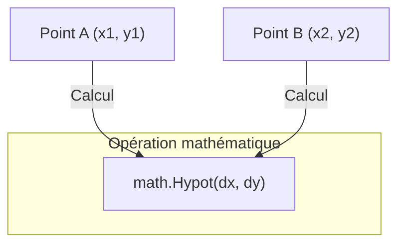

# Chapitre 28 : Opérations mathématiques {#chapitre-28-opérations-mathématiques}

math, float64, arrondi, puissance, trigonométrie

## Le package math {#le-package-math}

### 1. Quoi {#quoi}
Le package **math** de la bibliothèque standard de Go fournit des fonctions mathématiques de base, telles que les fonctions trigonométriques, logarithmiques, exponentielles, ainsi que des constantes comme **Pi** et **E**. Il travaille principalement avec des nombres à virgule flottante de type **float64**.

### 2. Pourquoi {#pourquoi}
Bien que les opérateurs arithmétiques de base (`+`, `-`, `*`, `/`) soient intégrés au langage, les calculs complexes (racine carrée, puissance, arrondi, trigonométrie) nécessitent des fonctions spécialisées. Le package `math` est indispensable pour les applications scientifiques, financières ou graphiques.

### 3. Comment {#comment}

#### A. Syntaxe de base
La plupart des fonctions prennent et retournent des `float64`.

```go
package main

import (
	"fmt"
	"math"
)

func main() {
	// Racine carrée
	fmt.Println(math.Sqrt(16)) // 4

	// Puissance (x^y)
	fmt.Println(math.Pow(2, 3)) // 8

	// Arrondi
	fmt.Println(math.Round(3.5)) // 4
}
```

#### B. Cas concret : Calcul de distance
Utilisation de `math.Hypot` pour calculer l'hypoténuse d'un triangle rectangle (distance euclidienne).



```go
package main

import (
	"fmt"
	"math"
)

func main() {
	x1, y1 := 0.0, 0.0
	x2, y2 := 3.0, 4.0

	// Calcul de la distance entre deux points
	dx := x2 - x1
	dy := y2 - y1
	distance := math.Hypot(dx, dy)

	fmt.Printf("La distance est : %.2f\n", distance)
}
```

#### C. Exemples pratiques
1. **Arrondis** : `math.Ceil` (arrondi supérieur), `math.Floor` (arrondi inférieur).
2. **Min/Max** : `math.Max(a, b)` et `math.Min(a, b)` pour comparer deux nombres.
3. **Trigonométrie** : `math.Sin`, `math.Cos` pour des calculs géométriques.

### 4. Zone de Danger {#zone-de-danger}

- ❌ **Confusion de types** : Oublier de convertir des entiers en `float64` avant d'appeler une fonction `math`.
- ❌ **Division par zéro** : `math` gère les divisions par zéro en retournant `+Inf` ou `-Inf` (infini), ce qui peut causer des comportements inattendus si non vérifié.
- ✅ **Bonne pratique** : Utilisez `math.IsNaN(x)` ou `math.IsInf(x, 0)` pour vérifier la validité d'un résultat après des calculs complexes.

### 🚨 Limitations de l'approche standard {#limitations-de-l-approche-standard}

Le package `math` est conçu pour la précision standard `float64`. Pour des calculs financiers nécessitant une précision décimale absolue (où les erreurs d'arrondi flottant sont inacceptables), il est fortement recommandé d'utiliser des bibliothèques de type `decimal` (comme `shopspring/decimal`) ou de travailler avec des entiers (représentant des centimes).

## Questions clés (validation des acquis du chapitre) {#questions-clés-(validation-des-acquis-du-chapitre)-28}

- **Pourquoi les fonctions `math` utilisent-elles `float64` ?** (Réponse : Pour offrir une précision standard élevée et gérer des nombres très grands ou très petits).
- **Quelle fonction utiliser pour obtenir la valeur absolue d'un nombre ?** (Réponse : `math.Abs`).
- **Que retourne `math.Sqrt(-1)` ?** (Réponse : `NaN` - Not a Number).

## Exercices : {#exercices-:-28}

### Exercice 1 - Le calculateur de cercle {#exercice-1---le-calculateur-de-cercle}
🎯 **Objectif** : Utiliser la constante Pi.
💼 **Mise en situation** : Vous devez calculer l'aire d'un cercle à partir de son rayon.
📝 **Énoncé** : Calculez l'aire d'un cercle de rayon 5.0 (Formule : Pi * r^2).
📺 **Résultat attendu** : `78.54` (environ)

<details><summary>Voir le code complet commenté</summary>

```go
package main

import (
	"fmt"
	"math"
)

func main() {
	r := 5.0
	// Utilisation de math.Pi et math.Pow pour le carré
	aire := math.Pi * math.Pow(r, 2)
	fmt.Printf("%.2f\n", aire)
}
```
</details>

### Exercice 2 - Le comparateur de prix {#exercice-2---le-comparateur-de-prix}
🎯 **Objectif** : Utiliser `math.Max` et `math.Min`.
💼 **Mise en situation** : Vous comparez deux offres de prix.
📝 **Énoncé** : Trouvez le prix le plus bas entre 19.99 et 25.50.
📺 **Résultat attendu** : `19.99`

<details><summary>Voir le code complet commenté</summary>

```go
package main

import (
	"fmt"
	"math"
)

func main() {
	prix1 := 19.99
	prix2 := 25.50
	
	// math.Min retourne le plus petit des deux float64
	min := math.Min(prix1, prix2)
	fmt.Println(min)
}
```
</details>

### Exercice 3 - L'arrondisseur de notes {#exercice-3---le-arrondisseur-de-notes}
🎯 **Objectif** : Utiliser `math.Round`.
💼 **Mise en situation** : Vous devez arrondir des notes d'étudiants à l'entier le plus proche.
📝 **Énoncé** : Arrondissez la note 14.7.
📺 **Résultat attendu** : `15`

<details><summary>Voir le code complet commenté</summary>

```go
package main

import (
	"fmt"
	"math"
)

func main() {
	note := 14.7
	// math.Round arrondit au plus proche
	arrondi := math.Round(note)
	fmt.Println(arrondi)
}
```
</details>