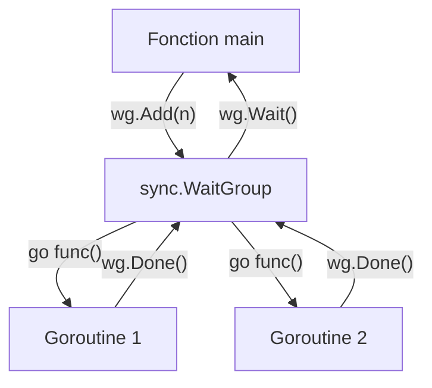

# Chapitre 29 : Synchronisation de base {#chapitre-29-synchronisation-de-base}

sync, Mutex, WaitGroup, Goroutines, Race Conditions

## Le package sync {#le-package-sync}

### 1. Quoi {#quoi}
Le package **sync** fournit des primitives de synchronisation de bas niveau pour gérer l'accès concurrent aux données dans les programmes Go. Les outils principaux sont le **Mutex** (Mutual Exclusion) pour protéger les sections critiques et le **WaitGroup** pour attendre la fin de l'exécution de plusieurs goroutines.

### 2. Pourquoi {#pourquoi}
En Go, les goroutines s'exécutent en parallèle. Si plusieurs goroutines tentent de modifier la même variable simultanément, cela provoque une **race condition** (condition de concurrence), rendant le programme instable. Le package `sync` permet de coordonner ces accès pour garantir l'intégrité des données.

### 3. Comment {#comment}

#### A. Syntaxe de base
Utilisation d'un `sync.Mutex` pour protéger une variable partagée.

```go
package main

import (
	"fmt"
	"sync"
)

var (
	compteur int
	mu       sync.Mutex // Protège l'accès à 'compteur'
)

func incrementer() {
	mu.Lock()         // Verrouille l'accès
	defer mu.Unlock() // Garantit le déverrouillage même en cas de panique
	compteur++
}

func main() {
	var wg sync.WaitGroup
	for i := 0; i < 10; i++ {
		wg.Add(1) // Signale qu'une goroutine démarre
		go func() {
			defer wg.Done() // Signale la fin de la goroutine
			incrementer()
		}()
	}
	wg.Wait() // Attend que toutes les goroutines finissent
	fmt.Println("Valeur finale :", compteur)
}
```

#### B. Cas concret : Coordination de tâches
Le `sync.WaitGroup` est idéal pour attendre la fin d'un groupe de tâches asynchrones.



#### C. Exemples pratiques
1. **Protection de cache** : Utiliser un Mutex pour protéger une map partagée.
2. **Attente de services** : Utiliser un WaitGroup pour attendre que plusieurs appels API se terminent.
3. **Initialisation unique** : Utiliser `sync.Once` pour garantir qu'une configuration ne soit chargée qu'une seule fois.

### 4. Zone de Danger {#zone-de-danger}

- ❌ **Oublier le Unlock** : Si vous oubliez de déverrouiller un Mutex, votre programme restera bloqué indéfiniment (**deadlock**).
- ❌ **Copier un Mutex** : Un Mutex ne doit jamais être copié. Passez-le toujours par pointeur ou déclarez-le au niveau du package/struct.
- ✅ **Bonne pratique** : Utilisez toujours `defer mu.Unlock()` immédiatement après `mu.Lock()` pour éviter les oublis.

### 🚨 Limitations de l'approche standard {#limitations-de-l-approche-standard}

Les Mutex sont puissants mais peuvent devenir un goulot d'étranglement si la section critique est trop longue.
*   **Solution moderne** : Préférez le passage de messages via les **Channels** (`chan`) pour partager des données entre goroutines ("Ne communiquez pas en partageant la mémoire, partagez la mémoire en communiquant").
*   **Pourquoi l'enseigner** : Le Mutex est parfois plus performant ou plus simple pour des structures de données complexes où les channels seraient trop verbeux.

## Questions clés (validation des acquis du chapitre) {#questions-clés-(validation-des-acquis-du-chapitre)-29}

- **Qu'est-ce qu'une race condition ?** (Réponse : Un bug où plusieurs goroutines accèdent à une donnée partagée simultanément, dont au moins une en écriture).
- **À quoi sert `wg.Add(1)` ?** (Réponse : À incrémenter le compteur du WaitGroup pour indiquer qu'une nouvelle tâche est en cours).
- **Pourquoi utiliser `defer` avec `mu.Unlock()` ?** (Réponse : Pour garantir que le verrou est libéré même si la fonction s'arrête prématurément ou panique).

## Exercices : {#exercices-:-29}

### Exercice 1 - Le compteur sécurisé {#exercice-1---le-compteur-sécurisé}
🎯 **Objectif** : Utiliser un Mutex pour éviter une race condition.
💼 **Mise en situation** : Vous avez un compteur de visites sur votre site web.
📝 **Énoncé** : Créez une variable `visites` et lancez 100 goroutines qui l'incrémentent. Utilisez un `sync.Mutex` pour éviter les erreurs.
📺 **Résultat attendu** : `100`

<details><summary>Voir le code complet commenté</summary>

```go
package main

import (
	"fmt"
	"sync"
)

func main() {
	var visites int
	var mu sync.Mutex
	var wg sync.WaitGroup

	for i := 0; i < 100; i++ {
		wg.Add(1)
		go func() {
			defer wg.Done()
			mu.Lock()
			visites++
			mu.Unlock()
		}()
	}
	wg.Wait()
	fmt.Println(visites)
}
```
</details>

### Exercice 2 - L'attente de services {#exercice-2---l-attente-de-services}
🎯 **Objectif** : Utiliser `sync.WaitGroup`.
💼 **Mise en situation** : Votre application doit initialiser 3 services avant de démarrer.
📝 **Énoncé** : Simulez 3 services avec `time.Sleep` et attendez leur fin avec un `WaitGroup`.
📺 **Résultat attendu** : `Tous les services sont prêts`

<details><summary>Voir le code complet commenté</summary>

```go
package main

import (
	"fmt"
	"sync"
	"time"
)

func main() {
	var wg sync.WaitGroup
	for i := 1; i <= 3; i++ {
		wg.Add(1)
		go func(id int) {
			defer wg.Done()
			time.Sleep(time.Millisecond * 100) // Simulation de travail
			fmt.Printf("Service %d prêt\n", id)
		}(i)
	}
	wg.Wait()
	fmt.Println("Tous les services sont prêts")
}
```
</details>

### Exercice 3 - Le cache protégé {#exercice-3---le-cache-protégé}
🎯 **Objectif** : Protéger une map.
💼 **Mise en situation** : Vous stockez des sessions utilisateurs dans une map partagée.
📝 **Énoncé** : Créez une map et une fonction qui ajoute une clé. Utilisez un Mutex pour protéger la map pendant l'écriture.
📺 **Résultat attendu** : `Map mise à jour avec succès`

<details><summary>Voir le code complet commenté</summary>

```go
package main

import (
	"fmt"
	"sync"
)

type Cache struct {
	mu   sync.Mutex
	data map[string]string
}

func (c *Cache) Set(key, value string) {
	c.mu.Lock()
	defer c.mu.Unlock()
	c.data[key] = value
}

func main() {
	c := &Cache{data: make(map[string]string)}
	c.Set("user1", "Alice")
	fmt.Println("Map mise à jour avec succès")
}
```
</details>