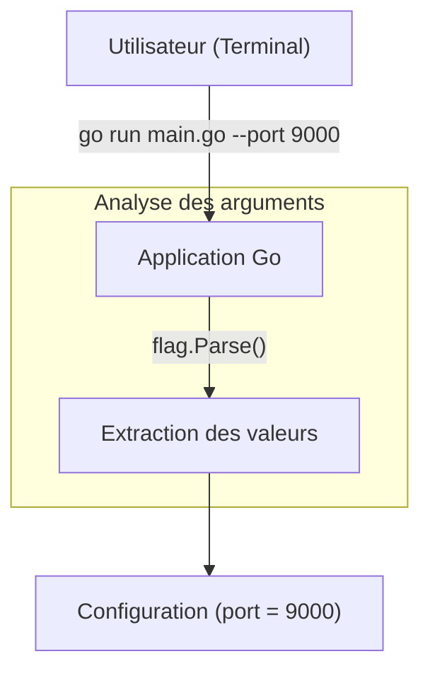

# Chapitre 30 : Arguments en ligne de commande {#chapitre-30-arguments-en-ligne-de-commande}

flag, CLI, arguments, parsing, flags

## Le package flag {#le-package-flag}

### 1. Quoi {#quoi}
Le package **flag** est la bibliothèque standard de Go dédiée à l'analyse des arguments passés en ligne de commande. Il permet de définir des options (flags) avec leurs types, leurs valeurs par défaut et leurs descriptions, facilitant ainsi la création d'outils CLI (Command Line Interface) robustes.

### 2. Pourquoi {#pourquoi}
Les outils en ligne de commande sont le cœur de l'écosystème Go (ex: `go build`, `go test`). Pour rendre vos propres outils configurables sans modifier le code source à chaque exécution, vous devez pouvoir accepter des paramètres dynamiques (ex: `--port 8080`, `--verbose`).

### 3. Comment {#comment}

#### A. Syntaxe de base
On définit les flags avant d'appeler `flag.Parse()`.

```go
package main

import (
	"flag"
	"fmt"
)

func main() {
	// Définition d'un flag de type chaîne
	nom := flag.String("nom", "Inconnu", "Nom de l'utilisateur")
	// Définition d'un flag de type entier
	age := flag.Int("age", 0, "Âge de l'utilisateur")

	// Analyse des arguments (obligatoire)
	flag.Parse()

	fmt.Printf("Bonjour %s, vous avez %d ans.\n", *nom, *age)
}
```

#### B. Cas concret : Outil de configuration
Utilisation de flags pour configurer un serveur.



```go
package main

import (
	"flag"
	"fmt"
)

func main() {
	// Configuration avec valeur par défaut
	port := flag.Int("port", 8080, "Port du serveur")
	debug := flag.Bool("debug", false, "Activer le mode debug")

	flag.Parse()

	if *debug {
		fmt.Println("Mode debug activé")
	}
	fmt.Printf("Serveur démarré sur le port %d\n", *port)
}
```

#### C. Exemples pratiques
1. **Flags booléens** : Utiliser `--verbose` pour activer des logs détaillés.
2. **Flags requis** : Bien que `flag` ne gère pas nativement les flags "obligatoires", on vérifie après `Parse()` si la valeur est restée par défaut.
3. **Aide automatique** : Lancer le programme avec `--help` affiche automatiquement la documentation définie dans le code.

### 4. Zone de Danger {#zone-de-danger}

- ❌ **Oublier `flag.Parse()`** : Si vous oubliez cette ligne, les variables contiendront toujours leurs valeurs par défaut.
- ❌ **Utiliser des pointeurs sans déréférencement** : `flag` retourne des pointeurs (`*int`, `*string`). Oublier l'étoile `*` provoquera une erreur de compilation.
- ✅ **Bonne pratique** : Utilisez des noms de flags explicites et fournissez toujours une description utile pour l'aide automatique.

### 🚨 Limitations de l'approche standard {#limitations-de-l-approche-standard}

Le package `flag` est limité aux interfaces CLI simples. Il ne supporte pas nativement les commandes imbriquées (ex: `git remote add`) ou les interfaces complexes avec des raccourcis (ex: `-v` vs `--verbose`).
*   **Solution moderne** : Pour des outils CLI complexes, utilisez des bibliothèques comme **Cobra** ou **urfave/cli**.
*   **Pourquoi l'enseigner** : `flag` est intégré à la bibliothèque standard, ne nécessite aucune dépendance externe et suffit pour 90% des besoins de scripts utilitaires.

## Questions clés (validation des acquis du chapitre) {#questions-clés-(validation-des-acquis-du-chapitre)-30}

- **Pourquoi `flag.Parse()` est-il obligatoire ?** (Réponse : Parce qu'il déclenche l'analyse réelle des arguments passés dans `os.Args`).
- **Que retourne `flag.String(...)` ?** (Réponse : Un pointeur vers une chaîne de caractères `*string`).
- **Comment afficher l'aide générée automatiquement ?** (Réponse : En passant l'argument `--help` au programme).

## Exercices : {#exercices-:-30}

### Exercice 1 - Le salueur personnalisé {#exercice-1---le-salueur-personnalisé}
🎯 **Objectif** : Utiliser un flag de type chaîne.
💼 **Mise en situation** : Vous créez un script de bienvenue.
📝 **Énoncé** : Créez un programme qui accepte un flag `--nom` et affiche "Bonjour [nom]".
📺 **Résultat attendu** : `go run main.go --nom=Alice` -> `Bonjour Alice`

<details><summary>Voir le code complet commenté</summary>

```go
package main

import (
	"flag"
	"fmt"
)

func main() {
	// Définition du flag
	nom := flag.String("nom", "Inconnu", "Nom à saluer")
	flag.Parse()
	
	// Déréférencement du pointeur pour obtenir la valeur
	fmt.Printf("Bonjour %s\n", *nom)
}
```
</details>

### Exercice 2 - Le mode silencieux {#exercice-2---le-mode-silencieux}
🎯 **Objectif** : Utiliser un flag booléen.
💼 **Mise en situation** : Vous voulez pouvoir désactiver les logs de votre script.
📝 **Énoncé** : Ajoutez un flag `--silencieux` (bool). Si vrai, n'affichez rien. Sinon, affichez "Traitement en cours...".
📺 **Résultat attendu** : `go run main.go --silencieux=false` -> `Traitement en cours...`

<details><summary>Voir le code complet commenté</summary>

```go
package main

import (
	"flag"
	"fmt"
)

func main() {
	silencieux := flag.Bool("silencieux", false, "Désactiver les logs")
	flag.Parse()
	
	if !*silencieux {
		fmt.Println("Traitement en cours...")
	}
}
```
</details>

### Exercice 3 - Le configurateur de port {#exercice-3---le-configurateur-de-port}
🎯 **Objectif** : Utiliser un flag entier avec valeur par défaut.
💼 **Mise en situation** : Vous configurez un service web.
📝 **Énoncé** : Créez un flag `--port` par défaut à 8080. Affichez "Serveur sur [port]".
📺 **Résultat attendu** : `go run main.go --port=3000` -> `Serveur sur 3000`

<details><summary>Voir le code complet commenté</summary>

```go
package main

import (
	"flag"
	"fmt"
)

func main() {
	port := flag.Int("port", 8080, "Port du serveur")
	flag.Parse()
	
	fmt.Printf("Serveur sur %d\n", *port)
}
```
</details>