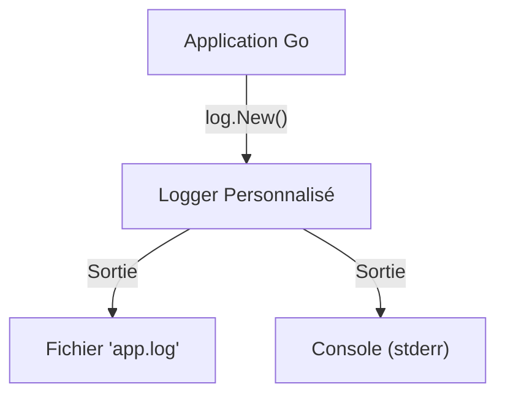

# Chapitre 31 : Journalisation (Logging) {#chapitre-31-journalisation-logging}

log, Logger, Println, Fatal, Panic, Output

## Le package log {#le-package-log}

### 1. Quoi {#quoi}
Le package **log** de la bibliothèque standard de Go permet d'écrire des messages de journalisation (logs) vers une sortie standard (généralement `stderr`). Il ajoute automatiquement des informations de contexte comme la date et l'heure à chaque message.

### 2. Pourquoi {#pourquoi}
La journalisation est essentielle pour le débogage et le suivi en production. Elle permet de savoir ce que fait votre application, d'identifier les erreurs et de comprendre l'état du système au moment d'un incident.

### 3. Comment {#comment}

#### A. Syntaxe de base
Les fonctions de base écrivent dans `stderr` et ajoutent un saut de ligne.

```go
package main

import (
	"log"
)

func main() {
	log.Println("Message d'information standard")
	// log.Fatal arrête le programme après le log
	// log.Panic arrête le programme et provoque une panique
}
```

#### B. Cas concret : Configuration d'un logger personnalisé
On peut créer un logger dédié pour diriger les logs vers un fichier ou un format spécifique.



```go
package main

import (
	"log"
	"os"
)

func main() {
	// Création d'un logger vers un fichier
	file, _ := os.OpenFile("app.log", os.O_CREATE|os.O_WRONLY|os.O_APPEND, 0666)
	defer file.Close()

	// Création d'un logger avec préfixe et flags (date/heure)
	logger := log.New(file, "INFO: ", log.Ldate|log.Ltime|log.Lshortfile)

	logger.Println("Ceci est un log dans le fichier")
}
```

#### C. Exemples pratiques
1. **Logs d'erreurs** : Utiliser `log.Printf` pour formater des messages d'erreur dynamiques.
2. **Arrêt critique** : Utiliser `log.Fatal` lors de l'échec de connexion à une base de données au démarrage.
3. **Logs de développement** : Utiliser `log.Lshortfile` pour afficher le nom du fichier et la ligne dans le log.

### 4. Zone de Danger {#zone-de-danger}

- ❌ **Utiliser `log.Fatal` partout** : `log.Fatal` appelle `os.Exit(1)`, ce qui empêche l'exécution des `defer`. Ne l'utilisez que dans `main()` ou lors de l'initialisation critique.
- ❌ **Logs trop verbeux en production** : Trop de logs peuvent saturer le disque et ralentir l'application.
- ✅ **Bonne pratique** : Utilisez des niveaux de logs (si vous utilisez une bibliothèque tierce) ou des préfixes clairs pour distinguer les logs d'information des erreurs.

### 🚨 Limitations de l'approche standard {#limitations-de-l-approche-standard}

Le package `log` est très basique : il ne gère pas nativement les niveaux de logs (DEBUG, INFO, WARN, ERROR) ni le format JSON, très utilisé pour les outils de monitoring modernes (ex: ELK, Datadog).
*   **Solution moderne** : Utilisez `slog` (introduit en Go 1.21) pour des logs structurés, ou des bibliothèques comme `zap` ou `zerolog` pour des performances extrêmes.
*   **Pourquoi l'enseigner** : `log` est toujours présent, simple à utiliser pour des petits scripts et ne nécessite aucune configuration.

## Questions clés (validation des acquis du chapitre) {#questions-clés-(validation-des-acquis-du-chapitre)-31}

- **Quelle est la différence entre `log.Println` et `log.Fatal` ?** (Réponse : `Fatal` arrête le programme après avoir écrit le message).
- **Où sont écrits les logs par défaut ?** (Réponse : Vers `stderr`).
- **Comment ajouter le nom du fichier et la ligne au log ?** (Réponse : En utilisant le flag `log.Lshortfile`).

## Exercices : {#exercices-:-31}

### Exercice 1 - Le journal de bord {#exercice-1---le-journal-de-bord}
🎯 **Objectif** : Utiliser le logger standard.
💼 **Mise en situation** : Vous voulez tracer le démarrage de votre application.
📝 **Énoncé** : Affichez "Démarrage du service..." avec le logger standard.
📺 **Résultat attendu** : `2023/10/27 10:00:00 Démarrage du service...`

<details><summary>Voir le code complet commenté</summary>

```go
package main

import "log"

func main() {
	// log.Println ajoute automatiquement la date et l'heure par défaut
	log.Println("Démarrage du service...")
}
```
</details>

### Exercice 2 - Le logger avec préfixe {#exercice-2---le-logger-avec-préfixe}
🎯 **Objectif** : Créer un logger personnalisé.
💼 **Mise en situation** : Vous voulez distinguer les logs de votre module "AUTH".
📝 **Énoncé** : Créez un logger avec le préfixe "AUTH: " qui écrit dans la console.
📺 **Résultat attendu** : `AUTH: Utilisateur connecté`

<details><summary>Voir le code complet commenté</summary>

```go
package main

import (
	"log"
	"os"
)

func main() {
	// log.New(sortie, préfixe, flags)
	authLogger := log.New(os.Stdout, "AUTH: ", log.LstdFlags)
	authLogger.Println("Utilisateur connecté")
}
```
</details>

### Exercice 3 - Gestion d'erreur critique {#exercice-3---le-gestion-d-erreur-critique}
🎯 **Objectif** : Utiliser `log.Fatal`.
💼 **Mise en situation** : Votre application ne peut pas fonctionner sans fichier de configuration.
📝 **Énoncé** : Simulez l'absence de fichier et utilisez `log.Fatal` pour arrêter le programme.
📺 **Résultat attendu** : `[Date/Heure] Fichier introuvable` suivi de l'arrêt du programme.

<details><summary>Voir le code complet commenté</summary>

```go
package main

import "log"

func main() {
	fichierExiste := false
	
	if !fichierExiste {
		// log.Fatal arrête le programme (code 1)
		log.Fatal("Fichier introuvable")
	}
	
	log.Println("Suite du programme") // Ne sera jamais exécuté
}
```
</details>