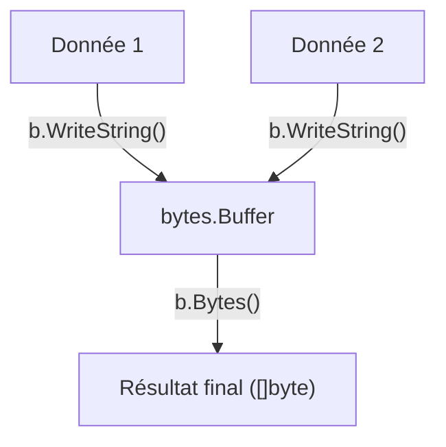

# Chapitre 32 : Manipulation de buffers d'octets {#chapitre-32-manipulation-de-buffers-d-octets}

bytes, Buffer, Reader, manipulation, performance

## Le package bytes {#le-package-bytes}

### 1. Quoi {#quoi}
Le package **bytes** fournit des fonctions pour manipuler des tranches d'octets (`[]byte`). Il propose également le type **bytes.Buffer**, un tampon de lecture/écriture de taille variable qui est extrêmement efficace pour construire des chaînes de caractères ou manipuler des données binaires.

### 2. Pourquoi {#pourquoi}
En Go, les chaînes de caractères (`string`) sont immuables. Concaténer des chaînes dans une boucle crée de nombreuses allocations mémoire inutiles. Le `bytes.Buffer` permet de construire des données de manière dynamique en minimisant les allocations, ce qui est crucial pour les performances.

### 3. Comment {#comment}

#### A. Syntaxe de base
Utilisation de `bytes.Buffer` pour construire une chaîne.

```go
package main

import (
	"bytes"
	"fmt"
)

func main() {
	var b bytes.Buffer
	b.WriteString("Hello")
	b.WriteString(" ")
	b.WriteString("World")
	
	fmt.Println(b.String()) // "Hello World"
}
```

#### B. Cas concret : Construction dynamique de données
Le `bytes.Buffer` agit comme un flux de données que vous pouvez remplir et lire.



```go
package main

import (
	"bytes"
	"fmt"
)

func main() {
	var b bytes.Buffer
	
	// Simulation de construction de message
	for i := 0; i < 3; i++ {
		b.WriteString(fmt.Sprintf("Ligne %d\n", i))
	}
	
	fmt.Print(b.String())
}
```

#### C. Exemples pratiques
1. **Concaténation efficace** : Utiliser `Buffer` au lieu de `+` pour construire des messages longs.
2. **Manipulation binaire** : Utiliser `bytes.Contains` ou `bytes.Split` pour analyser des flux de données brutes.
3. **Réinitialisation** : Utiliser `b.Reset()` pour vider le tampon et réutiliser la mémoire allouée.

### 4. Zone de Danger {#zone-de-danger}

- ❌ **Concaténation avec `+` dans une boucle** : C'est l'erreur classique qui dégrade les performances.
- ❌ **Oublier de vérifier les erreurs** : Bien que `WriteString` ne retourne pas d'erreur, d'autres méthodes de lecture/écriture le font.
- ✅ **Bonne pratique** : Utilisez `bytes.Buffer` pour toute construction de chaîne complexe ou répétitive.

### 🚨 Limitations de l'approche standard {#limitations-de-l-approche-standard}

Bien que `bytes.Buffer` soit très efficace, il peut parfois être surpassé par `strings.Builder` si vous ne manipulez que du texte (UTF-8).
*   **Solution moderne** : Utilisez `strings.Builder` pour construire des chaînes de caractères (plus rapide et plus idiomatique pour le texte). Utilisez `bytes.Buffer` lorsque vous manipulez des données binaires ou que vous avez besoin de lire/écrire des octets.
*   **Pourquoi l'enseigner** : `bytes.Buffer` est un outil polyvalent qui fait partie des fondamentaux de la manipulation de données en Go.

## Questions clés (validation des acquis du chapitre) {#questions-clés-(validation-des-acquis-du-chapitre)-32}

- **Pourquoi `bytes.Buffer` est-il plus performant qu'une concaténation `+` dans une boucle ?** (Réponse : Il évite de créer une nouvelle chaîne à chaque itération, réduisant ainsi les allocations mémoire).
- **Quelle méthode utiliser pour vider un `bytes.Buffer` ?** (Réponse : `b.Reset()`).
- **Quelle est la différence principale entre `bytes.Buffer` et `strings.Builder` ?** (Réponse : `strings.Builder` est optimisé pour les chaînes de caractères, tandis que `bytes.Buffer` est plus généraliste et gère mieux les données binaires).

## Exercices : {#exercices-:-32}

### Exercice 1 - Le constructeur de message {#exercice-1---le-constructeur-de-message}
🎯 **Objectif** : Utiliser `bytes.Buffer` pour concaténer.
💼 **Mise en situation** : Vous construisez un log complexe.
📝 **Énoncé** : Utilisez un `bytes.Buffer` pour assembler "Go", " est", " génial".
📺 **Résultat attendu** : `Go est génial`

<details><summary>Voir le code complet commenté</summary>

```go
package main

import (
	"bytes"
	"fmt"
)

func main() {
	var b bytes.Buffer
	b.WriteString("Go")
	b.WriteString(" est")
	b.WriteString(" génial")
	
	fmt.Println(b.String())
}
```
</details>

### Exercice 2 - Analyse de données binaires {#exercice-2---le-analyse-de-données-binaires}
🎯 **Objectif** : Utiliser `bytes.Contains`.
💼 **Mise en situation** : Vous vérifiez si un flux de données contient une signature spécifique.
📝 **Énoncé** : Vérifiez si la tranche d'octets `[]byte("Bonjour tout le monde")` contient "Bonjour".
📺 **Résultat attendu** : `Contient Bonjour : true`

<details><summary>Voir le code complet commenté</summary>

```go
package main

import (
	"bytes"
	"fmt"
)

func main() {
	data := []byte("Bonjour tout le monde")
	signature := []byte("Bonjour")
	
	// bytes.Contains vérifie la présence d'une sous-tranche
	found := bytes.Contains(data, signature)
	fmt.Printf("Contient Bonjour : %v\n", found)
}
```
</details>

### Exercice 3 - Réutilisation de mémoire {#exercice-3---le-réutilisation-de-mémoire}
🎯 **Objectif** : Utiliser `Reset`.
💼 **Mise en situation** : Vous traitez plusieurs messages en boucle.
📝 **Énoncé** : Créez un buffer, écrivez "Message 1", affichez-le, réinitialisez-le, puis écrivez "Message 2" et affichez-le.
📺 **Résultat attendu** : `Message 1` puis `Message 2`

<details><summary>Voir le code complet commenté</summary>

```go
package main

import (
	"bytes"
	"fmt"
)

func main() {
	var b bytes.Buffer
	
	b.WriteString("Message 1")
	fmt.Println(b.String())
	
	// Reset vide le buffer tout en gardant la mémoire allouée pour la réutilisation
	b.Reset()
	
	b.WriteString("Message 2")
	fmt.Println(b.String())
}
```
</details>