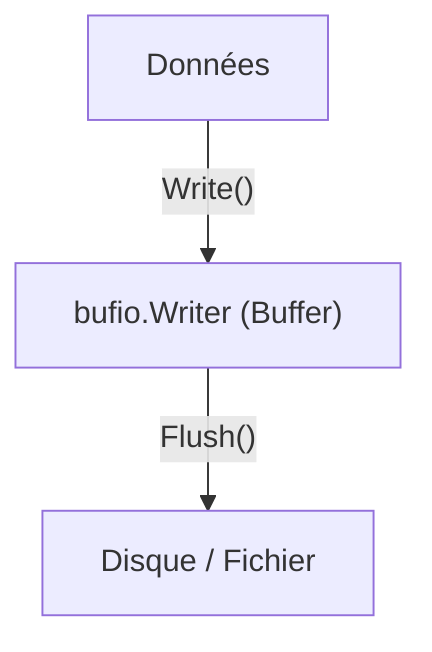

# Chapitre 33 : Lecture/Écriture bufferisée {#chapitre-33-lecture-écriture-bufferisée}

bufio, Scanner, Reader, Writer, I/O, performance

## Le package bufio {#le-package-bufio}

### 1. Quoi {#quoi}
Le package **bufio** implémente une entrée/sortie (I/O) bufferisée. Il enveloppe des objets `io.Reader` ou `io.Writer` pour ajouter une couche de tampon (buffer) en mémoire, réduisant ainsi le nombre d'appels système coûteux lors des opérations de lecture ou d'écriture.

### 2. Pourquoi {#pourquoi}
Les opérations I/O directes (comme lire un fichier octet par octet) sont extrêmement lentes car chaque appel nécessite une interaction avec le système d'exploitation. Le buffer permet de lire ou d'écrire des blocs de données en une seule fois, améliorant drastiquement les performances pour les fichiers volumineux ou les flux réseau.

### 3. Comment {#comment}

#### A. Syntaxe de base
Utilisation de `bufio.Scanner` pour lire un fichier ligne par ligne.

```go
package main

import (
	"bufio"
	"fmt"
	"os"
)

func main() {
	file, _ := os.Open("test.txt")
	defer file.Close()

	scanner := bufio.NewScanner(file)
	for scanner.Scan() {
		fmt.Println(scanner.Text()) // Lit ligne par ligne
	}
}
```

#### B. Cas concret : Écriture efficace
Utilisation de `bufio.Writer` pour accumuler des données avant de les écrire sur disque.



```go
package main

import (
	"bufio"
	"os"
)

func main() {
	file, _ := os.Create("output.txt")
	defer file.Close()

	writer := bufio.NewWriter(file)
	writer.WriteString("Ligne 1\n")
	writer.WriteString("Ligne 2\n")
	
	// Flush est CRUCIAL pour vider le buffer vers le fichier
	writer.Flush() 
}
```

#### C. Exemples pratiques
1. **Lecture de fichiers** : `bufio.Scanner` est l'outil standard pour lire des fichiers texte ligne par ligne.
2. **Traitement de flux** : `bufio.Reader` permet de lire des données avec des méthodes comme `ReadString('\n')`.
3. **Optimisation d'écriture** : `bufio.Writer` est indispensable pour générer des fichiers de logs ou des rapports volumineux.

### 4. Zone de Danger {#zone-de-danger}

- ❌ **Oublier `Flush()`** : Si vous utilisez `bufio.Writer` et que vous oubliez d'appeler `Flush()`, les données resteront dans le buffer et ne seront jamais écrites dans le fichier.
- ❌ **Scanner trop long** : `bufio.Scanner` a une limite de taille de ligne par défaut (64 Ko). Pour des lignes très longues, utilisez `bufio.Reader`.
- ✅ **Bonne pratique** : Utilisez toujours `defer writer.Flush()` ou appelez-le explicitement à la fin de vos opérations d'écriture.

### 🚨 Limitations de l'approche standard {#limitations-de-l-approche-standard}

`bufio` est excellent pour les I/O synchrones classiques. Cependant, pour des applications hautement concurrentes (serveurs web à haute charge), les mécanismes de bufferisation peuvent introduire une latence de mémoire.
*   **Solution moderne** : Dans des contextes réseau complexes, utilisez des bibliothèques de gestion de flux asynchrones ou des pools de buffers (`sync.Pool`) pour réduire la pression sur le Garbage Collector.
*   **Pourquoi l'enseigner** : C'est la méthode standard et la plus efficace pour 99% des besoins en I/O en Go.

## Questions clés (validation des acquis du chapitre) {#questions-clés-(validation-des-acquis-du-chapitre)-33}

- **Pourquoi utiliser `bufio` au lieu de `os.File` directement ?** (Réponse : Pour réduire le nombre d'appels système en regroupant les opérations I/O dans un buffer mémoire).
- **Que se passe-t-il si on oublie `writer.Flush()` ?** (Réponse : Les données stockées dans le buffer ne sont pas écrites dans la destination finale).
- **Quelle est la limite par défaut de `bufio.Scanner` ?** (Réponse : 64 Ko par ligne).

## Exercices : {#exercices-:-33}

### Exercice 1 - Le lecteur de lignes {#exercice-1---le-lecteur-de-lignes}
🎯 **Objectif** : Utiliser `bufio.Scanner`.
💼 **Mise en situation** : Vous devez lire un fichier de configuration ligne par ligne.
📝 **Énoncé** : Créez un fichier `config.txt` avec 3 lignes, puis lisez-le avec `bufio.Scanner`.
📺 **Résultat attendu** : Affichage des 3 lignes dans la console.

<details><summary>Voir le code complet commenté</summary>

```go
package main

import (
	"bufio"
	"fmt"
	"os"
)

func main() {
	file, _ := os.Open("config.txt")
	defer file.Close()

	scanner := bufio.NewScanner(file)
	for scanner.Scan() {
		fmt.Println("Lue :", scanner.Text())
	}
}
```
</details>

### Exercice 2 - L'écrivain bufferisé {#exercice-2---le-écrivain-bufferisé}
🎯 **Objectif** : Utiliser `bufio.Writer`.
💼 **Mise en situation** : Vous générez un rapport de performance.
📝 **Énoncé** : Écrivez 1000 lignes dans un fichier en utilisant `bufio.Writer` pour optimiser l'écriture.
📺 **Résultat attendu** : Un fichier `rapport.txt` contenant 1000 lignes.

<details><summary>Voir le code complet commenté</summary>

```go
package main

import (
	"bufio"
	"fmt"
	"os"
)

func main() {
	file, _ := os.Create("rapport.txt")
	defer file.Close()

	writer := bufio.NewWriter(file)
	for i := 0; i < 1000; i++ {
		writer.WriteString(fmt.Sprintf("Ligne %d\n", i))
	}
	// Important : vider le buffer vers le fichier
	writer.Flush()
}
```
</details>

### Exercice 3 - Lecture de mots {#exercice-3---le-lecture-de-mots}
🎯 **Objectif** : Utiliser `bufio.Scanner` avec un `SplitFunc`.
💼 **Mise en situation** : Vous voulez compter les mots d'un texte.
📝 **Énoncé** : Utilisez `scanner.Split(bufio.ScanWords)` pour lire un texte mot par mot.
📺 **Résultat attendu** : Chaque mot affiché sur une nouvelle ligne.

<details><summary>Voir le code complet commenté</summary>

```go
package main

import (
	"bufio"
	"fmt"
	"strings"
)

func main() {
	input := "Go est un langage fantastique"
	scanner := bufio.NewScanner(strings.NewReader(input))
	
	// Change le comportement par défaut (lignes) pour des mots
	scanner.Split(bufio.ScanWords)
	
	for scanner.Scan() {
		fmt.Println("Mot :", scanner.Text())
	}
}
```
</details>