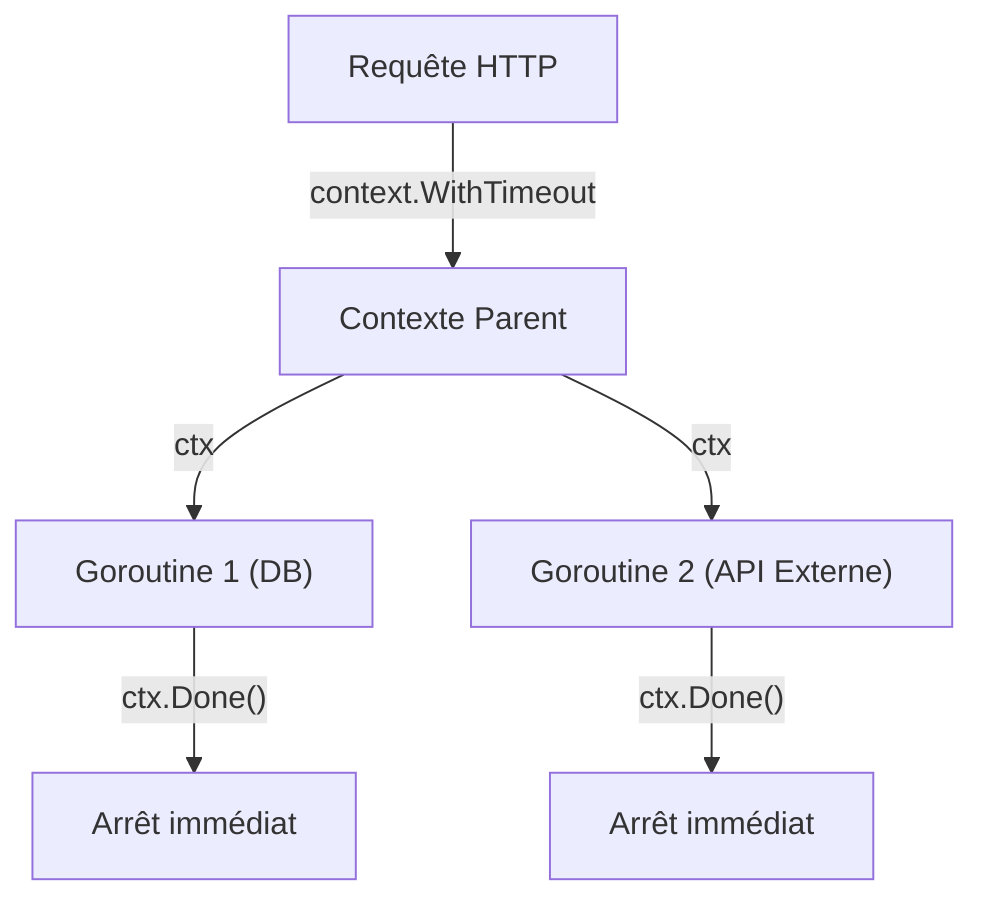

# Chapitre 34 : Introduction au contexte {#chapitre-34-introduction-au-contexte}

context, timeout, cancellation, goroutines, API

## Le package context {#le-package-context}

### 1. Quoi {#quoi}
Le package **context** définit le type `Context`, qui transporte des signaux d'annulation, des délais d'expiration (timeouts) et des valeurs à travers les limites des API et entre les goroutines. C'est un outil fondamental pour gérer le cycle de vie des opérations asynchrones.

### 2. Pourquoi {#pourquoi}
Dans une application Go, une requête entrante peut déclencher plusieurs goroutines. Si le client annule sa requête, il est crucial que toutes les goroutines associées s'arrêtent immédiatement pour libérer les ressources (mémoire, connexions DB). Le `context` permet de propager ce signal d'arrêt en cascade.

### 3. Comment {#comment}

#### A. Syntaxe de base
Création d'un contexte avec un délai d'expiration.

```go
package main

import (
	"context"
	"fmt"
	"time"
)

func main() {
	// Création d'un contexte qui expire après 2 secondes
	ctx, cancel := context.WithTimeout(context.Background(), 2*time.Second)
	defer cancel() // Libère les ressources du contexte

	select {
	case <-time.After(1 * time.Second):
		fmt.Println("Opération terminée avec succès")
	case <-ctx.Done():
		fmt.Println("Opération annulée ou expirée :", ctx.Err())
	}
}
```

#### B. Cas concret : Propagation de l'annulation
Le contexte est passé en premier argument des fonctions pour permettre la propagation.



```go
func effectuerRequete(ctx context.Context) {
	select {
	case <-time.After(5 * time.Second):
		fmt.Println("Travail terminé")
	case <-ctx.Done():
		// On arrête tout si le contexte est annulé
		fmt.Println("Annulation reçue :", ctx.Err())
	}
}
```

#### C. Exemples pratiques
1. **Timeouts API** : Limiter le temps d'attente d'une requête vers un service tiers.
2. **Arrêt propre** : Annuler toutes les goroutines en cours lors de l'arrêt du serveur.
3. **Passage de données** : Transmettre des informations de requête (ex: ID de trace) à travers les couches de l'application.

### 4. Zone de Danger {#zone-de-danger}

- ❌ **Stocker le contexte dans une struct** : Le contexte doit être passé explicitement en argument de fonction (généralement le premier).
- ❌ **Ignorer `ctx.Done()`** : Si vous ne vérifiez pas le canal `Done()` dans vos goroutines, l'annulation ne servira à rien.
- ✅ **Bonne pratique** : Appelez toujours la fonction `cancel()` retournée par `WithTimeout` ou `WithCancel` pour éviter les fuites de mémoire.

### 🚨 Limitations de l'approche standard {#limitations-de-l-approche-standard}

Le `context` est puissant mais peut être abusé pour passer des données métier (ex: utilisateur connecté, base de données).
*   **Problème** : Cela rend les dépendances des fonctions opaques et difficiles à tester.
*   **Solution moderne** : Utilisez le contexte uniquement pour le contrôle de flux (annulation/timeout). Pour les données métier, utilisez l'injection de dépendances.
*   **Pourquoi l'enseigner** : C'est le mécanisme standard pour gérer les timeouts et l'annulation en Go, indispensable pour écrire des services robustes.

## Questions clés (validation des acquis du chapitre) {#questions-clés-(validation-des-acquis-du-chapitre)-34}

- **Quel est le but principal du package `context` ?** (Réponse : Propager des signaux d'annulation et des délais d'expiration entre goroutines).
- **Pourquoi faut-il appeler `cancel()` ?** (Réponse : Pour libérer les ressources associées au contexte dès que l'opération est terminée).
- **Où doit-on passer le contexte dans une fonction ?** (Réponse : En premier argument de la fonction).

## Exercices : {#exercices-:-34}

### Exercice 1 - Le timeout simple {#exercice-1---le-timeout-simple}
🎯 **Objectif** : Utiliser `context.WithTimeout`.
💼 **Mise en situation** : Vous appelez une API externe qui peut être lente.
📝 **Énoncé** : Créez un contexte avec un timeout de 1 seconde. Simulez une tâche qui prend 2 secondes. Vérifiez si le timeout est atteint.
📺 **Résultat attendu** : `Opération annulée : context deadline exceeded`

<details><summary>Voir le code complet commenté</summary>

```go
package main

import (
	"context"
	"fmt"
	"time"
)

func main() {
	ctx, cancel := context.WithTimeout(context.Background(), 1*time.Second)
	defer cancel()

	// Simulation de tâche longue
	select {
	case <-time.After(2 * time.Second):
		fmt.Println("Tâche terminée")
	case <-ctx.Done():
		fmt.Println("Opération annulée :", ctx.Err())
	}
}
```
</details>

### Exercice 2 - Annulation manuelle {#exercice-2---le-annulation-manuelle}
🎯 **Objectif** : Utiliser `context.WithCancel`.
💼 **Mise en situation** : Vous voulez arrêter une tâche dès qu'un utilisateur appuie sur une touche.
📝 **Énoncé** : Créez un contexte annulable. Lancez une goroutine qui attend. Annulez le contexte depuis le main.
📺 **Résultat attendu** : `Goroutine arrêtée`

<details><summary>Voir le code complet commenté</summary>

```go
package main

import (
	"context"
	"fmt"
	"time"
)

func main() {
	ctx, cancel := context.WithCancel(context.Background())

	go func() {
		<-ctx.Done()
		fmt.Println("Goroutine arrêtée")
	}()

	time.Sleep(500 * time.Millisecond)
	cancel() // Annulation manuelle
	time.Sleep(100 * time.Millisecond)
}
```
</details>

### Exercice 3 - Propagation de contexte {#exercice-3---le-propagation-de-contexte}
🎯 **Objectif** : Passer le contexte à une fonction.
💼 **Mise en situation** : Vous avez une fonction de recherche qui doit respecter le timeout global.
📝 **Énoncé** : Créez une fonction `rechercher(ctx context.Context)` qui simule une recherche. Appelez-la avec un contexte timeout.
📺 **Résultat attendu** : `Recherche annulée` si le timeout est trop court.

<details><summary>Voir le code complet commenté</summary>

```go
package main

import (
	"context"
	"fmt"
	"time"
)

func rechercher(ctx context.Context) {
	select {
	case <-time.After(2 * time.Second):
		fmt.Println("Recherche réussie")
	case <-ctx.Done():
		fmt.Println("Recherche annulée :", ctx.Err())
	}
}

func main() {
	ctx, cancel := context.WithTimeout(context.Background(), 1*time.Second)
	defer cancel()
	
	rechercher(ctx)
}
```
</details>