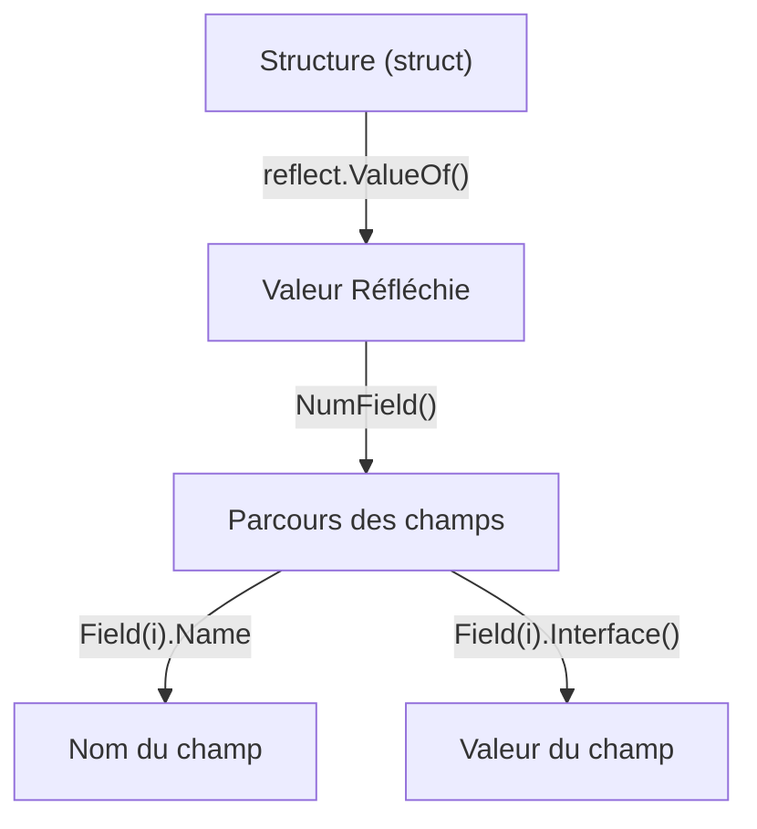

# Chapitre 35 : Introduction à la réflexion {#chapitre-35-introduction-à-la-réflexion}

reflect, Type, Value, introspection, métaprogrammation

## Le package reflect {#le-package-reflect}

### 1. Quoi {#quoi}
Le package **reflect** permet à un programme Go d'examiner ses propres structures, types et valeurs lors de l'exécution (runtime). C'est ce qu'on appelle l'**introspection**. Il permet de manipuler des objets dont le type n'est pas connu au moment de la compilation.

### 2. Pourquoi {#pourquoi}
La réflexion est nécessaire pour écrire du code générique capable de traiter des structures arbitraires. C'est la base de nombreux outils puissants en Go, comme les sérialiseurs JSON (`encoding/json`), les ORM (Object-Relational Mapping) ou les frameworks de test, qui doivent inspecter les champs d'une structure sans connaître son type à l'avance.

### 3. Comment {#comment}

#### A. Syntaxe de base
Les deux piliers de `reflect` sont `reflect.Type` et `reflect.Value`.

```go
package main

import (
	"fmt"
	"reflect"
)

func main() {
	x := 42
	// Obtenir le type
	t := reflect.TypeOf(x)
	// Obtenir la valeur
	v := reflect.ValueOf(x)

	fmt.Println("Type :", t)
	fmt.Println("Valeur :", v)
}
```

#### B. Cas concret : Inspection d'une structure
La réflexion permet de parcourir les champs d'une structure dynamiquement.



```go
package main

import (
	"fmt"
	"reflect"
)

type Utilisateur struct {
	Nom string
	Age int
}

func inspecter(i interface{}) {
	v := reflect.ValueOf(i)
	for j := 0; j < v.NumField(); j++ {
		champ := v.Type().Field(j)
		valeur := v.Field(j)
		fmt.Printf("%s: %v\n", champ.Name, valeur)
	}
}

func main() {
	u := Utilisateur{"Alice", 30}
	inspecter(u)
}
```

#### C. Exemples pratiques
1. **Sérialisation personnalisée** : Lire des tags de structure (ex: `json:"nom"`) pour mapper des données.
2. **Validation dynamique** : Vérifier si tous les champs d'une structure sont remplis.
3. **Appel de fonctions** : Invoquer des méthodes dynamiquement par leur nom.

### 4. Zone de Danger {#zone-de-danger}

- ❌ **Abuser de la réflexion** : Le code utilisant `reflect` est beaucoup plus lent, difficile à lire et moins sûr (pas de vérification à la compilation).
- ❌ **Paniquer avec `reflect`** : Tenter de modifier une valeur non adressable ou d'accéder à un champ inexistant provoquera une panique au runtime.
- ✅ **Bonne pratique** : N'utilisez la réflexion que si aucune autre solution (interfaces, génériques) ne permet d'atteindre votre objectif.

### 🚨 Limitations de l'approche standard {#limitations-de-l-approche-standard}

La réflexion casse la sécurité du typage statique de Go.
*   **Problèmes** : Perte de performance, code fragile, difficulté pour les outils d'analyse statique (IDE, linters).
*   **Solutions modernes** : Depuis Go 1.18, privilégiez les **Génériques** pour écrire du code réutilisable sans sacrifier la performance ni la sécurité du typage.
*   **Pourquoi l'enseigner** : La réflexion reste indispensable pour les outils système, les sérialiseurs et les frameworks qui manipulent des données dont la structure est définie par l'utilisateur.

## Questions clés (validation des acquis du chapitre) {#questions-clés-(validation-des-acquis-du-chapitre)-35}

- **Quelle est la différence entre `reflect.TypeOf` et `reflect.ValueOf` ?** (Réponse : `TypeOf` donne des informations sur le type, `ValueOf` permet d'accéder à la donnée elle-même).
- **Pourquoi la réflexion est-elle considérée comme lente ?** (Réponse : Parce qu'elle nécessite des vérifications de type et des accès mémoire dynamiques au moment de l'exécution, contrairement au code statique).
- **Quelle alternative moderne remplace souvent la réflexion pour le code générique ?** (Réponse : Les Génériques introduits en Go 1.18).

## Exercices : {#exercices-:-35}

### Exercice 1 - Détecteur de type {#exercice-1---le-détecteur-de-type}
🎯 **Objectif** : Utiliser `reflect.TypeOf`.
💼 **Mise en situation** : Vous créez un outil de debug.
📝 **Énoncé** : Écrivez une fonction qui accepte une interface et affiche son type.
📺 **Résultat attendu** : `Type : int` ou `Type : string`

<details><summary>Voir le code complet commenté</summary>

```go
package main

import (
	"fmt"
	"reflect"
)

func afficherType(i interface{}) {
	fmt.Println("Type :", reflect.TypeOf(i))
}

func main() {
	afficherType(10)
	afficherType("Hello")
}
```
</details>

### Exercice 2 - Lecture de valeur {#exercice-2---le-lecture-de-valeur}
🎯 **Objectif** : Utiliser `reflect.ValueOf`.
💼 **Mise en situation** : Vous voulez extraire la valeur d'une interface.
📝 **Énoncé** : Écrivez une fonction qui affiche la valeur d'une interface.
📺 **Résultat attendu** : `Valeur : 42`

<details><summary>Voir le code complet commenté</summary>

```go
package main

import (
	"fmt"
	"reflect"
)

func afficherValeur(i interface{}) {
	fmt.Println("Valeur :", reflect.ValueOf(i))
}

func main() {
	afficherValeur(42)
}
```
</details>

### Exercice 3 - Inspection de structure {#exercice-3---le-inspection-de-structure}
🎯 **Objectif** : Parcourir les champs d'une struct.
💼 **Mise en situation** : Vous créez un validateur de formulaire.
📝 **Énoncé** : Créez une structure `Produit` avec `Nom` et `Prix`. Affichez le nom de chaque champ.
📺 **Résultat attendu** : `Champ : Nom`, `Champ : Prix`

<details><summary>Voir le code complet commenté</summary>

```go
package main

import (
	"fmt"
	"reflect"
)

type Produit struct {
	Nom  string
	Prix int
}

func main() {
	p := Produit{"PC", 1000}
	v := reflect.ValueOf(p)
	t := v.Type()

	for i := 0; i < v.NumField(); i++ {
		fmt.Println("Champ :", t.Field(i).Name)
	}
}
```
</details>