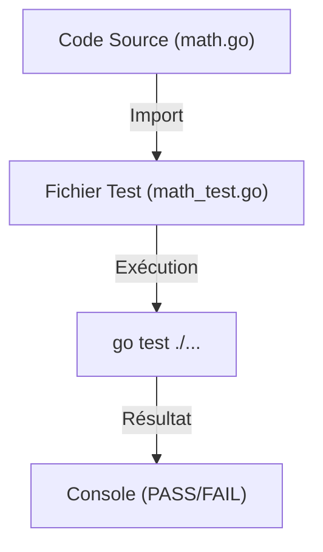

# Chapitre 36 : Tests unitaires {#chapitre-36-tests-unitaires}

testing, T, Test, assertion, go test

## Le package testing {#le-package-testing}

### 1. Quoi {#quoi}
Le package **testing** est la bibliothèque standard de Go pour écrire des tests. Il fournit les outils nécessaires pour automatiser la vérification de votre code. En Go, les fichiers de test doivent se terminer par `_test.go` et les fonctions de test doivent commencer par `Test` et accepter un argument `*testing.T`.

### 2. Pourquoi {#pourquoi}
Les tests unitaires garantissent que chaque petite partie de votre code fonctionne comme prévu. Ils permettent de détecter les régressions (bugs introduits par de nouvelles modifications) et servent de documentation vivante pour le comportement attendu de vos fonctions.

### 3. Comment {#comment}

#### A. Syntaxe de base
Un test simple vérifie une condition et utilise `t.Errorf` en cas d'échec.

```go
// math.go
func Somme(a, b int) int {
	return a + b
}

// math_test.go
func TestSomme(t *testing.T) {
	resultat := Somme(2, 3)
	attendu := 5
	if resultat != attendu {
		t.Errorf("Somme(2, 3) = %d; attendu %d", resultat, attendu)
	}
}
```

#### B. Cas concret : Architecture de test
Go exécute les tests via la commande `go test`.



```go
// Exemple de test robuste avec table-driven tests
func TestSommeTable(t *testing.T) {
	tests := []struct {
		a, b, attendu int
	}{
		{1, 2, 3},
		{0, 0, 0},
		{-1, 1, 0},
	}

	for _, tc := range tests {
		res := Somme(tc.a, tc.b)
		if res != tc.attendu {
			t.Errorf("Somme(%d, %d) = %d; attendu %d", tc.a, tc.b, res, tc.attendu)
		}
	}
}
```

#### C. Exemples pratiques
1. **Tests unitaires simples** : Vérifier une fonction isolée.
2. **Table-driven tests** : Tester plusieurs cas d'entrée avec une seule fonction de test (idiomatique en Go).
3. **Tests de sous-groupes** : Utiliser `t.Run` pour organiser les tests par sous-catégories.

### 4. Zone de Danger {#zone-de-danger}

- ❌ **Utiliser `panic` dans les tests** : Utilisez les méthodes du `*testing.T` (`Errorf`, `Fatalf`) pour signaler une erreur.
- ❌ **Tests dépendants les uns des autres** : Chaque test doit être indépendant et pouvoir être exécuté dans n'importe quel ordre.
- ✅ **Bonne pratique** : Adoptez les "Table-driven tests" pour couvrir un maximum de cas limites avec un code propre et maintenable.

### 🚨 Limitations de l'approche standard {#limitations-de-l-approche-standard}

Le package `testing` est minimaliste et ne propose pas d'assertions complexes (ex: `assert.Equal(t, a, b)`).
*   **Problème** : Le code de test devient verbeux avec beaucoup de `if` et `t.Errorf`.
*   **Solutions modernes** : Beaucoup d'équipes utilisent des bibliothèques comme `testify/assert` pour rendre les tests plus lisibles.
*   **Pourquoi l'enseigner** : Il est crucial de maîtriser les fondamentaux de la bibliothèque standard avant d'ajouter des dépendances externes.

## Questions clés (validation des acquis du chapitre) {#questions-clés-(validation-des-acquis-du-chapitre)-36}

- **Comment nommer un fichier de test en Go ?** (Réponse : Il doit se terminer par `_test.go`).
- **Quelle est la signature correcte d'une fonction de test ?** (Réponse : `func TestXxx(t *testing.T)`).
- **Quelle commande permet d'exécuter tous les tests d'un projet ?** (Réponse : `go test ./...`).

## Exercices : {#exercices-:-36}

### Exercice 1 - Le test de multiplication {#exercice-1---le-test-de-multiplication}
🎯 **Objectif** : Écrire un test unitaire simple.
💼 **Mise en situation** : Vous développez une calculatrice.
📝 **Énoncé** : Créez une fonction `Multiplier(a, b int) int` et son test associé vérifiant `2 * 3 = 6`.
📺 **Résultat attendu** : `PASS` lors de l'exécution de `go test`.

<details><summary>Voir le code complet commenté</summary>

```go
// math.go
func Multiplier(a, b int) int {
	return a * b
}

// math_test.go
func TestMultiplier(t *testing.T) {
	if Multiplier(2, 3) != 6 {
		t.Error("Attendu 6")
	}
}
```
</details>

### Exercice 2 - Table-driven test {#exercice-2---le-table-driven-test}
🎯 **Objectif** : Utiliser les tests par table.
💼 **Mise en situation** : Vous testez une fonction `EstPair(n int) bool`.
📝 **Énoncé** : Testez les cas : 2 (true), 3 (false), 0 (true).
📺 **Résultat attendu** : `PASS` avec 3 cas testés.

<details><summary>Voir le code complet commenté</summary>

```go
func TestEstPair(t *testing.T) {
	tests := []struct {
		n        int
		attendu bool
	}{
		{2, true},
		{3, false},
		{0, true},
	}
	for _, tc := range tests {
		if res := EstPair(tc.n); res != tc.attendu {
			t.Errorf("EstPair(%d) = %v; attendu %v", tc.n, res, tc.attendu)
		}
	}
}
```
</details>

### Exercice 3 - Test avec sous-tests {#exercice-3---le-test-avec-sous-tests}
🎯 **Objectif** : Utiliser `t.Run`.
💼 **Mise en situation** : Vous voulez isoler les tests de cas limites.
📝 **Énoncé** : Réutilisez l'exercice 2 mais organisez chaque cas dans un `t.Run`.
📺 **Résultat attendu** : `PASS` avec des sous-tests nommés.

<details><summary>Voir le code complet commenté</summary>

```go
func TestEstPairRun(t *testing.T) {
	t.Run("Pair", func(t *testing.T) {
		if !EstPair(2) { t.Error("2 devrait être pair") }
	})
	t.Run("Impair", func(t *testing.T) {
		if EstPair(3) { t.Error("3 devrait être impair") }
	})
}
```
</details>

> 📸 **CAPTURE D'ÉCRAN REQUISE**
> **Sujet** : Résultat de la commande `go test -v` dans le terminal.
> **Alt Text** : Terminal affichant "PASS" pour les tests unitaires exécutés.