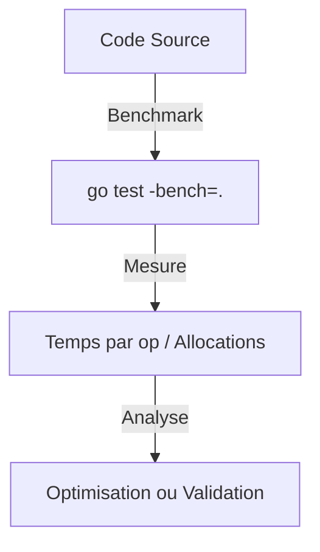

# Chapitre 37 : Benchmarks {#chapitre-37-benchmarks}

testing, Benchmark, performance, b.N, go test

## Les tests de performance (Benchmarks) {#les-tests-de-performance-(benchmarks)}

### 1. Quoi {#quoi}
Les **benchmarks** sont des tests de performance intégrés au package `testing`. Ils permettent de mesurer le temps d'exécution d'une fonction et le nombre d'allocations mémoire par opération. En Go, une fonction de benchmark doit commencer par `Benchmark` et accepter un argument `*testing.B`.

### 2. Pourquoi {#pourquoi}
Il est souvent difficile d'estimer intuitivement quel algorithme ou quelle approche est le plus rapide. Les benchmarks fournissent des données chiffrées objectives pour comparer différentes implémentations et identifier les goulots d'étranglement dans votre code.

### 3. Comment {#comment}

#### A. Syntaxe de base
La boucle `for i := 0; i < b.N; i++` est obligatoire. Le moteur de test ajuste `b.N` automatiquement pour obtenir une mesure statistiquement significative.

```go
// math_test.go
func BenchmarkSomme(b *testing.B) {
	for i := 0; i < b.N; i++ {
		Somme(2, 3) // Fonction à tester
	}
}
```

#### B. Cas concret : Analyse de performance
Exécution via `go test -bench=.`.



```go
// Exemple : Comparaison de deux méthodes
func BenchmarkConcatPlus(b *testing.B) {
	for i := 0; i < b.N; i++ {
		_ = "a" + "b" + "c"
	}
}

func BenchmarkConcatBuffer(b *testing.B) {
	for i := 0; i < b.N; i++ {
		var buf bytes.Buffer
		buf.WriteString("a")
		buf.WriteString("b")
		buf.WriteString("c")
	}
}
```

#### C. Exemples pratiques
1. **Comparaison d'algorithmes** : Choisir entre deux structures de données (ex: `map` vs `slice`).
2. **Détection de régressions** : S'assurer qu'une nouvelle fonctionnalité ne ralentit pas le système.
3. **Optimisation mémoire** : Utiliser `go test -bench=. -benchmem` pour voir le nombre d'allocations.

### 4. Zone de Danger {#zone-de-danger}

- ❌ **Code de setup coûteux dans la boucle** : Ne faites pas d'initialisation lourde (ex: lecture de fichier) à l'intérieur de la boucle `b.N`. Utilisez `b.ResetTimer()`.
- ❌ **Ignorer le résultat** : Si le compilateur voit que le résultat n'est pas utilisé, il peut optimiser le code et fausser les résultats. Utilisez `_ = result` si nécessaire.
- ✅ **Bonne pratique** : Utilisez `b.ResetTimer()` après une phase d'initialisation pour ne mesurer que la fonction cible.

### 🚨 Limitations de l'approche standard {#limitations-de-l-approche-standard}

Les benchmarks Go sont sensibles à l'environnement (CPU, charge système, mode économie d'énergie).
*   **Problème** : Les résultats peuvent varier d'une machine à l'autre.
*   **Solutions modernes** : Utilisez des outils comme `benchstat` pour comparer les résultats de manière statistique et fiable.
*   **Pourquoi l'enseigner** : C'est l'outil de base pour tout développeur Go souhaitant écrire du code performant.

## Questions clés (validation des acquis du chapitre) {#questions-clés-(validation-des-acquis-du-chapitre)-37}

- **Pourquoi la boucle `for i := 0; i < b.N; i++` est-elle nécessaire ?** (Réponse : Elle permet au framework de test de déterminer le nombre d'itérations requis pour obtenir une mesure précise).
- **Quelle commande permet d'afficher les allocations mémoire ?** (Réponse : `go test -bench=. -benchmem`).
- **À quoi sert `b.ResetTimer()` ?** (Réponse : À réinitialiser le chronomètre après une phase d'initialisation coûteuse).

## Exercices : {#exercices-:-37}

### Exercice 1 - Benchmark simple {#exercice-1---le-benchmark-simple}
🎯 **Objectif** : Créer un benchmark de base.
💼 **Mise en situation** : Vous voulez mesurer la vitesse d'une fonction `Calcul()`.
📝 **Énoncé** : Créez une fonction `Calcul()` qui retourne `10*10` et son benchmark associé.
📺 **Résultat attendu** : Affichage du temps par opération (ns/op).

<details><summary>Voir le code complet commenté</summary>

```go
func Calcul() int { return 10 * 10 }

func BenchmarkCalcul(b *testing.B) {
	for i := 0; i < b.N; i++ {
		Calcul()
	}
}
```
</details>

### Exercice 2 - Benchmark avec setup {#exercice-2---le-benchmark-avec-setup}
🎯 **Objectif** : Utiliser `ResetTimer`.
💼 **Mise en situation** : La préparation prend du temps.
📝 **Énoncé** : Simulez une préparation de 100ms avant le benchmark. Utilisez `ResetTimer`.
📺 **Résultat attendu** : Le temps de préparation ne doit pas impacter le résultat.

<details><summary>Voir le code complet commenté</summary>

```go
func BenchmarkAvecSetup(b *testing.B) {
	// Préparation coûteuse
	time.Sleep(100 * time.Millisecond)
	b.ResetTimer() // On ignore le temps de préparation

	for i := 0; i < b.N; i++ {
		_ = 1 + 1
	}
}
```
</details>

### Exercice 3 - Comparaison mémoire {#exercice-3---le-comparaison-mémoire}
🎯 **Objectif** : Analyser les allocations.
💼 **Mise en situation** : Comparer `fmt.Sprintf` et `strconv.Itoa`.
📝 **Énoncé** : Écrivez deux benchmarks pour convertir un entier en chaîne. Comparez les résultats avec `-benchmem`.
📺 **Résultat attendu** : `strconv.Itoa` devrait être plus rapide et allouer moins de mémoire.

<details><summary>Voir le code complet commenté</summary>

```go
import (
	"fmt"
	"strconv"
)

func BenchmarkSprintf(b *testing.B) {
	for i := 0; i < b.N; i++ {
		_ = fmt.Sprintf("%d", 123)
	}
}

func BenchmarkItoa(b *testing.B) {
	for i := 0; i < b.N; i++ {
		_ = strconv.Itoa(123)
	}
}
```
</details>

> 📸 **CAPTURE D'ÉCRAN REQUISE**
> **Sujet** : Résultat de la commande `go test -bench=. -benchmem` dans le terminal.
> **Alt Text** : Terminal affichant les statistiques de performance (ns/op, B/op, allocs/op).