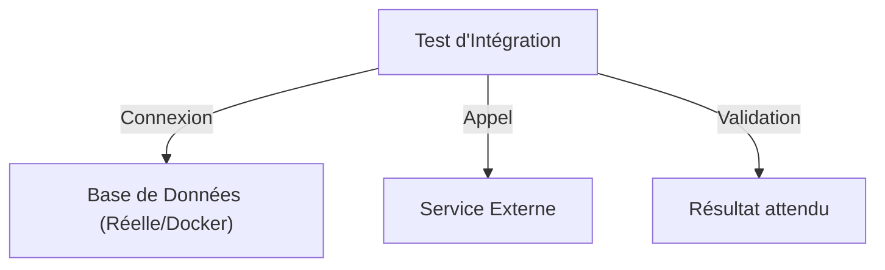

# Chapitre 38 : Tests d'intégration {#chapitre-38-tests-d-intégration}

testing, intégration, base de données, API, environnement

## Les tests d'intégration {#les-tests-d-intégration}

### 1. Quoi {#quoi}
Les **tests d'intégration** vérifient la collaboration entre plusieurs composants de votre application (ex: votre code et une base de données, ou votre code et une API externe). Contrairement aux tests unitaires qui isolent le code, les tests d'intégration valident que les différentes couches communiquent correctement.

### 2. Pourquoi {#pourquoi}
Un code peut être unitairement correct mais échouer lors de l'interaction avec des systèmes externes (ex: erreur de syntaxe SQL, timeout réseau, mauvaise configuration). Les tests d'intégration assurent la fiabilité globale du système dans un environnement proche de la production.

### 3. Comment {#comment}

#### A. Syntaxe de base
Il n'y a pas de syntaxe spécifique au package `testing` pour l'intégration. On utilise les mêmes fonctions `TestXxx(t *testing.T)`, mais on y instancie des dépendances réelles.



#### B. Cas concret : Test avec base de données
```go
func TestIntegrationUtilisateur(t *testing.T) {
	// 1. Setup : Connexion à une base de test
	db := setupTestDB() 
	defer db.Close()

	// 2. Action : Insérer puis lire
	err := CreerUtilisateur(db, "Alice")
	if err != nil {
		t.Fatalf("Échec création : %v", err)
	}

	// 3. Assertion : Vérifier le résultat
	u, _ := LireUtilisateur(db, "Alice")
	if u.Nom != "Alice" {
		t.Errorf("Attendu Alice, reçu %s", u.Nom)
	}
}
```

#### C. Exemples pratiques
1. **Tests DB** : Vérifier que les requêtes SQL sont valides et retournent les bonnes données.
2. **Tests API** : Appeler un endpoint de votre propre serveur pour vérifier la chaîne complète (handler -> service -> DB).
3. **Tests de configuration** : Valider que l'application démarre correctement avec des variables d'environnement spécifiques.

### 4. Zone de Danger {#zone-de-danger}

- ❌ **Utiliser la base de production** : Ne jamais exécuter de tests d'intégration sur une base de données réelle contenant des données sensibles.
- ❌ **Tests non isolés** : Si deux tests modifient la même ligne en base, ils peuvent échouer aléatoirement. Nettoyez toujours les données après chaque test.
- ✅ **Bonne pratique** : Utilisez des conteneurs (Docker) pour lancer des instances éphémères de bases de données ou de services tiers lors de vos tests.

### 🚨 Limitations de l'approche standard {#limitations-de-l-approche-standard}

Les tests d'intégration sont plus lents et plus fragiles que les tests unitaires.
*   **Problèmes** : Dépendance à l'infrastructure, temps d'exécution élevé, risque de "flaky tests" (tests qui échouent par intermittence).
*   **Solutions modernes** : Utilisez **Testcontainers** pour Go afin de gérer automatiquement le cycle de vie des conteneurs Docker pendant les tests.
*   **Pourquoi l'enseigner** : C'est le seul moyen de garantir que votre application fonctionne réellement dans son écosystème.

## Questions clés (validation des acquis du chapitre) {#questions-clés-(validation-des-acquis-du-chapitre)-38}

- **Quelle est la différence majeure entre un test unitaire et un test d'intégration ?** (Réponse : Le test unitaire isole le code, le test d'intégration vérifie l'interaction entre plusieurs composants).
- **Pourquoi est-il crucial de nettoyer la base de données après un test ?** (Réponse : Pour garantir l'indépendance des tests et éviter des effets de bord).
- **Quelle technologie facilite la gestion des dépendances externes lors des tests ?** (Réponse : Docker).

## Exercices : {#exercices-:-38}

### Exercice 1 - Test de base de données {#exercice-1---le-test-de-base-données}
🎯 **Objectif** : Tester une insertion SQL.
💼 **Mise en situation** : Vous testez votre couche d'accès aux données.
📝 **Énoncé** : Créez une fonction `CreerUtilisateur(db, nom)` et un test qui vérifie si l'utilisateur est bien présent en base.
📺 **Résultat attendu** : `PASS` avec une base de données SQLite en mémoire.

<details><summary>Voir le code complet commenté</summary>

```go
// db_test.go
func TestCreerUtilisateur(t *testing.T) {
	db := setupSQLite() // SQLite en mémoire
	defer db.Close()

	err := CreerUtilisateur(db, "Bob")
	if err != nil { t.Fatal(err) }

	u, _ := LireUtilisateur(db, "Bob")
	if u.Nom != "Bob" { t.Error("Nom incorrect") }
}
```
</details>

### Exercice 2 - Test d'API HTTP {#exercice-2---le-test-d-api-http}
🎯 **Objectif** : Tester un handler HTTP.
💼 **Mise en situation** : Vous testez votre endpoint `/ping`.
📝 **Énoncé** : Utilisez `net/http/httptest` pour simuler une requête vers votre handler.
📺 **Résultat attendu** : Statut 200 OK.

<details><summary>Voir le code complet commenté</summary>

```go
import (
	"net/http"
	"net/http/httptest"
)

func TestPingHandler(t *testing.T) {
	req := httptest.NewRequest("GET", "/ping", nil)
	w := httptest.NewRecorder()
	
	PingHandler(w, req)
	
	if w.Code != http.StatusOK {
		t.Errorf("Attendu 200, reçu %d", w.Code)
	}
}
```
</details>

### Exercice 3 - Test avec environnement {#exercice-3---le-test-avec-environnement}
🎯 **Objectif** : Tester la configuration.
💼 **Mise en situation** : Votre application doit lire une variable d'environnement.
📝 **Énoncé** : Utilisez `os.Setenv` dans votre test pour simuler une configuration et vérifiez que votre fonction `LireConfig()` la récupère bien.
📺 **Résultat attendu** : `PASS`.

<details><summary>Voir le code complet commenté</summary>

```go
import "os"

func TestLireConfig(t *testing.T) {
	os.Setenv("DB_URL", "localhost:5432")
	defer os.Unsetenv("DB_URL")

	url := LireConfig()
	if url != "localhost:5432" {
		t.Error("Config incorrecte")
	}
}
```
</details>

> 📸 **CAPTURE D'ÉCRAN REQUISE**
> **Sujet** : Résultat de `go test -v` montrant les tests d'intégration réussis.
> **Alt Text** : Terminal affichant "PASS" pour les tests d'intégration.